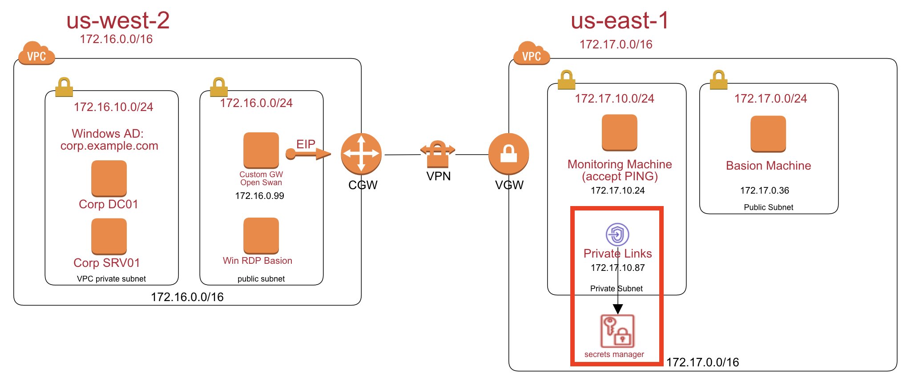
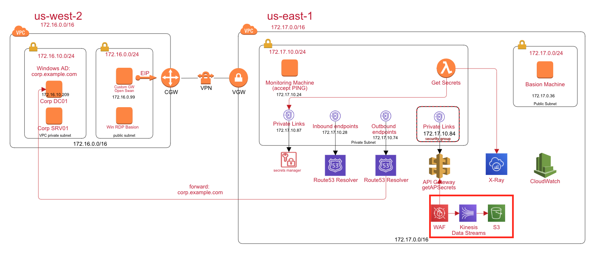
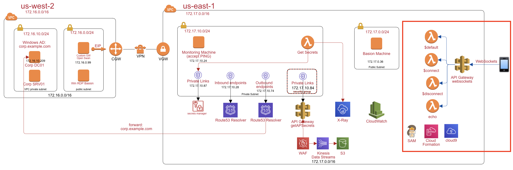
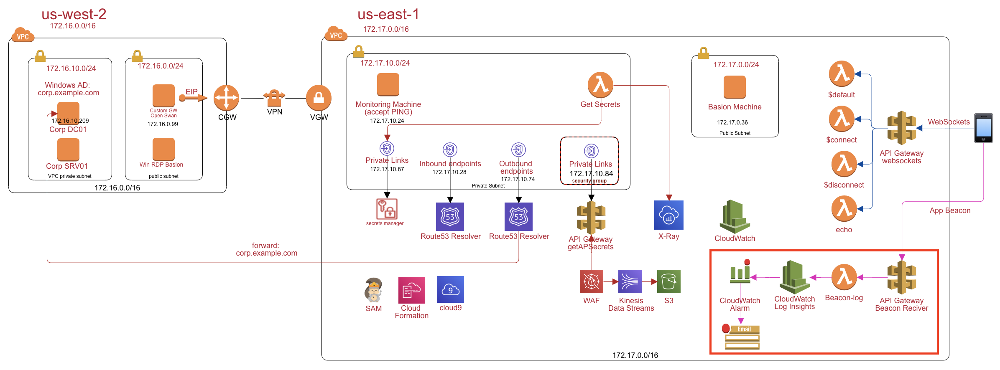
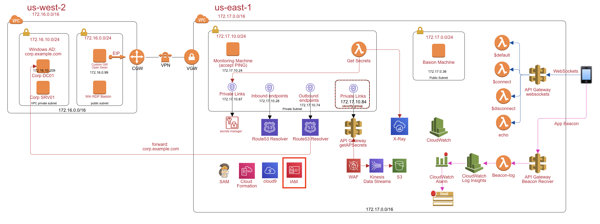
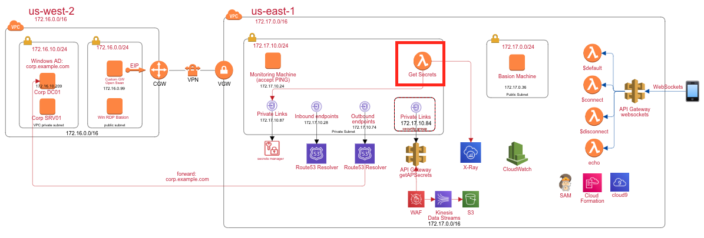

# Architecting on AWS Workshop

In this workshop, you will simulate a hybrid cloud environment:

- Corp (on-premise in `us-west-2`): An Windows AD. ie. corp.example.com
- Site-to-Site VPN Connections: DX or software VPN (Openswan)
- Hybrid DNS for Corp and Cloud
- Cloud (aws in `us-east-1`): 
	- IAM Nijia controller
	- WAF, Private API Gateway, Lambda, Secrets Manager, S3, CloudWatch, CloudWatch Log insides, and etc.
	- RDS, DynamoBD
	- Kinesis Firehouse

It's a real case in a enterprise or start-up companies environment. The workshop level is 300 to 400. Good to sharp your saw on AWS.

## Part1: Setup the site to site VPN
Setup the following diagram to connect Corp (`us-west-2`) and AWS Cloud (`us-east-1`). Please follow the step by step instructions [here](https://github.com/imyoungyang/myAWSStudyBlog/tree/master/advance-architecting/openswan)

## Part2: Setup windows AD
Setup a windows RDP basion, Windows Active Directory, and a windows server to join AD domain. Please follow the step by step instructions [here](https://github.com/imyoungyang/myAWSStudyBlog/tree/master/advance-architecting/windows-ad-on-ec2) to setup a windows AD on EC2.

## Part3: Private Links for AWS
You need to store some secrets such as DB connection strings in AWS secrets manager. But, you don't want to routes the API calls via public internet. In AWS, you need to create a private links for secrets manager.

Please follow the instrucitons [here](https://github.com/imyoungyang/myAWSStudyBlog/tree/master/advance-architecting/vpc-private-link) to create the private links.

## Part4: Route53 Resolver

Follow the step by step [instruction](https://github.com/imyoungyang/myAWSStudyBlog/tree/master/advance-architecting/route53-resolver) to setup the route53 resolver. So, the AWS cloud can forward the DNS query for the `corp.example.com` to the on-premise DC.

## Part5: Let corp DNS work with AWS

Add rout53 inbound endpoints into corp dc dns forwarder. The instruction is [here](https://github.com/imyoungyang/myAWSStudyBlog/tree/master/advance-architecting/win-dns-forwarder)

## Part6: Verify DNS Query Corp Machines in AWS

1. Login to the AWS basion machines and run command `nslookup the corp.example.com`. You should get the DNS result from route53 resolver via corp AD.

	

2. Login to corp SRV01 machine. run command `nslookup secretsmanager.us-east-1.amazonaws.com`. You should get the private link ips.

	
	
## Part7: Setup the secrets manager and lambda function

In this step, you will store your application secrets in the secrets manager. The secrets manager support KMS, key rotation, and DB connection strings. You can use a lambda funciton in the VPC to retrieve the secrets. The instructions are [here](https://github.com/imyoungyang/myAWSStudyBlog/tree/master/advance-architecting/secrets-manager)

## Part8: Add X-Ray to trace more detail information

Add X-ray lambda layer and instrumentation in the lambda codes. You can break down more detail informations. The instructions are [here](https://github.com/imyoungyang/myAWSStudyBlog/tree/master/advance-architecting/x-ray)

## Part9: Add private API Gateway

In this step, you need to create a private API Gateway Endpoint, invoke secrete manger lambda function, and build up the service map to see the latency of all hops. Also, make sure the private api endpoint can be invoked from the corp, i.e `us-west-2`. The instructions are [here](https://github.com/imyoungyang/myAWSStudyBlog/tree/master/advance-architecting/apigw-private)

## Part10: WAF

Enable WAF to protect your private api gateway. You need to verify the waf configuraiton for sql-injection, honey-pot, http flooding. The instructions are [here](https://github.com/imyoungyang/myAWSStudyBlog/tree/master/advance-architecting/waf)

## Part11: WebSocket on API Gateway

Build bidirectional communication applications using WebSocket APIs in Amazon API Gateway without having to provision and manage any servers. API Gateway can handle the WebSocket connections between the client and service. It lets you build your business logic using HTTP-based backends such as AWS Lambda, Amazon Kinesis, or any other HTTP endpoint. The instructions are [here](./advance-architecting/apigw-websocket/README.md)

## Part12: Beacon Solutions on - CloudWatch Log Insights

In this section, you need to build a mobile app beacon solutions for the emergency incidents. The instructions are [here](./cloudwatch-log-beacon/README.md)

## Part13: AWS Identify and Access Management (IAM)

Understand the resource tags, IAM PARC: Principle, Action, Resource, Conditions. Please finish the IAM Njia for EC2 [here](./iam-workshop/iam-workshop.md), for S3 [here](./iam-workshop/iam-workshop-s3.md), and for Lambda [here](./iam-workshop/iam-workshop-lambda.md).

## Part14: Lambda Performance Tuning

Please improve the lambda performance. Reduce the boto init time in the lambda function. The instructions are [here](./advance-architecting/lambda-black-belt/README.md)

