# WebSockets on AWS API Gateway

WebSocket-based APIs are bidirectional in nature. This means that a client can send messages to a service and services can independently send messages to its clients.

This bidirectional behavior allows for richer types of client/service interactions because services can push data to clients without a client needing to make an explicit request. 

WebSocket APIs are often used in real-time applications such as chat applications, collaboration platforms, multiplayer games, and financial trading platforms.

# routeKey in API Gateway

There are three special routeKey values that API Gateway allows you to use for a route:

- **`$default`**: Used when the route selection expression produces a value that does not match any of the other route keys in your API routes. This can be used, for example, to implement a generic error handling mechanism.
- **`$connect`**: The associated route is used when a client first connects to your WebSocket API.
- **`$disconnect`**: The associated route is used when a client disconnects from your API. This call is made on a best-effort basis.

# Part1: Create WebSockets in API Gateway

In the API Gateway console, create a new api:

1. select WebSocket
2. API name: `wsEcho`
3. Route selection expression: `$request.body.action`
4. Description: `echo websocket information`

	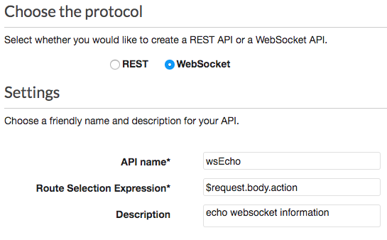

5. Add new route key `echo` to handle `$request.body.action`

	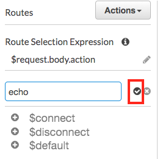

We will park here. Create lambda functions to handle different routes.

# Part2: IAM lambda execution role

## Create `lambda_basic_execution_role`:

1. In IAM console, click on create role.
2. Select `Lambda` service
3. Policies:
	- AWSLambdaBasicExecutionRole
	- AWSLambdaVPCAccessExecutionRole
	- AmazonAPIGatewayInvokeFullAccess

	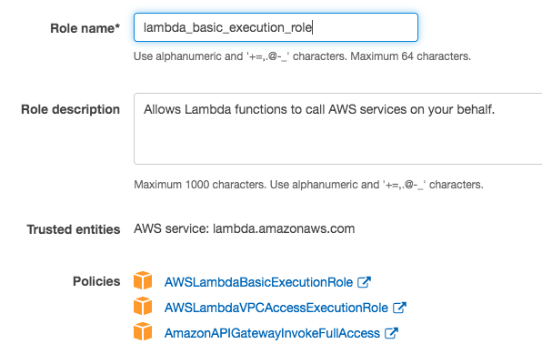

## Create `apigw_cloudwatch_log`:

1. service: api gateway
2. policy:  AmazonAPIGatewayPushToCloudWatchLogs

	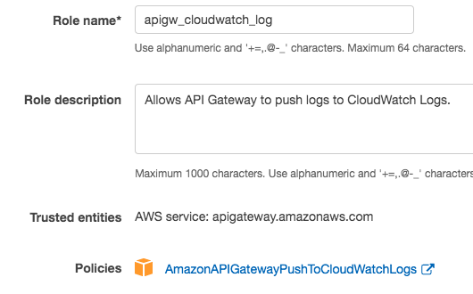	

3. copy the arn and put in the api gateway setting to enable cloudwatch log.

	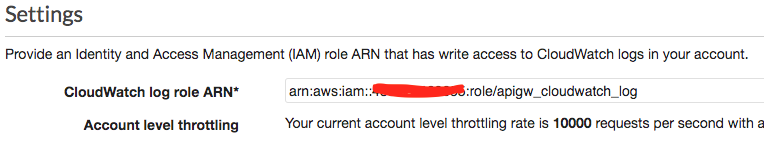	

# Part3: Lamdba functions to handle routes

## Setup SAM packages in cloud9

1. Create a cloud9 environment
2. click on AWS Resources and then create a local lambda function

	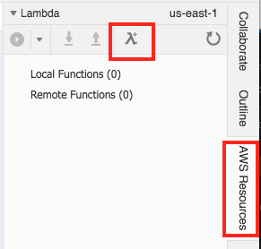

3. Setup the Applicaiton and Lambda Function

	- Application name: `webSocketsOnAPIGW`
	- Function name: `wsEcho`
	- runtime: `node.js 6.10`
	- blueprint `empty-nodejs`
	- Function trigger: `none`
	- Role: select existing role: `lambda_basic_execution_role`

	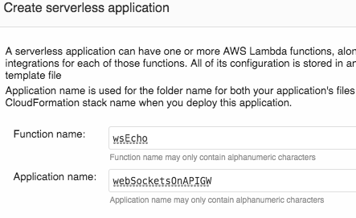
	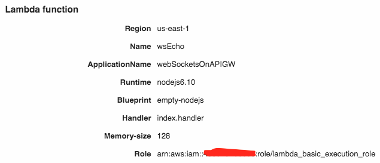

4. In the right panel, right click on `webSocketsOnAPIGW` and select `Create Here`:

	- Function name: `wsConnect`, `wsDisconnect`, and `wsDefault`
	- runtime: `node.js 6.10`
	- blueprint `empty-nodejs`
	- Function trigger: `none`
	- Role: select existing role: `lambda_basic_execution_role`

	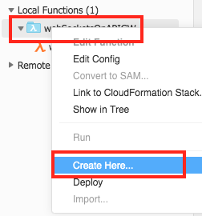
	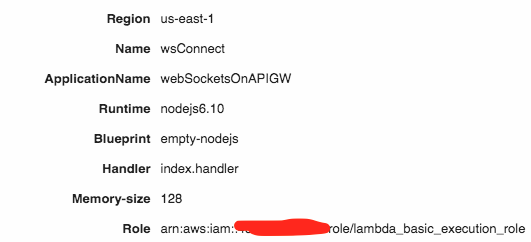
	
4. Modify template.yaml
	- All runtime: nodejs8.10
	- change hander name:
		- Handler: wsEcho/echo.handler
		- Handler: wsConnect/connect.handler
		- Handler: wsDisconnect/disconnect.handler
		- Handler: wsDefault/default.handler

	- You can reference template.yaml [sample](./src/template.yaml)

5. Rename index.js file name to the meaningful file names:
	- wsEcho/echo.js
	- wsConnect/connect.js
	- wsDisconnect/disconnect.js
	- wsDefault/default.js

	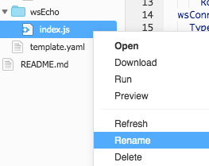
	
	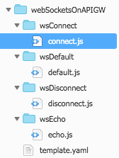

## Write websocket handler function

1. Copy the source code to related files:
	- wsEcho/echo.js [source](./src/echo.js)
	- wsConnect/connect.js [source](./src/connect.js)
	- wsDisconnect/disconnect.js [source](./src/disconnect.js)
	- wsDefault/default.js [source](./src/default.js)

2. Create a package.json:
	- wsEcho/package.json [source](./src/package.json)
	- wsDefault/package.json [source](./src/default-package.json)

3. In the cloud9, open a new terminal. Go to wsEcho to install related package.
	- `cd webSocketsOnAPIGW/wsEcho/`
	- `npm i`
	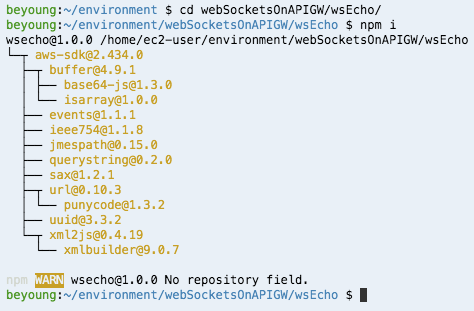

4. Right click on webSocketsOnAPIGW, then deploy.
	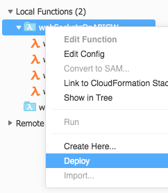
	
5. In lambda console, you will see the functions. If error, please check the cloudformation for detail information.
	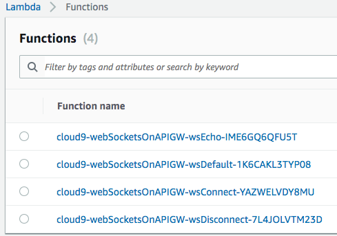

# Part3: Bind API Gateway with Lambda
1. Click on the `Integration Request` for the `echo` routes. Then bind to echo lambda function.

	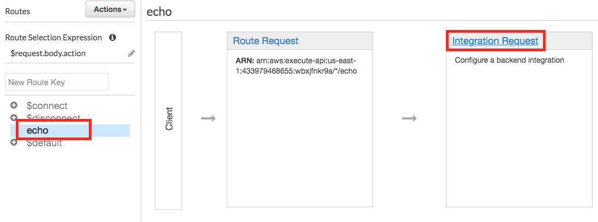
	
	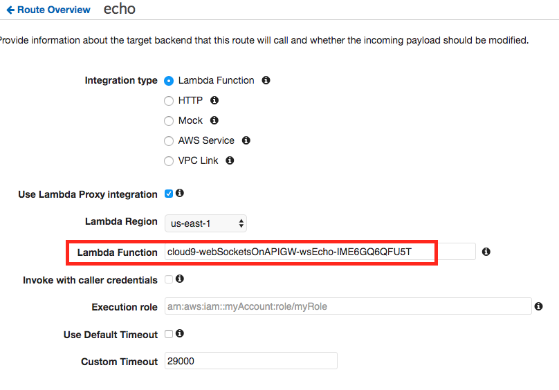

2. follow the same process to bind `$connect`, `$disconnect`, and `$default`.
3. Click on the `Actions` then deploy api to stage `dev`

	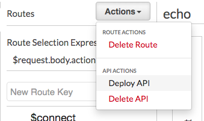
	
	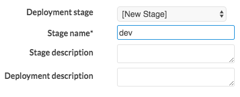

4. Copy the web socket end points. Setting Logs/Tracing.

	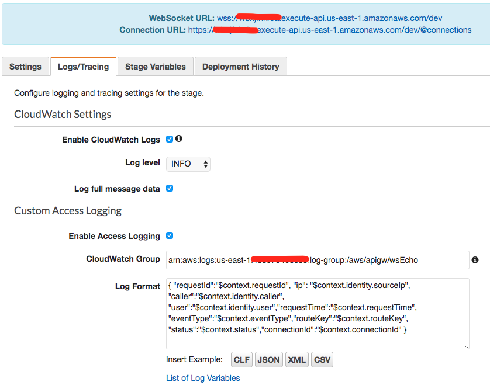

# Part4: Verify

1. In cloud9, `npm install -g wscat`
	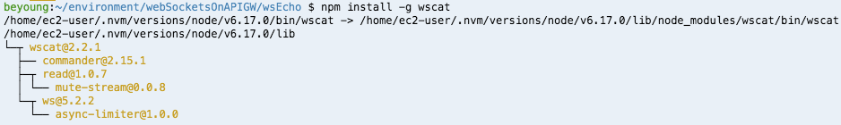

2. Then, in the cosonle, use the command 

	`wscat -c wss://<endpoint-id>.execute-api.us-east-1.amazonaws.com/dev`

	

3. Check cloud watch for api and lamdba.

# Reference

* AWS [blog](https://aws.amazon.com/blogs/compute/announcing-websocket-apis-in-amazon-api-gateway/)
* Lambda get event format [here](./src/event.json)