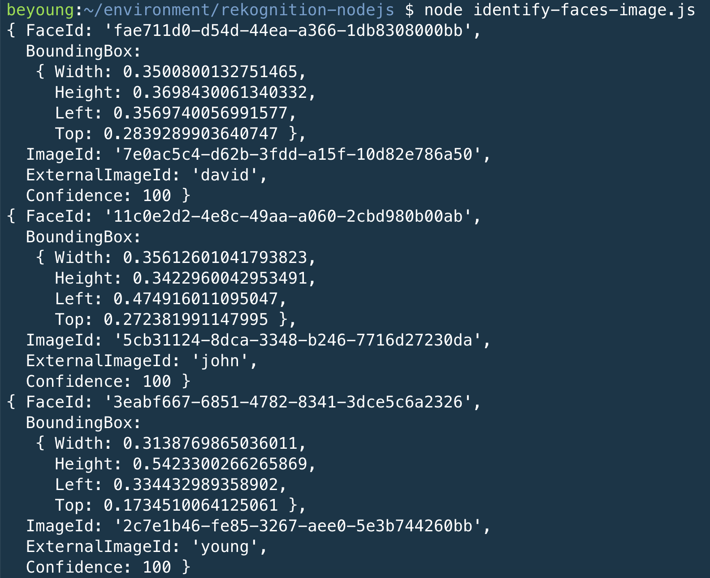

# Part1: Node.js environment

Cloud9 node.js setup [here](https://docs.aws.amazon.com/cloud9/latest/user-guide/sample-nodejs.html) We will use node.js 8.10 because AWS lambda version because of [async](https://lavrton.com/javascript-loops-how-to-handle-async-await-6252dd3c795/) 

* `command -v nvm`: check nvm installation
* `nvm install 8.10`
* `node --version`
* `npm install aws-sdk`

**Important**

Cloud9 terminal shell will get error `The security token included in the request is invalid.` for `rekognition-nodejs` but s3 don't. Please add the following information in `~/.bashrc`. Please reference cloud9 trouble shooting [here](https://docs.aws.amazon.com/cloud9/latest/user-guide/troubleshooting.html#troubleshooting-cli-invalid-token)

```
export AWS_ACCESS_KEY_ID=
export AWS_SECRET_ACCESS_KEY=
export AWS_DEFAULT_REGION=
```

**Notes**

Cloud9 defeault is use nodejs 6. When you turn on new terminal, you need to run `nvm install 8.10`. You get the following benefits:

* You can now get better performance when compared to the previous LTS version 6.x (up to 20%).
* defining a function handler using the async/await pattern.

# Part2: Rekognition Codes

You can check the code [here](./identify-faces-image.js)

* You need to use previous lab images.
* `npm install sharp`

Sharp document is [here](https://sharp.dimens.io/en/stable/). It is 4x-5x faster than GraphicsMagick (gm). Also, npm install with the Pre-compiled libvips binaries.

We leverage the node.js non-blocking (asynchronize) feature. The performance is faster than python version, especially when you have multi-faces in an image.



# Refrence
* lambda layer for sharp [here](https://sharp.dimens.io/en/stable/install/#aws-lambda)
* install gm for lambda. [here](https://stackoverflow.com/questions/44729088/how-can-i-install-graphicsmagick-or-imagemagick-on-aws-lambda/45555876#45555876)
