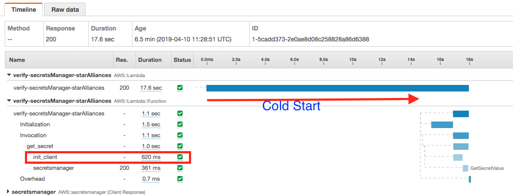
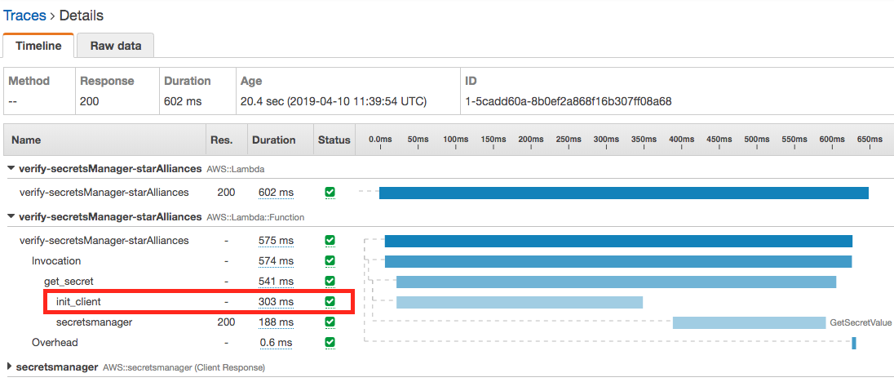
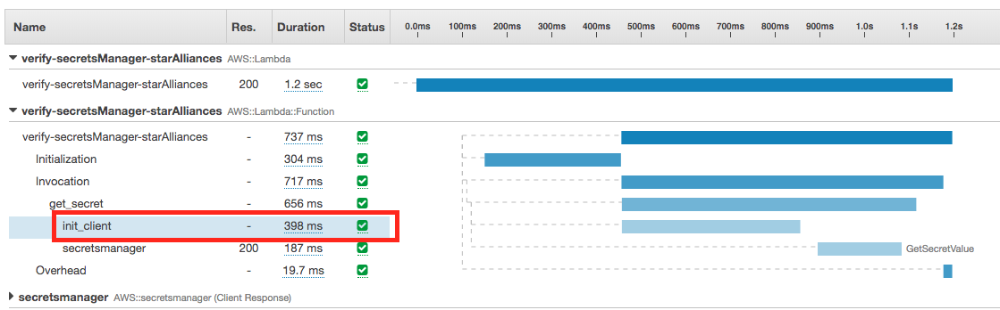
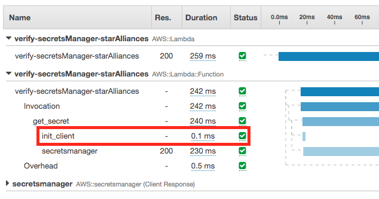

# Tuning Lambda Performance

REMEMBER - **Lambda's containers are reused.**

1. Lazily load variables in the global scope
2. Don't load it if you don't need it - cold starts are affected.

The boto3 client init have cost. It is around 200ms.

Please MUST watch [AWS re:Invent 2017: Become a Serverless Black Belt: Optimizing Your Serverless Appli (SRV401)](https://youtu.be/oQFORsso2go?t=720)


# Step 1: Init boto3 session object every time.

The source code is [here](./lambda-without-lazy-load.py). If you run the following code, every time get_secret() function will init boto client.

```python
@xray_recorder.capture('get_secret')
def get_secret():

    secret_name = "starAlliances/dev/seatMap/provider"
    region_name = "us-east-1"

    try:
        xray_recorder.begin_subsegment('init_client')
        # Create a Secrets Manager client
        session = boto3.session.Session()
        client = session.client(
            service_name='secretsmanager',
            region_name=region_name
        )
        xray_recorder.current_subsegment().put_annotation('init_client', 'done')
    finally:
        xray_recorder.end_subsegment()
```

You can see the result of time spent in the X-Ray. You will see the init spent 620ms.



Second and third calls. It is not from the cold start. You can see the init still spend a lot time time: ~ 300ms:





# Step 2: Use global variable to improve the performance

The source code is [here](./lambda-lazy-load.py). You can see the following change with global variable and lazy load:

```
client = None

@xray_recorder.capture('get_secret')
def get_secret():

    secret_name = "starAlliances/dev/seatMap/provider"
    region_name = "us-east-1"

    try:
        xray_recorder.begin_subsegment('init_client')
        # Create a Secrets Manager client
        global client
        if not client:
            client = boto3.client(
                service_name='secretsmanager',
                region_name=region_name
            )
        xray_recorder.current_subsegment().put_annotation('init_client', 'done')
    finally:
        xray_recorder.end_subsegment()

```

When you run the lambda after 2nd time, you will big save time on the init:


