Part 1:

* SSM command line

* SSM Agent is installed by default on instances created from Windows Server 2016 and Windows Server 2019 Amazon Machine Images (AMIs)
	* launch EC2 2019 AMI
	* IAM Role: EC2RoleforSSM
	  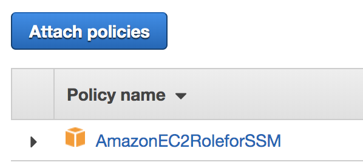
* In the EC2 console, left navigation system manager shard resources can see the managed instances.
	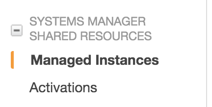
	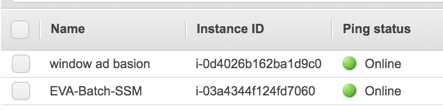	

* Create Document `dateDump` and then command
	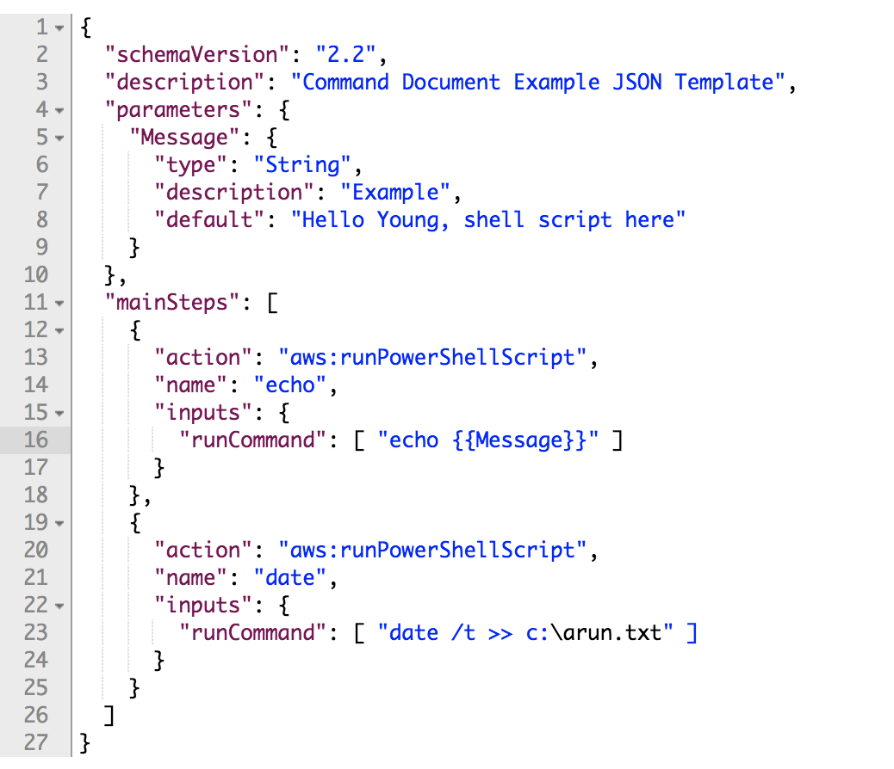	

```
{
  "schemaVersion": "2.2",
  "description": "Command Document Example JSON Template",
  "parameters": {
    "Message": {
      "type": "String",
      "description": "Example",
      "default": "Hello Young, shell script here"
    }
  },
  "mainSteps": [
    {
      "action": "aws:runPowerShellScript",
      "name": "echo",
      "inputs": {
        "runCommand": [ "echo {{Message}}" ]
      }
    },
    {
      "action": "aws:runPowerShellScript",
      "name": "date",
      "inputs": {
        "runCommand": [ "date >> c:\\arun.txt" ]
      }
    }
  ]
}
```

* Run command
	* select instance
		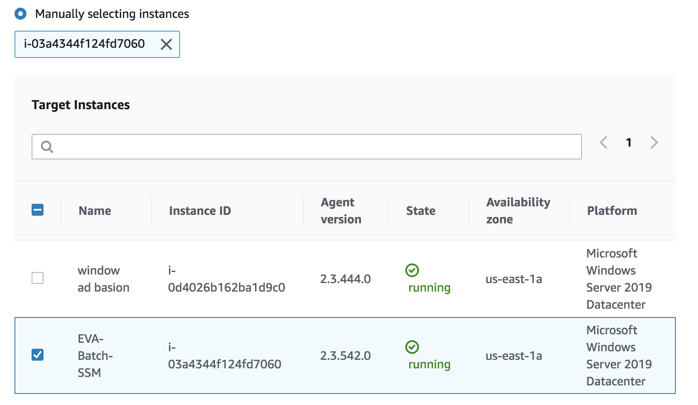
	* output options: s3 and log group
		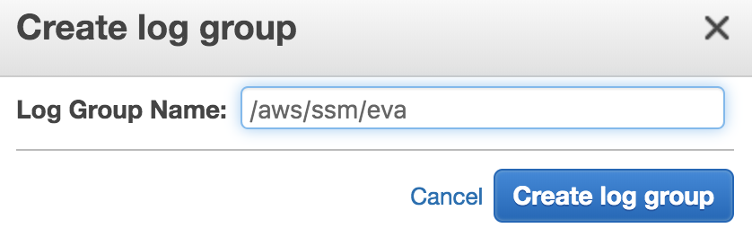
		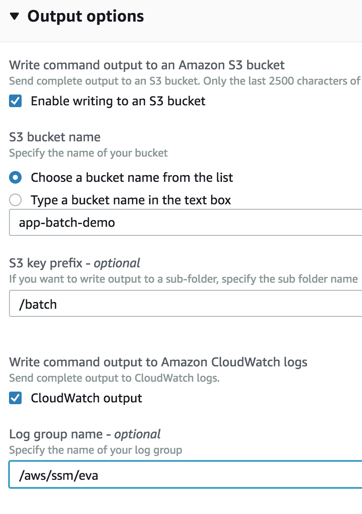
   * You will see the run history
		
	* See the command history
		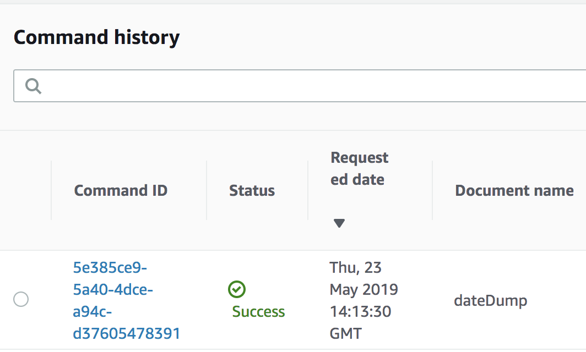
		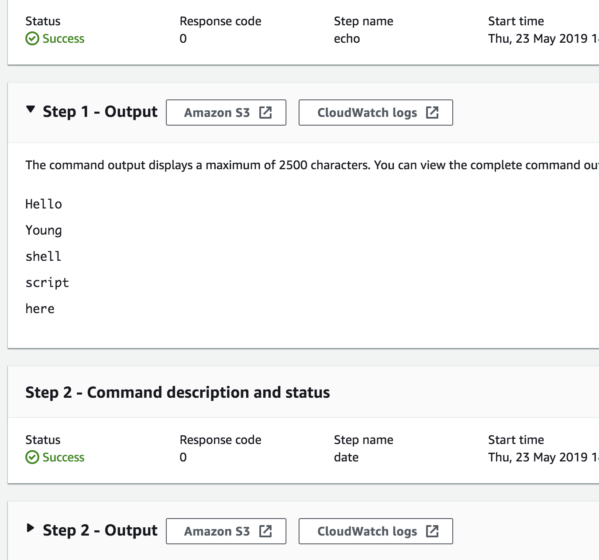		

* Setup Invnentory
	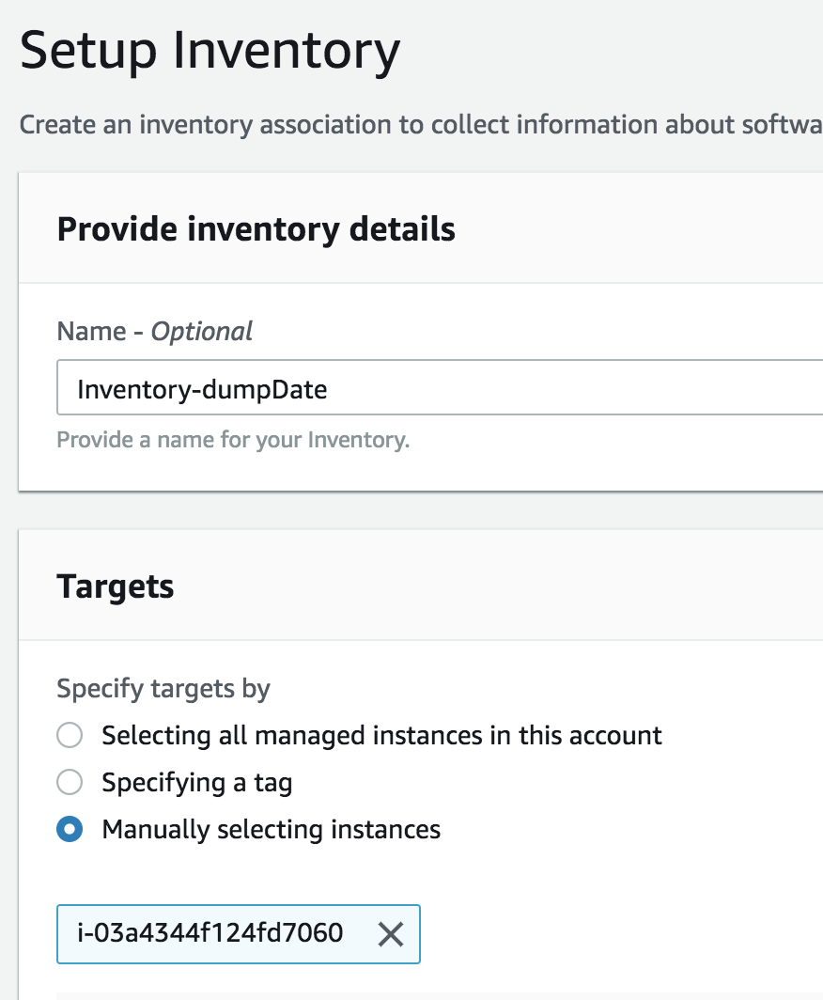
	* schdule: collect data every 30 min
	* file: `c:\arun.txt`
	* output to s3
	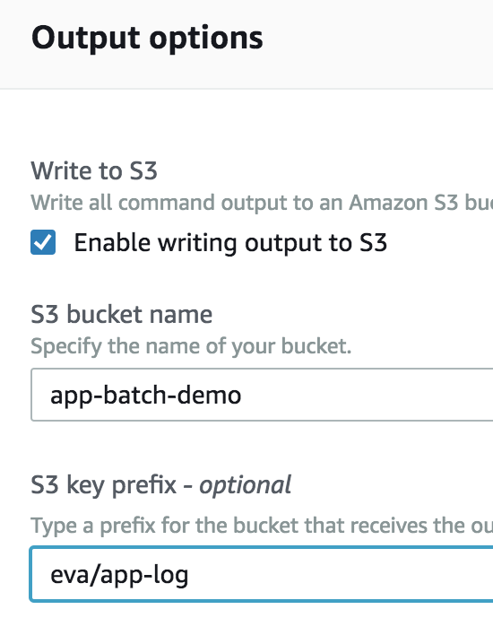	

* Lamda function
	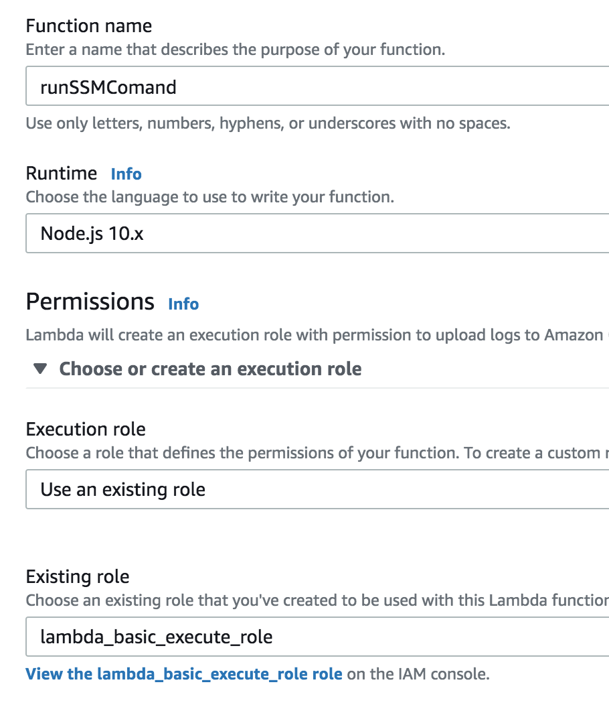

```
const aws = require('aws-sdk');
const ssm = new aws.SSM();

const runCommand = (documentName, instance) => new Promise(function(resolve, reject) {
  ssm.sendCommand({
    DocumentName: documentName,
    InstanceIds: [instance],
    TimeoutSeconds: 3600
  }, function(err, data) {
    if (err) {
      reject(JSON.stringify(err))
    }
    else {
      resolve(data)
    }
  })
  
});

/*
* @input {documentName, InstanceId}
* @return {CommandId: CommandId, InstanceId: InstanceId, Status: Status}
*/
exports.handler = async (event, context, callback) => {
  const result = await runCommand(event.documentName, event.InstanceId);
  const CommandId = result.Command.CommandId;
  const InstanceId = result.Command.InstanceIds[0];
  const Status = result.Command.Status;
  callback(null, {CommandId: CommandId, InstanceId: InstanceId, Status: Status});
};
```

```
{
    "documentName": "dateDump",
    "InstanceId": "i-03a4344f124fd7060"
}
```
```
Response:
{
  "CommandId": "45cf5b84-be4b-40ca-9ac2-bc4fe27bd265",
  "InstanceId": "i-03a4344f124fd7060",
  "Status": "Pending"
}
```
* lambda super execution role setup
