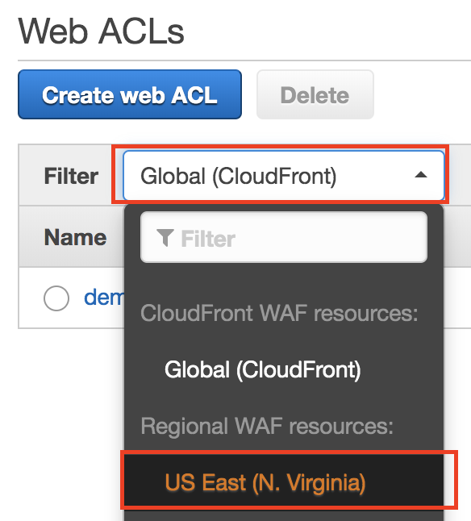
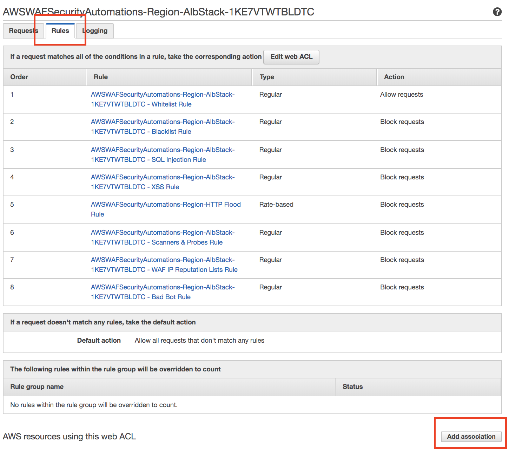
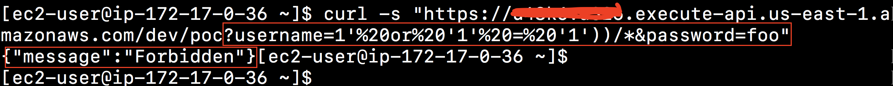

# AWS WAF

## Part 1: Deploy AWS WAF Security Automations
1. Import cloud formation templete [here](https://docs.aws.amazon.com/solutions/latest/aws-waf-security-automations/deployment.html#step1)
2. Deploy region `us-east-1`, endpoint `ALB`, and access log bucket name: `waf-alb-log`, which bucket is unique and need to create first in the s3.

	

## Part 2: Associate WAF to your API Gateway endpoints.

1. In the WAF console, click on WebACL navigation link.
2. Filter region `us-east-1`

	
	
3. Click on `Rules` tab, then scroll down to click on Add association.

	

4. Select the private api gateway.

	
	
## Part 3: Verify WAF functions

ssh to linux basion in `us-east-1`

### Test SQL Injection

1. Verify the endpoint of your private api via `curl -s`

	

2. Reference owasp [link](https://www.owasp.org/index.php/Testing_for_SQL_Injection_(OTG-INPVAL-005)) to get the sql inject example. For example, add the following in your api request.

	`?username=1'%20or%20'1'%20=%20'1'))/*&password=foo`
	
3. You will get the forbidden message

	
	
4. Few minutes later, you can see SQL Inject rules in the WAF console

		
	
### Test AWSWAFSecurityAutomations-Region-HTTP Flood Rule

2. Reference [here](https://docs.aws.amazon.com/sdk-for-javascript/v2/developer-guide/setting-up-node-on-ec2-instance.html) to install node.js on ec2
	1. `curl -o- https://raw.githubusercontent.com/creationix/nvm/v0.34.0/install.sh | bash`
	2. `. ~/.nvm/nvm.sh`
	3. `nvm install 10.15.3`
	4. `node -e "console.log('Running Node.js ' + process.version)"`
3. Install [artillery](https://artillery.io/)
   * `npm install -g artillery`

4. Hit the endpoints to test Http flooding

	`artillery quick -n 2000 --count 10 INVOKE_URL`
	
5. After Artillery finishes its execution, try re-running the cURL command. And you will get

	`{“message”:”Forbidden”}`
	
6. In WAF console, you will see the traffic graph and http flooding sample

	
	
## Part 4: Enable WAF Raw logs

1. Create a kinesis Data Firehose stream in `us-east-1`
2. In WAF rules, click on `Logging` tab and edit with data stream.
3. For the log raw data analysis, you can reference [here](https://docs.aws.amazon.com/waf/latest/developerguide/logging.html)

## Reference
* [API Gateway for WAF](https://aws.amazon.com/blogs/compute/amazon-api-gateway-adds-support-for-aws-waf/)