# Build up windows AD mutual trust

## Part1: Create AWS managed Windows AD

1. In AWS console, go to Directory Sevice. Click on setup directory. Select AWS Managed AD. Name: `cloud.example.com`. Select private subnets `172.17.10` and `172.17.20`.
	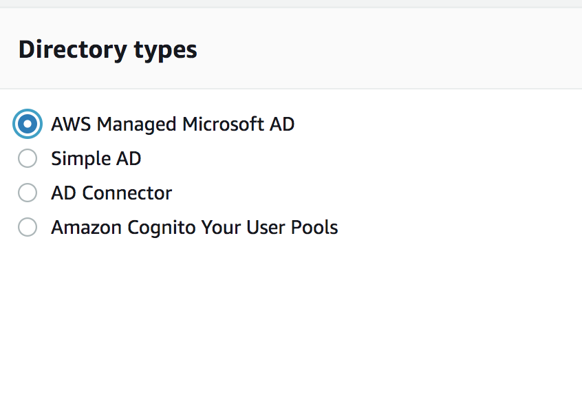
	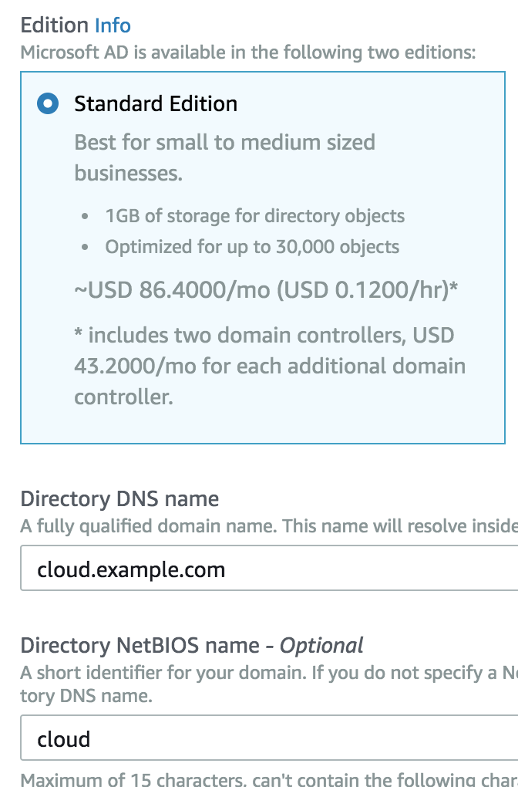	
	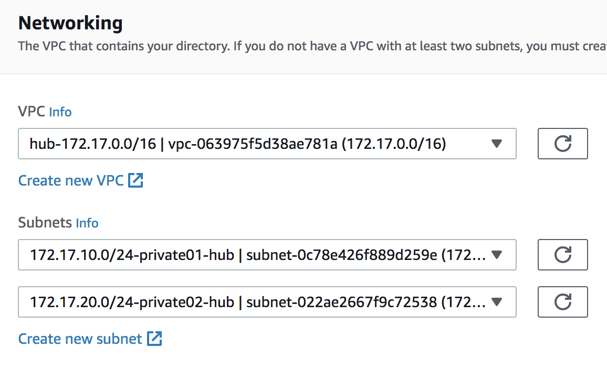
	
1. Launch windows server in the public subnet and join the windows AD domain.
	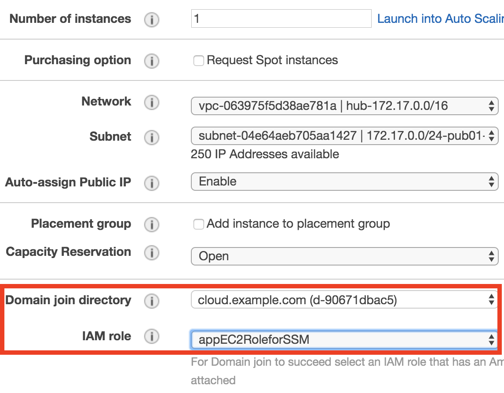

1. Install the Active Directory Administration Tools on Windows Server 2008.
	* Open Server Manager by choosing Start, Administrative Tools, Server Manager.

	* In the Server Manager tree pane, select Features, and choose Add Features,

	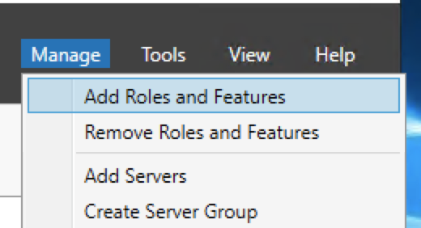
	
	* In the Add Features Wizard, open Remote Server Administration Tools, Role Administration Tools, select AD DS and AD LDS Tools, scroll down and select DNS, then choose Next.

	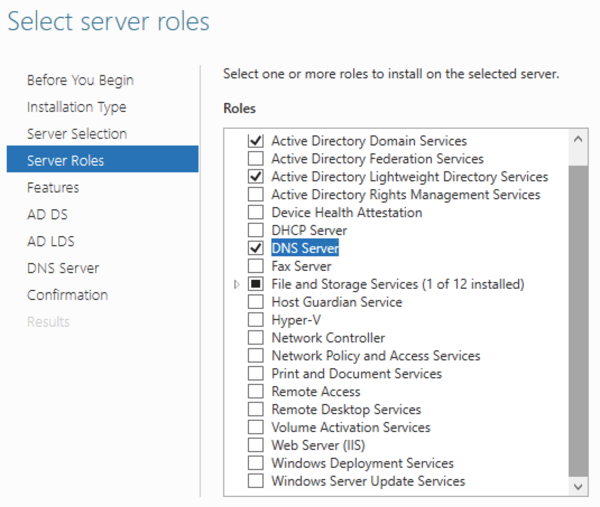
	* Review the information and choose Install. 

## Part2: Build up trust relationship with Corp AD
1. Check the SG for the corp AD, which is in the `us-west-2` region.
You must allow to open the CIDRs for corp and cloud subnets.
	- TCP/UDP 53 - DNS
	- TCP/UDP 88 - Kerberos authentication
	- TCP/UDP 389 - LDAP
	- TCP 445 - SMB
	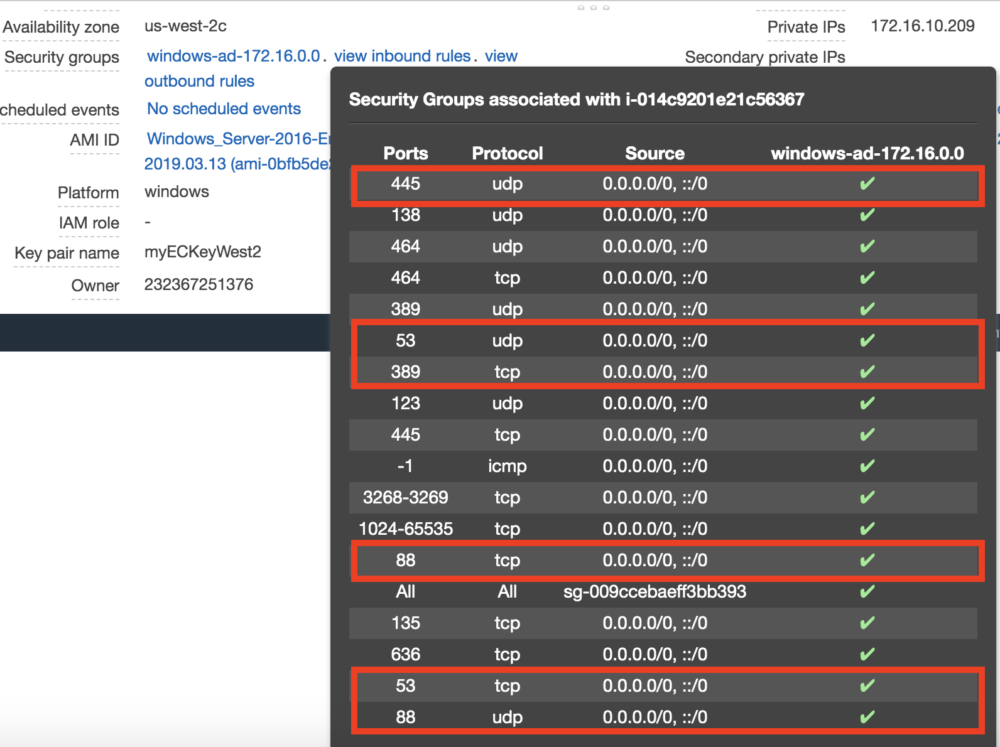

1. Configue `us-east-1` security group for AWS managed windows AD
	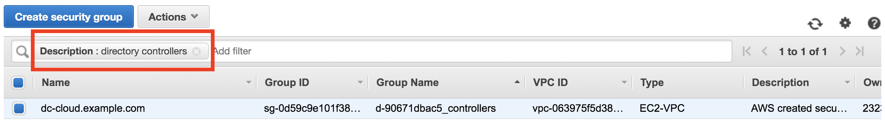
1. Add outbound rules for all traffic to the corp CIDR range, which your corp AD located in.
	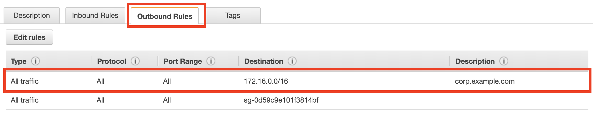
	

## Part3: Configure DNS Conditional Forwarders On Your On-premises domain

1. Via corp windows basion server to access your corp ad.
2. Open DNS Manager: click Start -> Administrative Tools -> DNS
3. Create New conditional forwarder
	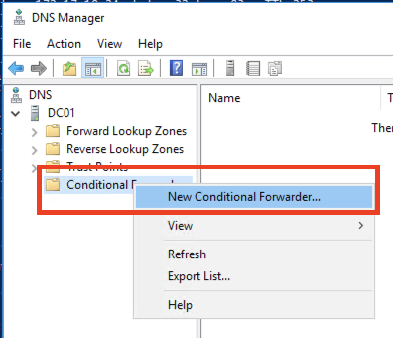
4. DNS domain name: `cloud.example.com`, IP address: 172.17.20.46,
172.17.10.19, which can find in AWS Managed AD console.
	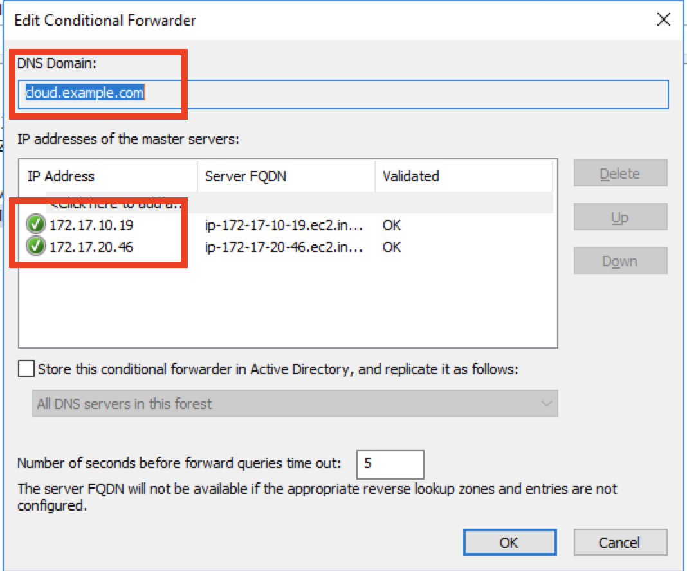
	
## Part4: Trust Relastionship

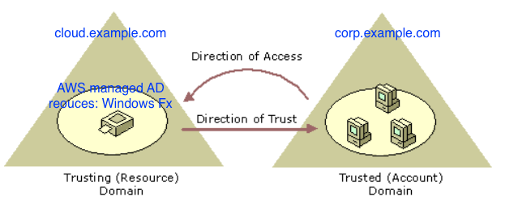

### Corp AD - config the trust relationship
We need to config the corp AD trust relationship. For the demo purpose, we use the **two-way forest trust**. please reference the MSDN [here](https://docs.microsoft.com/en-us/previous-versions/windows/it-pro/windows-server-2008-R2-and-2008/cc732859(v%3dws.10)) and step [here](https://docs.microsoft.com/en-us/previous-versions/windows/it-pro/windows-server-2008-R2-and-2008/cc771580(v%3dws.10))

1. Open **Active Directory Domains and Trusts** from Administrative Tools. Select the domain `corp.example.com` and then click Properties.

	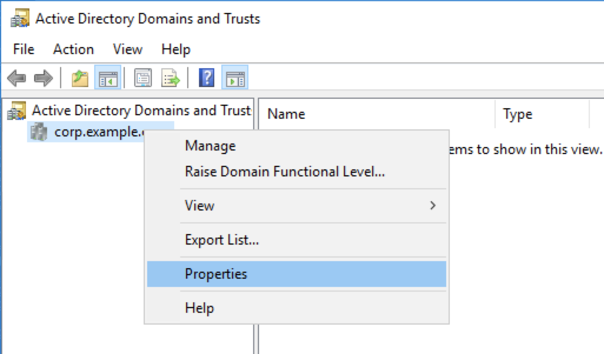

2. Trust Name: `cloud.example.com`, trust type: `Forest trust`, Direction of trust: `Two-way`, Sides of Trust: `This domain only`
	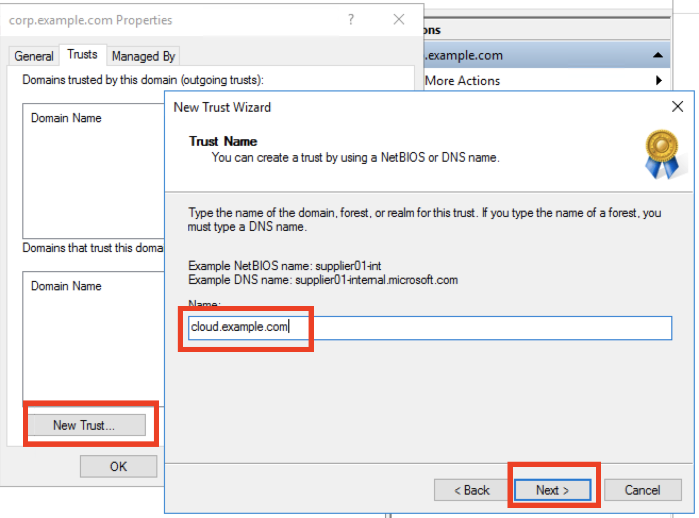
	
3. Create and save trust domain password. You will use this password in the AWS managed AD later.
	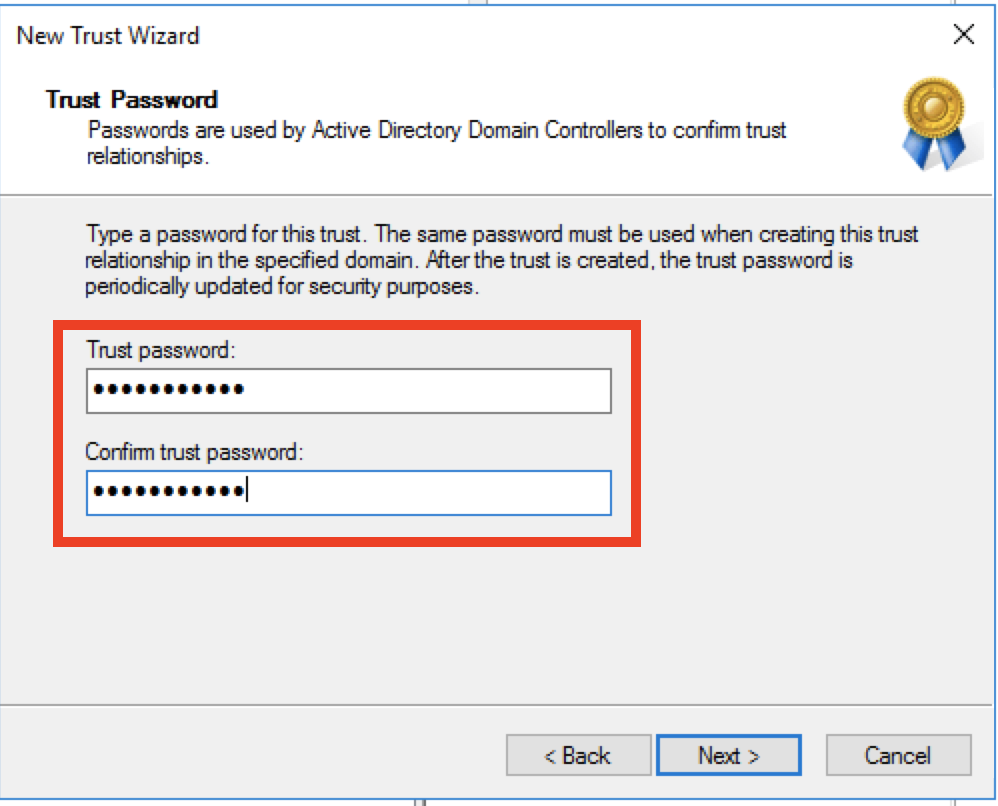
	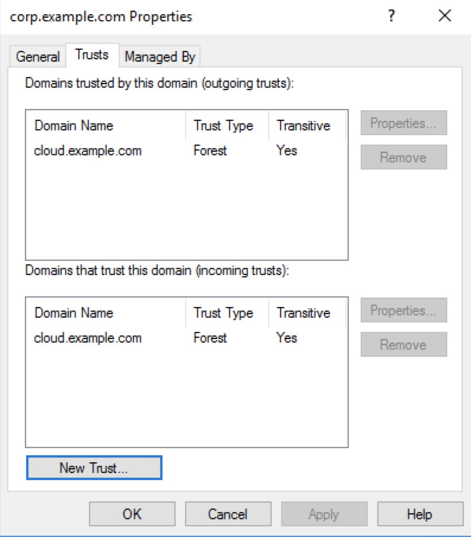

### AWS managed AD - create a trust relationship
1. In AWS Managed AD console, click on networking and security tab, and then add trust relationship

	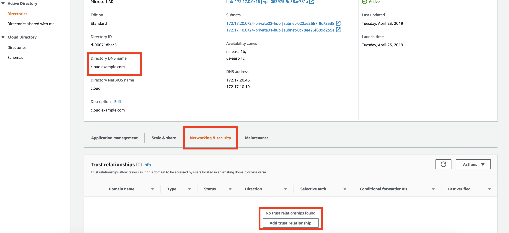

1. Edit the configuration as the following. Setup an out-going to let corp domain to access aws cloud resources.

	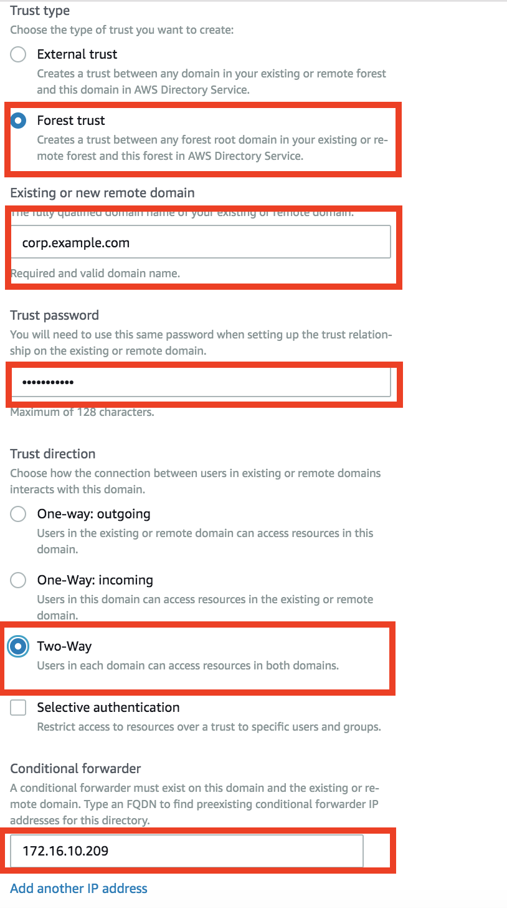
	
1. After a while, you will see the status is green.

	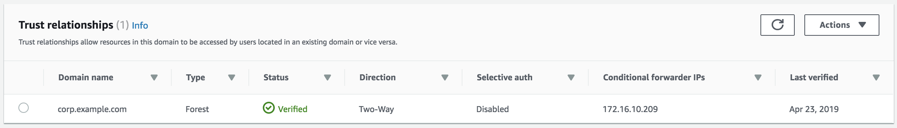

## Reference

* Create a trusted relastionship in the AWS Directory [steps](https://docs.aws.amazon.com/directoryservice/latest/admin-guide/ms_ad_setup_trust.html)

* [Tutorial: Create a Trust Relationship Between Your AWS Managed Microsoft AD and Your On-Premises Domain](https://docs.aws.amazon.com/directoryservice/latest/admin-guide/ms_ad_tutorial_setup_trust.html)

* Understand windows trust [here](https://docs.microsoft.com/en-us/previous-versions/windows/it-pro/windows-server-2008-R2-and-2008/cc731335(v%3dws.10))

* How to Delegate Administration of Your AWS Managed Microsoft AD Directory to Your On-Premises Active Directory Users [here](https://aws.amazon.com/blogs/security/how-to-delegate-administration-of-your-aws-managed-microsoft-ad-directory-to-your-on-premises-active-directory-users/)
