# Using Data Models to validate your api gateway inputs

Amazon API Gateway recently announced the release of request validators, a simple but powerful new feature that should help to liberate API developers from the undifferentiated effort of implementing basic request validation in their API backends.

## Steps
1. Analysis the request body format
2. Transform the request body into JSON Schema validation
3. Create models in the API Gateway
4. Enable API Gateway Request Validator
5. Test the request validator
6. (Optional) Customerize the validation error message
7. (Optional) Log the invalidate body information to cloudwatch log

## Analysis the request body format
Give the example for the reqeust body as the following to create the transactin tickets:

[source code](./post-body.json)

```
[
    {
      "account-id": "abcdef123456",
      "type": "STOCK",
      "symbol": "AMZN",
      "shares": 100,
      "order-date": "2018-01-28",
      "details": {
        "limit": 1000
      }
    },
    {
      "account-id": "zyxwvut987654",
      "type": "STOCK",
      "symbol": "BA",
      "shares": 250,
      "order-date": "2018-01-28",
      "details": {
        "limit": 200
      }
    }
]
```

The requirements for the data validations are:

* The root `array` must have at least 1 item
* All properties are required
* `Account ID` must match the regular expression format “[A-Za-z]{6}[0-9]{6}”
* `Date` format must be "yyyy-MM-dd"
* Type must be one of STOCK, BOND, or CASH
* Symbol must be a string between 1 and 4 characters
* Shares must be a number between 1 and 1000

## Transform the request body into JSON Schema validation

Please reference the [link](https://json-schema.org/understanding-json-schema/about.html) to understand the JSON Schema. The major JSON is built on the following data structures: object, array, number, string, boolean, and null.

So, you can convert the post json body into the following JSON schema model. Please aware that AWS API Gateway support draft-04 and string support regular expression pattern. The [date format](https://tools.ietf.org/html/draft-zyp-json-schema-03#section-5.23) is not fully supported yet.

[source code](./json-schema-validation-model.json)

```
{
  "$schema": "http://json-schema.org/draft-04/schema#",
  "title": "Create Orders Schema",
  "type": "array",
  "minItems": 1,
  "items": {
    "type": "object",
    "required": [
      "account-id",
      "type",
      "symbol",
      "shares",
      "order-date",
      "details"
    ],
    "properties": {
      "account_id": {
        "type": "string",
        "pattern": "[A-Za-z]{6}[0-9]{6}"
      },
      "type": {
        "type": "string",
        "enum": [
          "STOCK",
          "BOND",
          "CASH"
        ]
      },
      "symbol": {
        "type": "string",
        "minLength": 1,
        "maxLength": 4
      },
      "shares": {
        "type": "number",
        "minimum": 1,
        "maximum": 1000
      },
      "order-date": {
        "type": "string",
        "pattern": "^\\d{4}\\-(0[1-9]|1[012])\\-(0[1-9]|[12][0-9]|3[01])$",
        "description": "We expect yyyy-MM-dd"
      },
      "details": {
        "type": "object",
        "required": [
          "limit"
        ],
        "properties": {
          "limit": {
            "type": "number"
          }
        }
      }
    }
  }
}
```

## Create models in the API Gateway

* Create API: `validator-stocks-order`
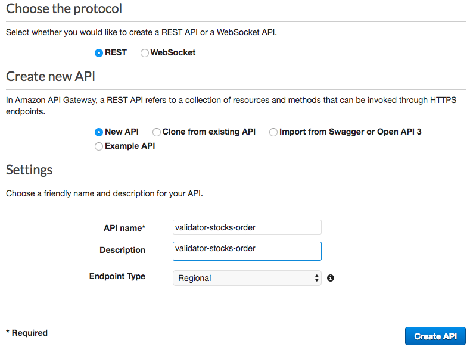

* Create Methods: post


* Use Mock for testing first
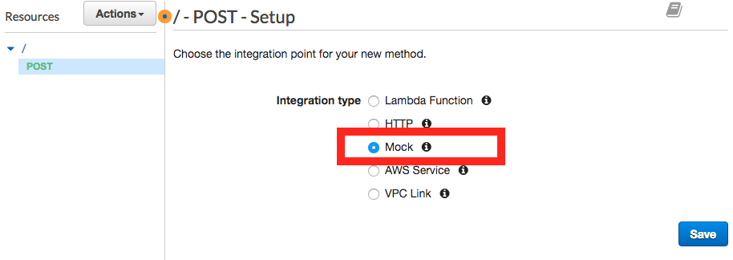

* Create Models
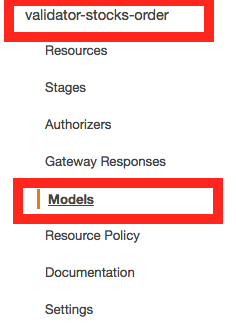

* Config Models
   - name: stockOrders
   - content type: application/json
   - description: stock-orders
   - Model schema: [source code](./json-schema-validation-model.json)

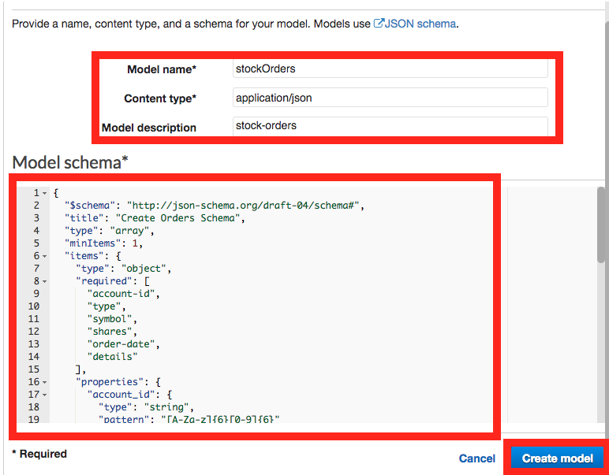

* Add model documents

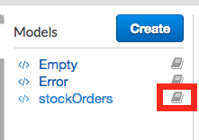


[source code](./model-documents.json)

```
{
  "description": "post data format example",
  "request-body-example": [
    {
      "account-id": "abcdef123456",
      "type": "STOCK",
      "symbol": "AMZN",
      "shares": 100,
      "order-date": "2018-01-28",
      "details": {
        "limit": 1000
      }
    },
    {
      "account-id": "zyxwvut987654",
      "type": "STOCK",
      "symbol": "BA",
      "shares": 250,
      "order-date": "2018-01-28",
      "details": {
        "limit": 200
      }
    }
  ]
}
```

You will see the following pictures for the documentation.
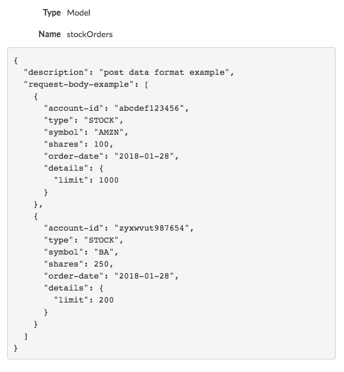

## Enable API Gateway Request Validator
* Click on resources and then Post

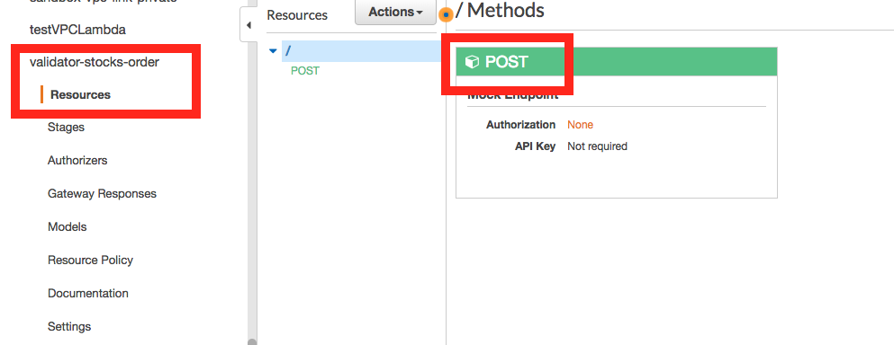

* Click on Method Request

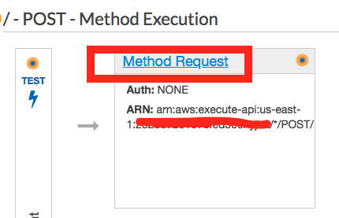

* In settings, set the request validator to `Validate body`

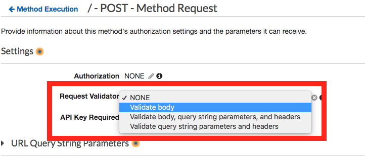

* Click on Request Body, and then "add model"

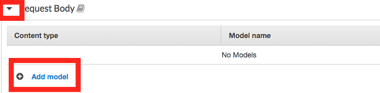

* Input `application/json` and choose model `stockOrders`

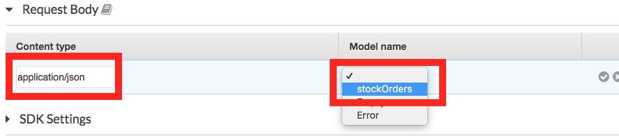

## Test the request validator

* Click on resources, method post, and then test

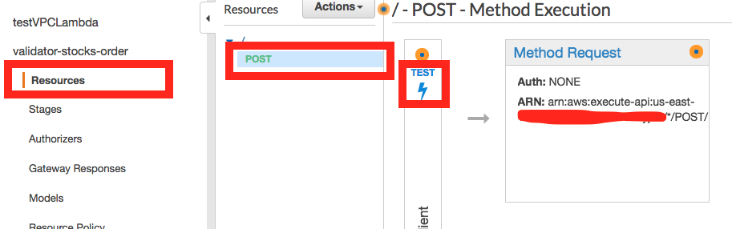

* Paste the request body and then test


You can see the response status 200 and pass the validation.

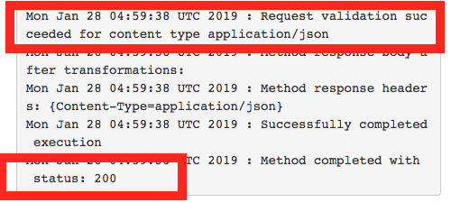

* Change the date format to "2018-01". You will see status 400 and error message about the invalid format

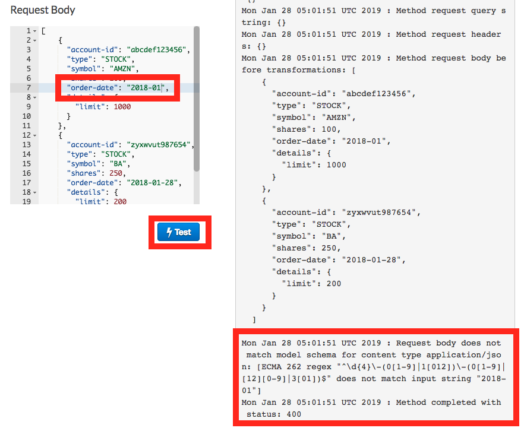

* Deploy API to stage `dev`

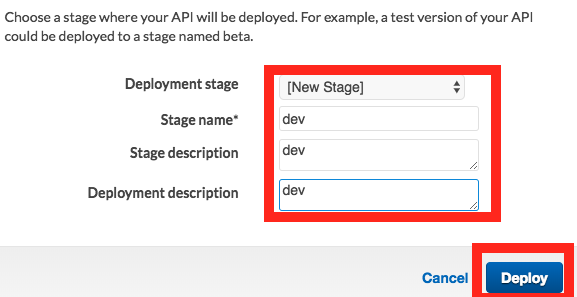

* Enable log

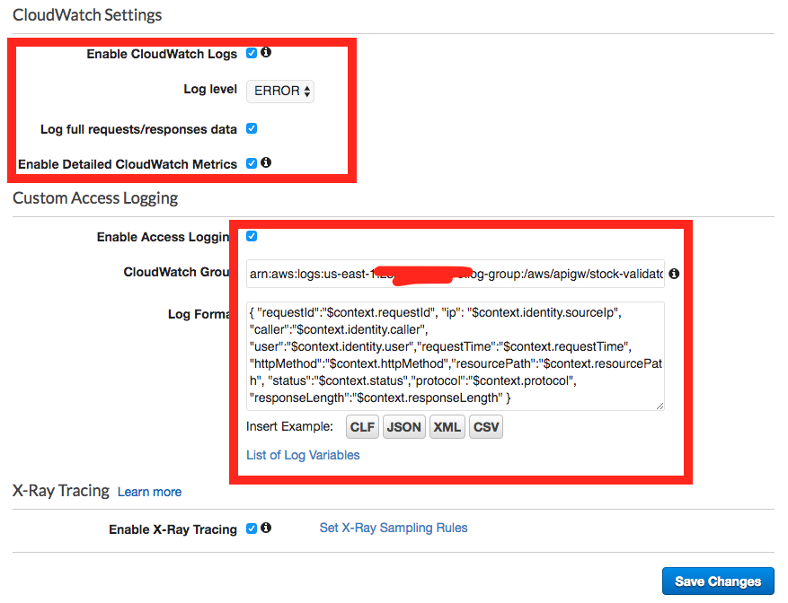

* Test in end point and see the cloudwatch log

[source code](./curl-cmd.txt)

```
curl -v -H "Content-Type: application/json" -X POST -d '[
  {
    "account-id": "abcdef123456",
    "type": "foobar",
    "symbol": "thisstringistoolong",
    "shares": 999999,
    "order-date": "2018-1-2",
    "details": {
       "limit": 1000
    }
  }
]' https://$API_ID.execute-api.us-east-1.amazonaws.com/dev
```

## Customerize the validation error message

If you want to frontend get the validation error message, you can add the validation error message in your repsonse message.

Click on "Gateway Response". Find "Bad Request Body (400)". Change the mapping template as: 

```
{"message":$context.error.messageString,
"error":$context.error.validationErrorString}
```

more informaiton about context you can check the [link](https://docs.aws.amazon.com/apigateway/latest/developerguide/api-gateway-mapping-template-reference.html#context-variable-reference)

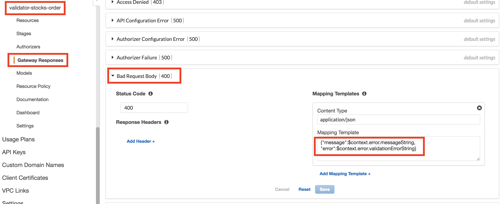

You can use the test client post the following body:

```
[
    {
      "account-id": "abcdef123456sss",
      "type": "WOW",
      "symbol": "AMZN",
      "shares": 10000000,
      "order-date": "2018-01-28",
      "details": {
        "limit": 1000
      }
    }
]
```

Now, you can see the error message as the following:

```
{"message": "Invalid request body", "error":[instance value (\"WOW\")
 not found in enum (possible values: [\"STOCK\",\"BOND\",\"CASH\"]), 
 numeric instance is greater than the required maximum (maximum: 1000,
  found: 10000000)]}
```

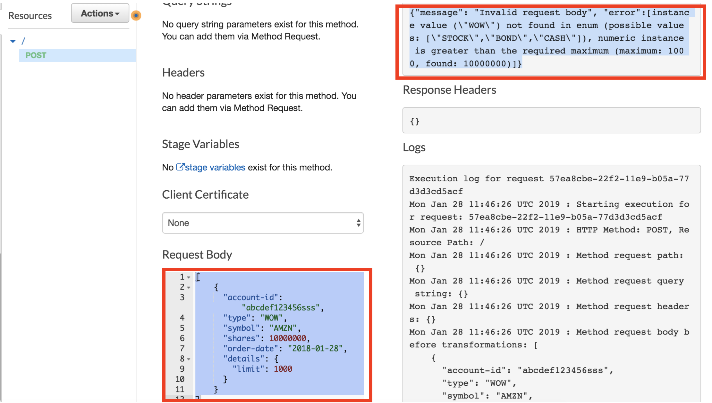

## (Optional) Log the invalidate body information to cloudwatch log

Click on the stage and select tab `log`. Add the `"invalidBody": $context.error.validationErrorString` in the json log format.

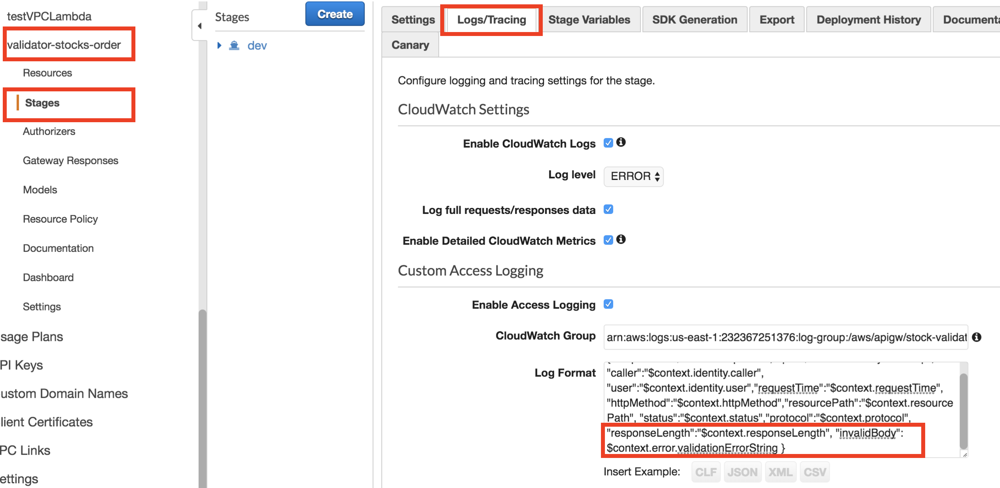

Use the following curl command to hit the dev stage api:

```
curl -v -H "Content-Type: application/json" -X POST -d '[
  {
    "account-id": "abcdef123456",
    "type": "foobar",
    "symbol": "thisstringistoolong",
    "shares": 999999,
    "order-date": "2018-1-2",
    "details": {
       "limit": 1000
    }
  }
]' https://$API_ID.execute-api.us-east-1.amazonaws.com/dev
```

You can get the error message about format error.

```
{"message": "Invalid request body", "error":[ECMA 262 regex \"^\\d{4}\\-(0[1-9]|1[012])\\-(0[1-9]|[12][0-9]|3[01])$\" does not match input string \"2018-1-2\", numeric instance is greater than the required maximum (maximum: 1000, found: 999999), string \"thisstringistoolong\" is too long (length: 19, maximum allowed: 4), instance value (\"foobar\") not found in enum (possible values: [\"STOCK\",\"BOND\",\"CASH\"])]}
```

Later on, you can check in the cloudwatch log to see the invalid body messages:

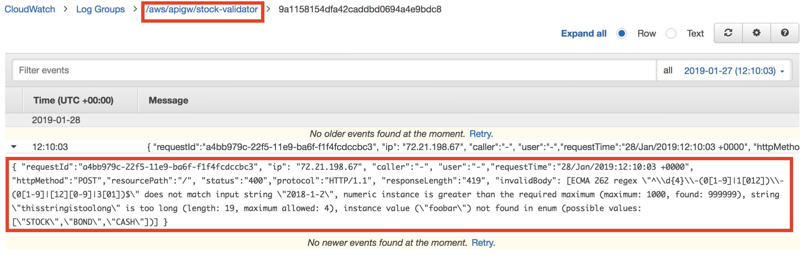

# References
* [How do I associate a model with my API in Amazon API Gateway?](https://aws.amazon.com/premiumsupport/knowledge-center/model-api-gateway/)
* [How to remove boilerplate validation logic in your REST APIs with Amazon API Gateway request validation](https://aws.amazon.com/blogs/compute/how-to-remove-boilerplate-validation-logic-in-your-rest-apis-with-amazon-api-gateway-request-validation/)
* [Understanding JSON Schema](https://json-schema.org/understanding-json-schema/about.html)
* [JSON Schema Step by Step](http://json-schema.org/learn/getting-started-step-by-step.html)