# Enable APIGW CloudWatch Logs

In this article, you will learn how to setup the API logs and Cloudwatch group.

## General Setting for Admin

* Enable Settings

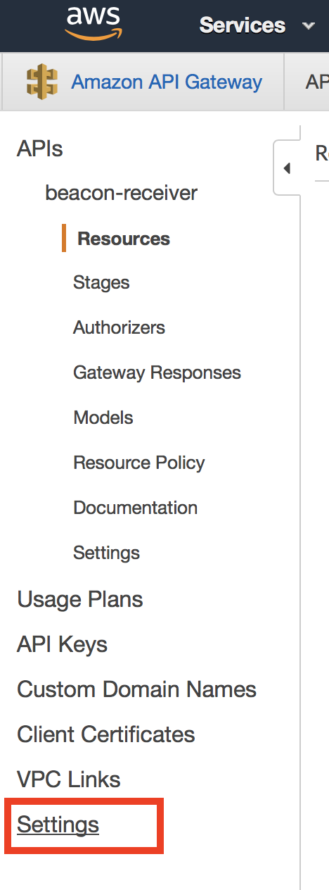

* input cloudwatch log arn. Reference the setting documents [link](https://docs.aws.amazon.com/apigateway/latest/developerguide/set-up-logging.html#set-up-access-logging-permissions)

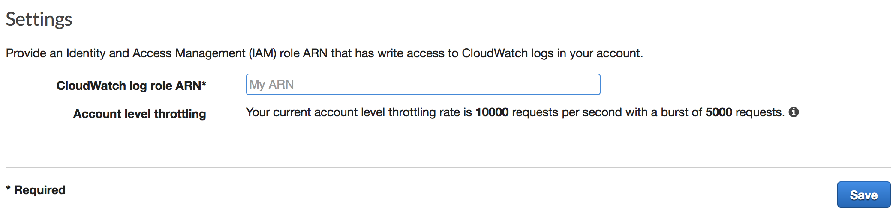

* open IAM in the new tab. Create new role.

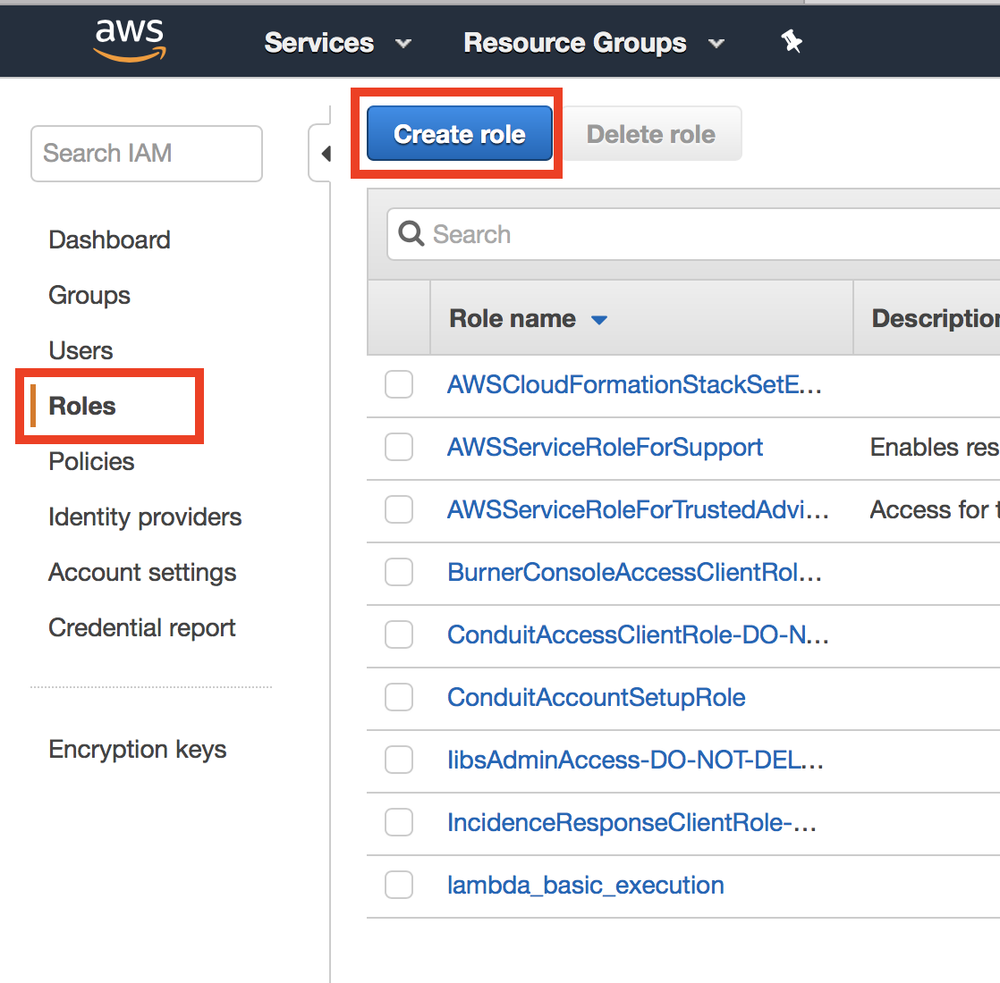

* click on the service 'api gateway'

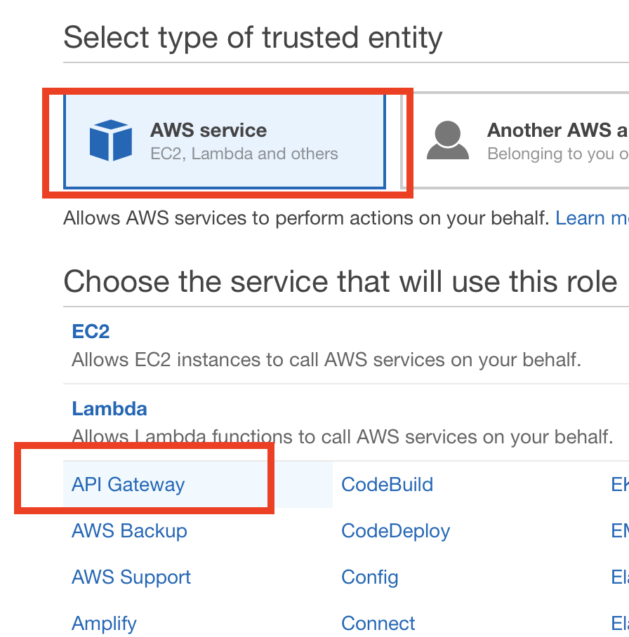

* use default list policy

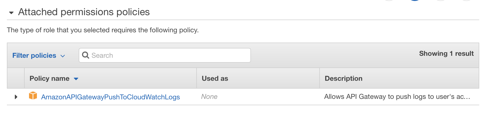

* add tag name with value `AmazonAPIGatewayPushToCloudWatchLogs`

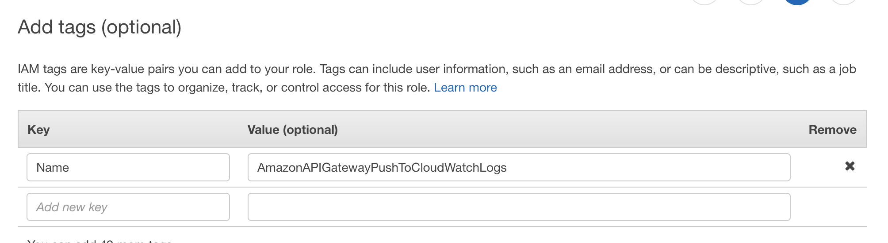

* Role name `AmazonAPIGatewayPushToCloudWatchLogs` then create role.

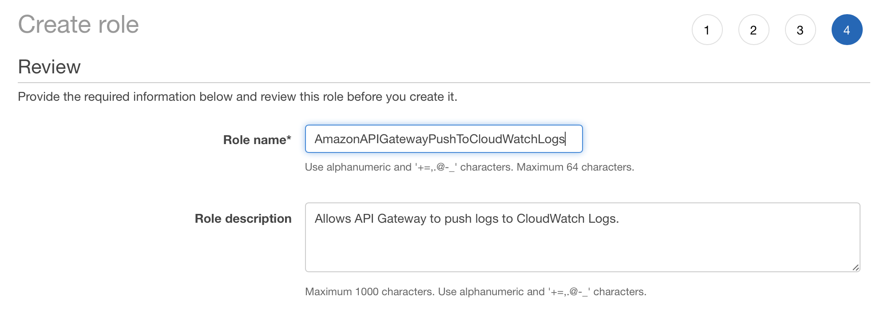

* Copy role name arn and input into the api gateway settings.

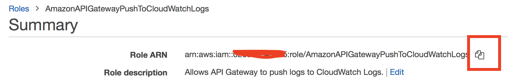

## Create a cloud watch group

* In the cloudwatch console, create the log group

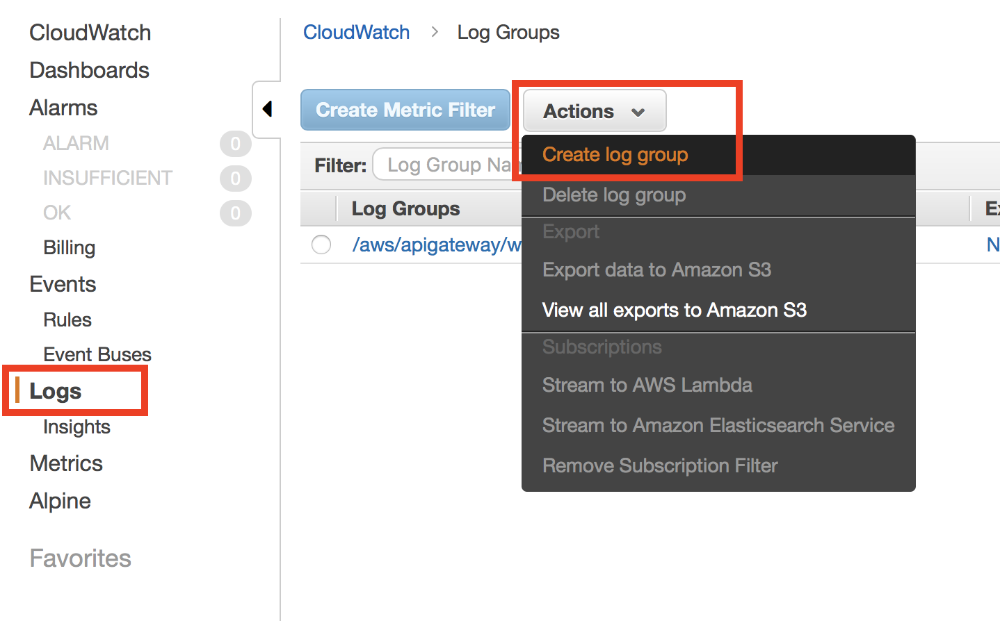

* Input log group name `/aws/apigw/beacon`

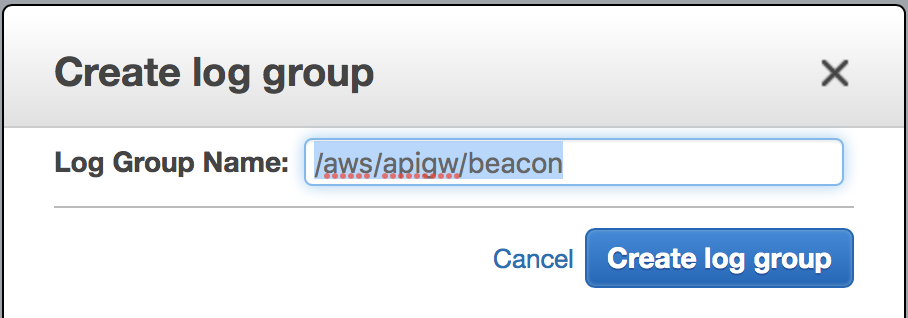

* Click on the setting and turn on the arn field

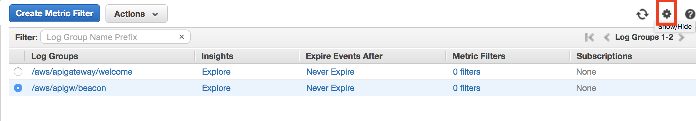
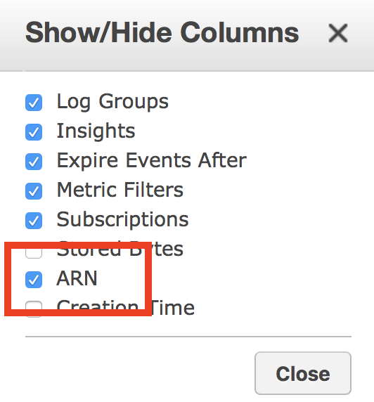