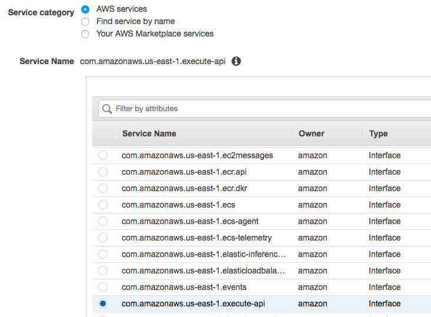
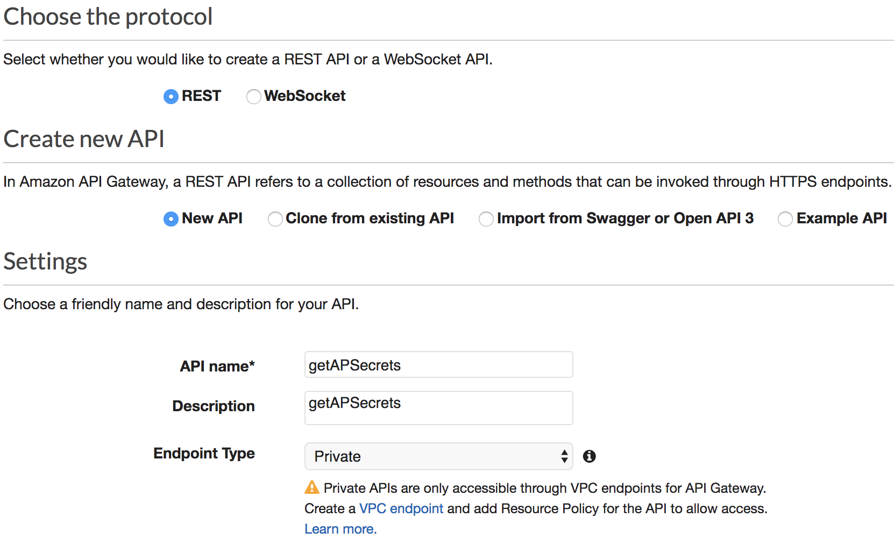
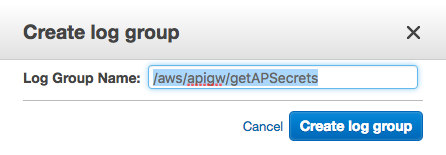
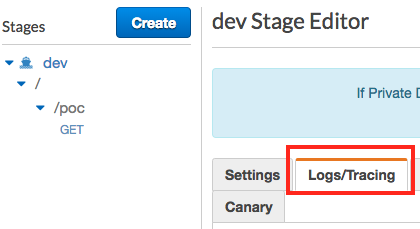
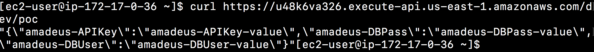
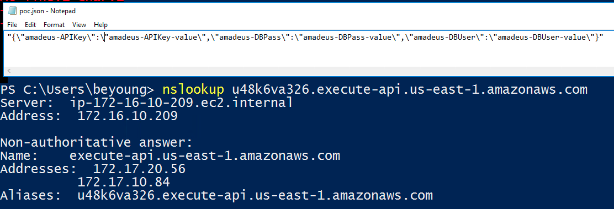

# Private API Gateway

## Part 1: Create a security group for VPC endpoints

* Name: apigw-private-endpoints-172.17.0.0
* Ingress: https, CIDR for your vpc and vpn such as 172.17.0.0/16 and 172.16.0.0/16
* Outgress: all traffic to 0.0.0.0/0


## Part 2: VPC endpoints
1. In VPC console, create endpoint for API Gateway. i.e `execute-api`
2. select private subnets
3. Use `apigw-private-endpoints-172.17.0.0` security group.




## Part 3: Create API

1. create new api
   
   
   
2. create resource poc, get method and integrate with lambda
   
   
   
   
3. In the reouces, test the method can invoke lambda function.

   
   
3. Actions: deploy api to the new stage dev.

     
      
## Part 4: Setup Resource Policy

1. Click on the resource policy, then source IP Range.

   

2. This example resource policy specifies a source VPC endpoint. notes: change the sourceVpc**e**. Save and redeploy your api.

```
{
    "Version": "2012-10-17",
    "Statement": [
        {
            "Effect": "Allow",
            "Principal": "*",
            "Action": "execute-api:Invoke",
            "Resource": "arn:aws:execute-api:us-east-1:<aws-account-id>:u48k6va326/dev/*/*",
            "Condition": {
                "StringEquals": {
                    "aws:sourceVpce": "vpce-028e39e5987346edf"
                }
            }
        }
    ]
}
```

## Part 5: Enable API logs and trace

### Create cloudwatch log group
1. Go to cloudwatch log console.
2. Click on Logs in the left navigation
3. In the actions, click on create log group
4. Input log group name and then create.
5. Click on the right corner setting. Show ARN. Copy the log group ARN. The format is like `arn:aws:logs:us-east-1:<aws-account-id>:log-group:/aws/apigw/getAPSecrets` 




### Enable dev stage log and tracing
1. In the api gateway console, click on the stages in the navigation. Then click on the log/tracing tab.

	

2. Turn on the cloudwatch settings
3. Setup the custom access loggin. Paste cloudwatch ARN in the previous step. **notes: remove the `:*`** at the end.
4. Log Format use JSOn.
5. Turn on X-Ray Tracing.

	

## Part 6: Test your Private API endpoint.
1. Login to your basion machine. Curl your api endpoint.
2. Login to your machine at corp. Curl your api endpoint.

	

	

	

3. See the code trace in the X-Ray Service Map

	


## Reference
* Private API for AWS blog [link](https://aws.amazon.com/blogs/compute/introducing-amazon-api-gateway-private-endpoints/)