# Steps
1. Create github organization
2. Create api gateway with labmda to get the webhook payload
3. Create webhook in the github organization [link](https://developer.github.com/webhooks/creating/). Content type use `application/json`

# Part1: GitHub Personal Access Tokens
1. Create personal access tokens
	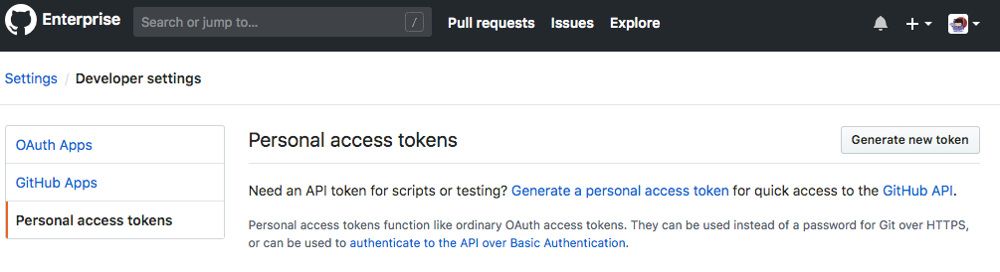
2. Give token name and select the token scope
	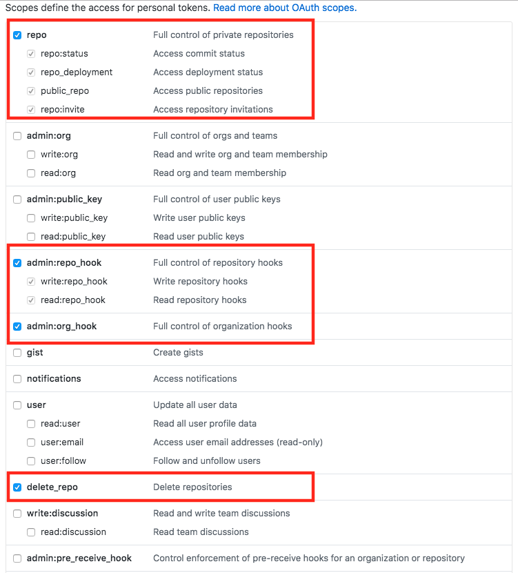
3. Copy the personal key and keep it in secrete place.
	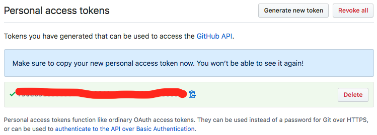
4. Now, you have a personal access tokens
	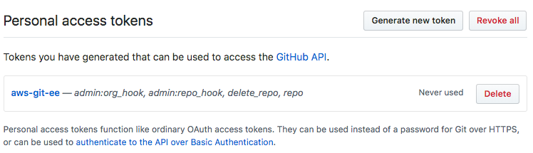
	
# Part2: Create Organizations
1. In personal setting, click on organization.
	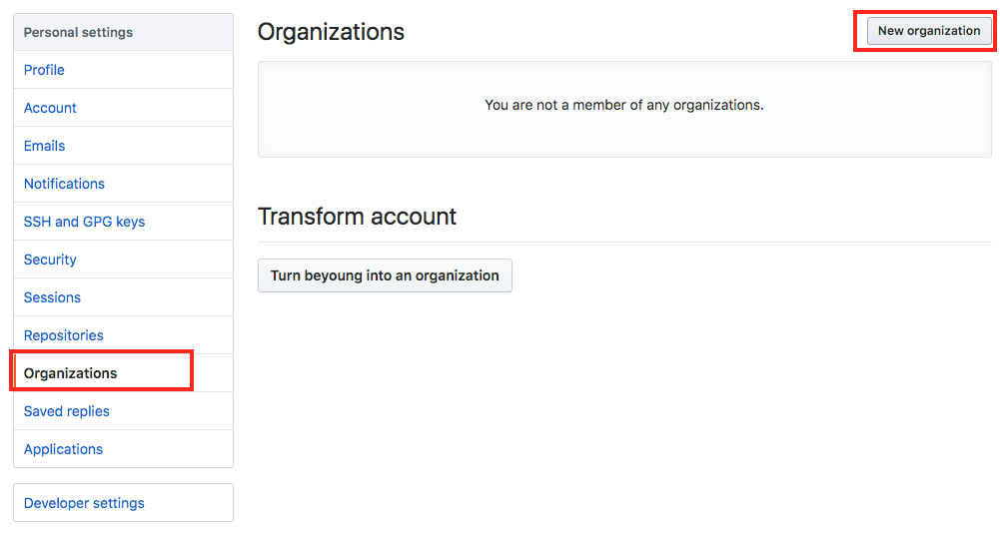
2. Create Organization
	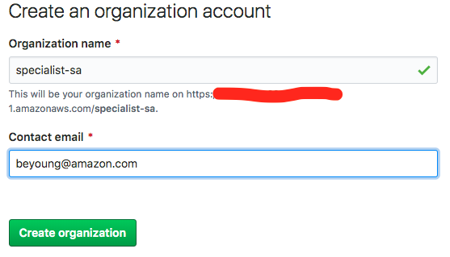

# Part3: Save Creditial in AWS Secrets Manager
1. In AWS Secrets Manager, create new secret
	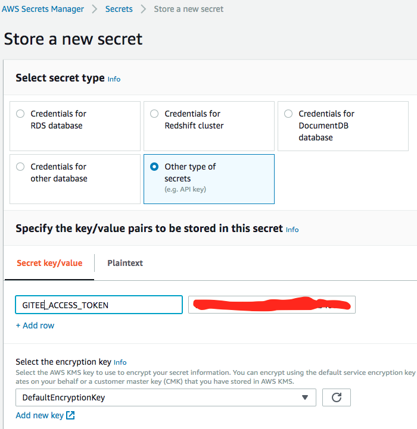
2. Give secret name
	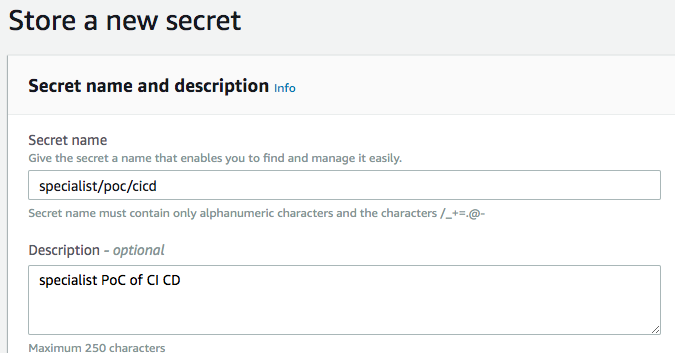
3. Save the secrets
	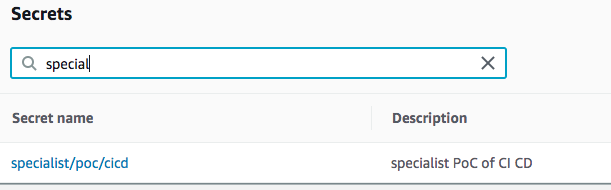

	
# Part4: Create a webhook endpoint in AWS
1. In AWS Cloud9, click on right tab AWS resources. Then Add Lambda.
	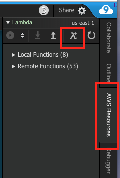
2. Application Name: `aws-gitee-webhook`, Function Name: `repoWebhook`
	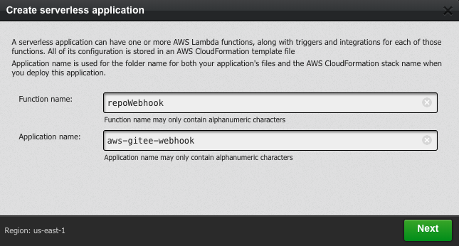
3. Use api-gateway-hello-world node.js tempalte
	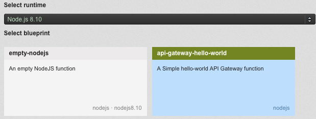
4. Add api gateway trigger
	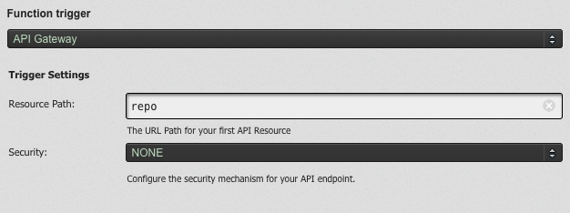
5. Add lambda execution role
	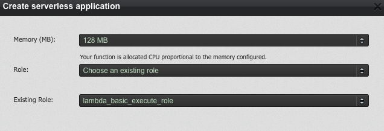
6. Install [aws git secrets](https://github.com/awslabs/git-secrets) for the folder
7. The sample code is [here](https://github.com/imyoungyang/aws-gitee-webhook/tree/master/repoWebhook)
8. The SAM template file is [here](https://github.com/imyoungyang/aws-gitee-webhook/blob/master/template.yaml)
9. After that, deploy your code to AWS APIGateway and Lambda
	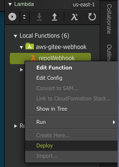
1. Get the webhook endpoint in the lambda console
	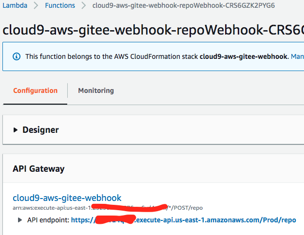

# Part5: Verify the webhook
1. In github EE organization setting pages, click on Add webhook
	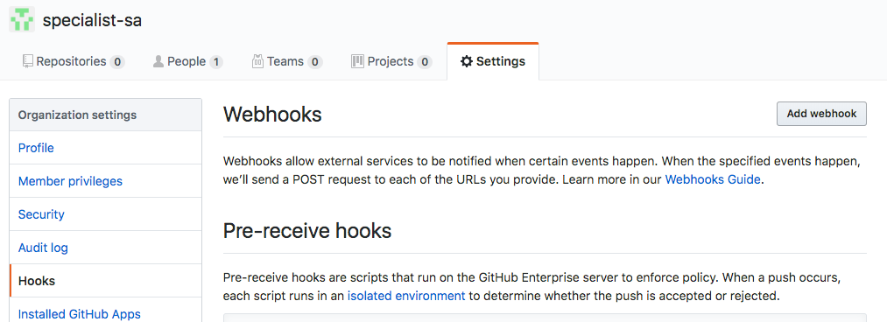
2. Config the webhook. content type: `application/json` and put your personal access token in Secret. And, send me everything.
	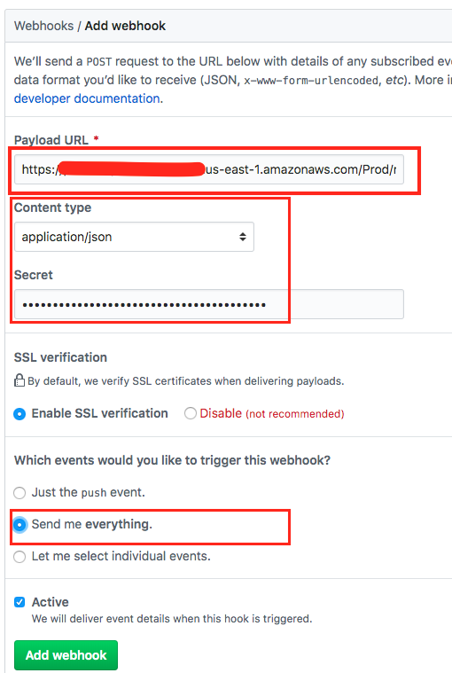
3. After you save, GitHub EE will call your webhook endpoint. You can see the log in your lambda cloudwatch.
	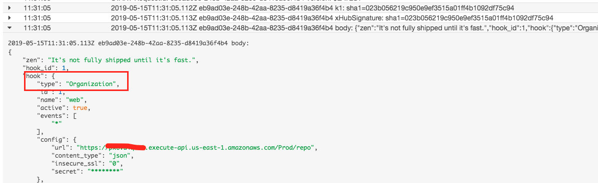
4. Create a new repository in the orginzation. You will get the repo create webhook event.
	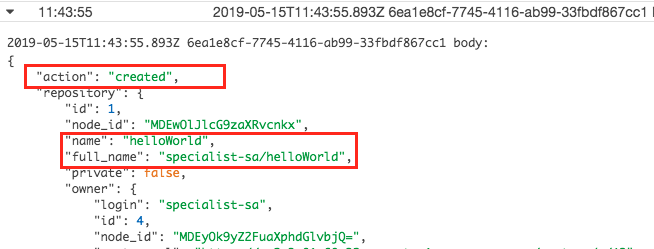

# Codebuild or CodePipeline

## CodeBuild
AWS CodeBuild is a fully managed **continuous integration** service that compiles source code, runs tests, and **produces software packages that are ready to deploy**.

## CodePipeline
AWS CodePipeline is a **continuous delivery** service you can use to model, visualize, and automate the steps required to release your software. The service currently supports GitHub (github.com), AWS CodeCommit, and Amazon S3 as source providers. CodePipeline integrates continuous integration and continuous delivery services, making it simple to automatically deploy your updated application.

**Important**: Code pipeline source did not support customized GitHub address ie. enterprise GitHub.

# Git Authentication

Which remote URL should I use? HTTPS or SSH [link](https://help.github.com/en/articles/which-remote-url-should-i-use)


## Personal access token (HTTPS)
A personal access token is required to authenticate to GitHub in the following situations:

* When you're using two-factor authentication
* To access protected content in an organization that uses SAML single sign-on (SSO). Tokens used with organizations that use SAML SSO must be authorized.

Create a personal access token step by step is [here](https://help.github.com/en/articles/creating-a-personal-access-token-for-the-command-line)

**important**
	
Personal access tokens can only be used for **HTTPS Git operations**. If your repository uses an SSH remote URL, you will need to switch the remote from SSH to HTTPS. The step is [here](https://help.github.com/en/articles/changing-a-remotes-url#switching-remote-urls-from-ssh-to-https)

## Git ssh
SSH URLs provide access to a Git repository via SSH, a secure protocol. To use these URLs, you must generate an SSH keypair on your computer and add the public key to your GitHub account. For information on setting up an SSH keypair, see [Generating an SSH key](https://help.github.com/en/articles/connecting-to-github-with-ssh) or [here](https://build-me-the-docs-please.readthedocs.io/en/latest/Using_Git/SetUpSSHForGit.html)


# Lambda handle git, aws-cli, and ssh
* [Lambda runtime environment](https://docs.aws.amazon.com/lambda/latest/dg/lambda-runtimes.html) does not have git command.
* [Running git in lambda function](https://cloudbriefly.com/post/running-git-in-aws-lambda/)
* Use the [sh.git()](https://amoffat.github.io/sh/index.html#subcommands) in python is the easy way. Can reference [stockoverflow](https://stackoverflow.com/questions/1456269/python-git-module-experiences)
* git ssh lambda layer [here](https://github.com/lambci/git-lambda-layer)
* aws-cli lambda layer [here](https://github.com/aws-samples/aws-lambda-layer-awscli)
* gitPullS3-lambda [here](./others/gitPullS3-lambda.zip)

# Git flow
* [Implementing gitflow using codepipeline, codecommit, codebuild and codedeploy](https://aws.amazon.com/blogs/devops/implementing-gitflow-using-aws-codepipeline-aws-codecommit-aws-codebuild-and-aws-codedeploy/)

# CDK
* [CDK Developer Guide](https://docs.aws.amazon.com/cdk/api/latest/)
* [CDK APP Delivery](https://github.com/awslabs/aws-cdk/tree/master/packages/%40aws-cdk/app-delivery)
* [CDK Codebuild soure github enterprise](https://awslabs.github.io/aws-cdk/refs/_aws-cdk_aws-codebuild.html#githubsource-and-githubenterprisesource)
* [CDK connect github with personal token](https://github.com/awslabs/aws-cdk/issues/1844)
* [Codebuild create webhook](https://docs.aws.amazon.com/codebuild/latest/APIReference/API_CreateWebhook.html) and cli [command line](https://docs.aws.amazon.com/cli/latest/reference/codebuild/create-webhook.html)

# Git Webhook
* [Create webhook via console](https://developer.github.com/webhooks/creating/)
* [Create webhook via API](https://developer.github.com/v3/repos/hooks/#create-a-hook)
* 1st setup the webhook in Org or repo. It will trigger [ping event](https://developer.github.com/webhooks/#ping-event). The sample payload is [here](./others/1st-create-webhook-ping-event-payload.json)
* 1st create the repo. Git will trigger [create event](https://developer.github.com/v3/activity/events/types/#createevent). The sample payload is [here](./others/1st-create-repo-payload.json)

## Authetication of webhook api
* Must read github [developer guide](https://developer.github.com/v3/#authentication)
* When you get `404 Not Found` or body with `"message": "Not Found"`, it means the api need authetication.
* Suggestion use `OAuth2 token` in the header. Such as 

	```
	curl -H "Authorization: token OAUTH-TOKEN" https://api.github.com
	```
	
* Create authrization token [here](https://developer.github.com/v3/oauth_authorizations/#create-a-new-authorization). The easy way is use personal access tokens in the console [here](https://help.github.com/en/articles/creating-a-personal-access-token-for-the-command-line#creating-a-token)
	

# Run CDK in AWS Lambda
* Check out this [repo](https://github.com/imyoungyang/cdk-app). It is the full CDK in AWS lambda to build a code build.
* node.js runtime require >= 8.12.0. Use [customer runtime](https://github.com/lambci/node-custom-lambda)
* create package.json then install cdk in your code folder.
* ref: [cdk javascript example](https://github.com/aws-samples/aws-cdk-changelogs-demo)

# Run Code Build in local
* [local build support in AWS CodeBuild - blog](https://aws.amazon.com/blogs/devops/announcing-local-build-support-for-aws-codebuild/)

# Reference
* [Integrating Git with AWS CodePipeline]
(https://aws.amazon.com/blogs/devops/integrating-git-with-aws-codepipeline/)
* [git to s3 using webhooks]
(https://aws.amazon.com/quickstart/architecture/git-to-s3-using-webhooks/)
* [AWS CodeBuild Support for GitHub Enterprise as a Source Type and Shallow Cloning]
(https://aws.amazon.com/blogs/devops/codebuild-support-for-github-enterprise/)
* [Git enterprise on AWS](https://aws.amazon.com/quickstart/architecture/github-enterprise/)
* [Serverless CI/CD for enterprises](https://aws.amazon.com/quickstart/architecture/serverless-cicd-for-enterprise/), which follow AWS multi-account best practices for isolation of resources.
* [Git personal access token for command line](https://help.github.com/en/articles/creating-a-personal-access-token-for-the-command-line)
* [Lambda GitPulltoS3](http://aws-quickstart.s3.amazonaws.com/quickstart-git2s3/functions/packages/GitPullS3/lambda.zip)
* [Access s3 bucket url](https://docs.aws.amazon.com/AmazonS3/latest/dev/UsingBucket.html#access-bucket-intro)
* [TypeScript HandBook](https://www.typescriptlang.org/docs/handbook/basic-types.html)