# CloudWatch Logs

# CloudWatch Logs Insigts - Lambda
Use lambda as the example. You can select any prefix `/aws/lambda/` to check the lambda logs. You can reference the lambda code [here](https://github.com/imyoungyang/myAWSStudyBlog/blob/master/api-gw/echo-request.py) which to get the request user name.

## Get recently messages
```
fields @timestamp, @message
| sort @timestamp desc
| limit 25
```
You will see the following graph and you can expand the field to see the detail message.

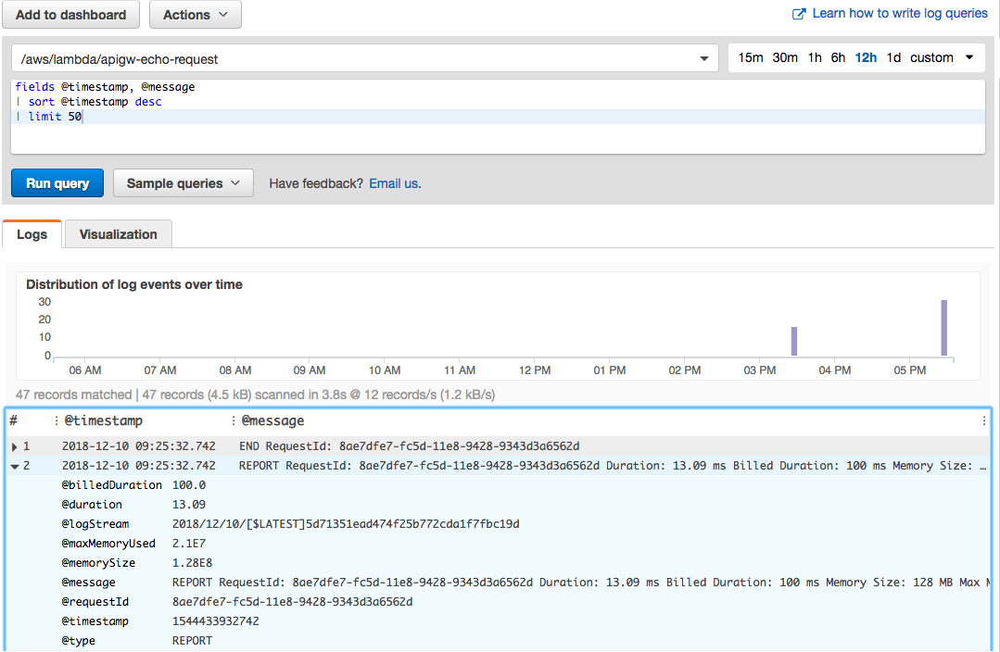

You will see the lambda code life cycle:

* START RequestId
* REPORT RequestId
* END RequestId

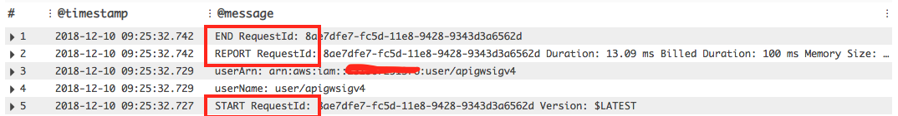

Any print information from your lambda code will become the messages. If you have time, you can check the "Loading function" message. It is related to the lambda global environment initilzaiton.

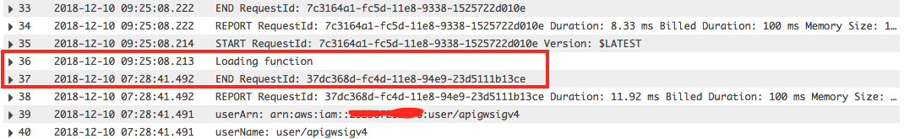

## Lambda fields

In the right panel, you can see the fields related to the lambda logs:

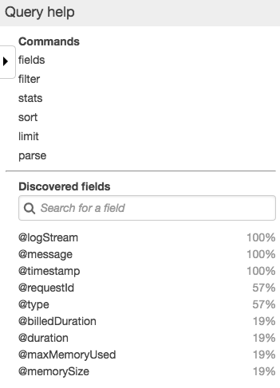

## Filter messages
### parse message
You can use the `parse` command to filter out the message such as error, user name, and etc. And, it becomes a new field.

```
fields @timestamp, @message |
parse @message "userName: user/*" as @userName
```

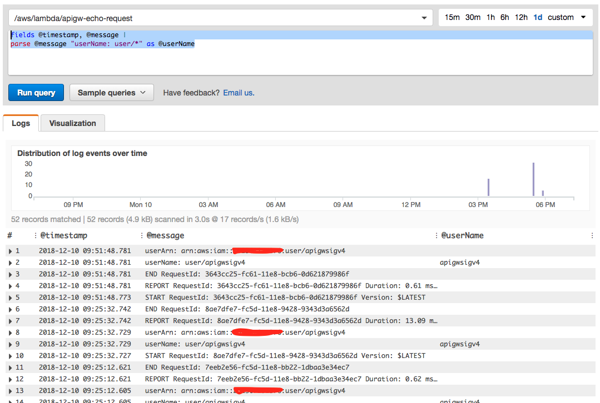

### When to use Parse

	
Extracts data from a log field, creating one or more **ephemeral fields** that you can process further in the query.

example:

```
parse @message "user=*, method:*, latency := *" 
as @user, @method, @latency
| stats avg(@latency) by @method, @user
```
extracts the ephemeral fields @user, @method, and @latency from the log field @message and returns the average latency for each unique combination of @method and @user.


### filter message

Filters the results of a query based on one or more conditions. You can use comparison operators (=, !=, <, <=, >, >=), Boolean operators (and, or, and not) and regular expressions.

```
fields @timestamp, @message |
filter @message like /userName:/ 
```
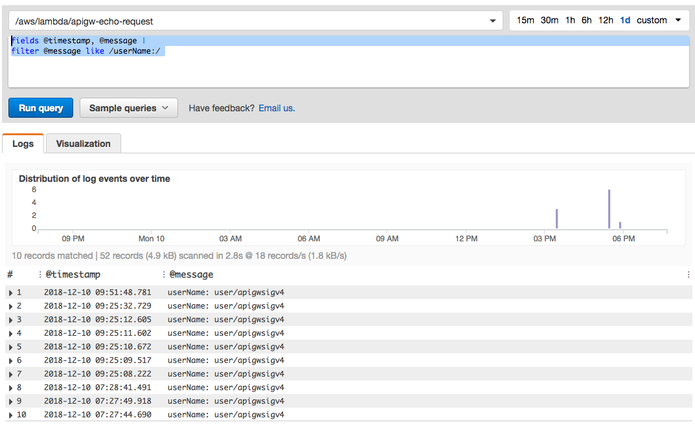

#### Regular Expressions in the Filter Command

like or =~ (equal sign followed by a tilde) in the filter query command to filter by substrings or regular expressions.

for examples:

```
fields f1, f2, f3 | filter f1 like /(?i)Exception/ 
```

returns all events in which f1 contains the word Exception. The query is not case-sensitive.


### Aggregate functions

Calculates aggregate statistics based on the values of log fields. Several statistical operators are supported, including sum(), avg(), count(), ,min(), and max().

for examples:

`filter @message like /userArn:/ | stats count(*)`

# CloudWatch Logs Metric Filter - Customer Metric

You can create custom metric and based on the custom metrics to trigger actions such as another lambda and alerts.

## Create Metric Filter
1. Go to cloudwatch logs
2. Select a log groups for example "aws/lambda/apigw-echo-request"
3. Click on "Create Metric Filter"


## Define Metric Filter
1. Filter Pattern: "userName:", which it will filter out events containing the phrase.
2. Select a log data to test
3. Check the result.
4. Click on "Assign Metric"

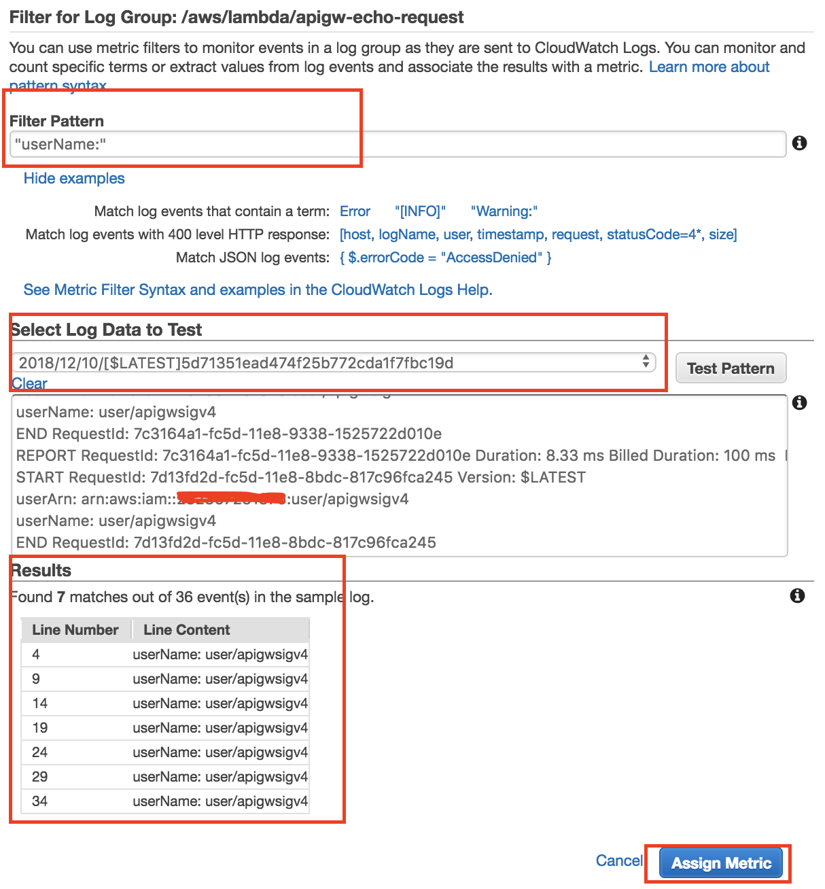

## Assign Metric

1. create or select Metric Namespace: `logMetricAPIGWEchoRequest`
2. Metric Name: `userName`
3. click `Create Filter`

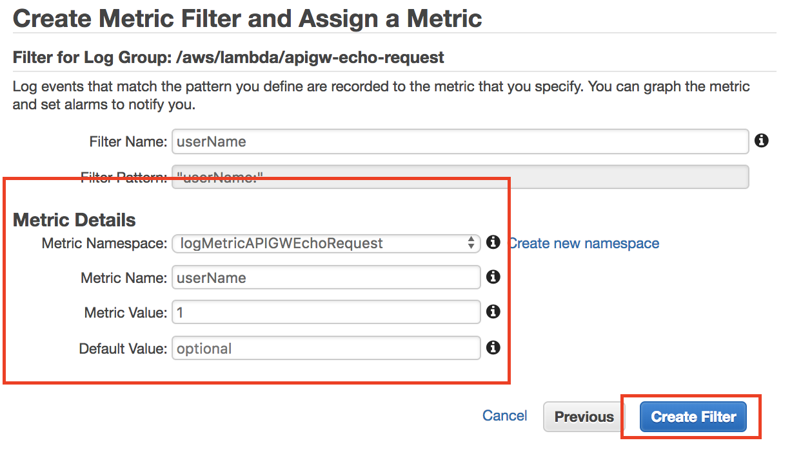

## Create Alarm

You will see the Metric created. If you want to create Alarm, you can click on the `Create Alarm`

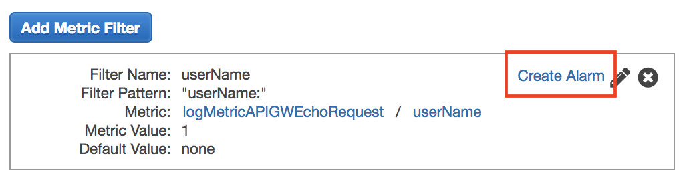

In the alarm setting screen, you can define count threadhold as the following screen. In the actions, you can select existing notificaton or create a new one.

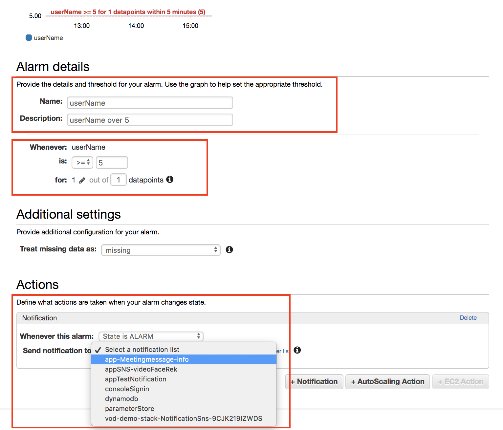

## Dashboard for custom metrics

1. Go to CloudWatch Metrics, select custom metrics.

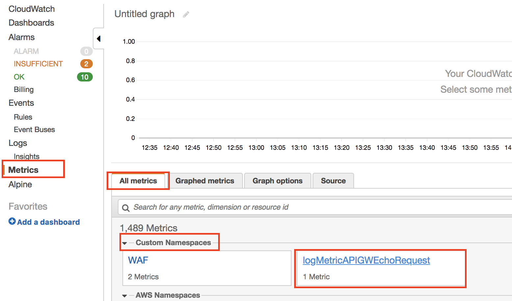

2. select the "userName" Metrics
3. switch tab "graphed metrics" and change to sum.

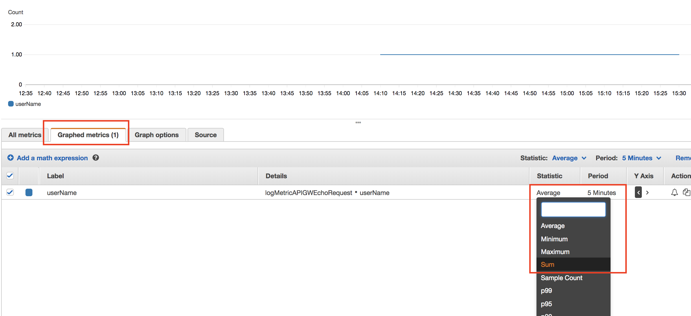

You will see the count for this metric.

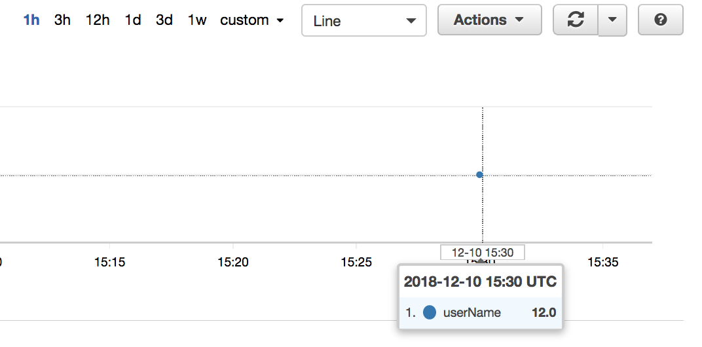

Because the metrics 12 is over 5, it will trigger notification and send the email to my account.

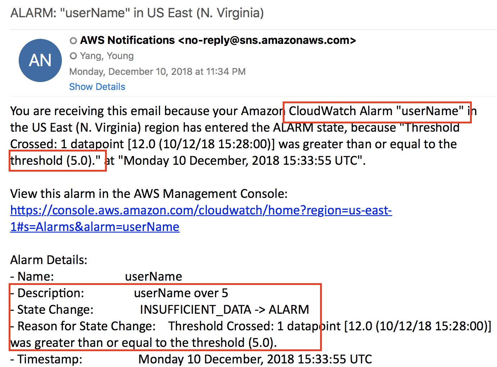

# Reference
* [CloudWatch Logs Insights](https://docs.aws.amazon.com/AmazonCloudWatch/latest/logs/AnalyzingLogData.html)
* [Searching and Filtering Log Data](https://docs.aws.amazon.com/AmazonCloudWatch/latest/logs/MonitoringLogData.html)
* [Creating Metric Filters Example](https://docs.aws.amazon.com/AmazonCloudWatch/latest/logs/MonitoringPolicyExamples.html)