# CloudWatch Log Insights - Beacon Sample

I wrote a step by step workshop to demo cloudwatch log insights, which is the new launch in re:Invent 2018. This workshop contains telemetric simulator + apigw + lambda + cloudwatch log inisghts and x-ray. It will be helpful to quickly understand the power of cloudwatch insights. The benefit to customers is you don't need to setup Elastic Search + Kibana to create simple dashboard.

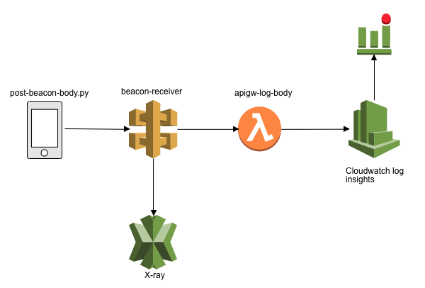

## Log beacon lambda function
This lambda function will log the beacon body into the lambda cloudwatch log. The souce code is [here](./apigw-log-body.py). 

### Create a lambda function
* function name: apigw-log-body
* runtime: python 3.7
* paste the [source code](./apigw-log-body.py) into editor. It's a very simple code. 7 lines!!

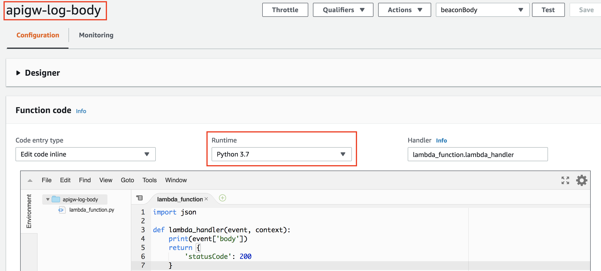

### Publish lambda function

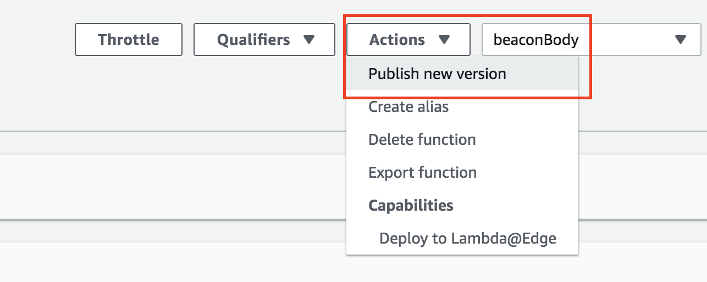

## API Gateway to collect beacon
Let us create a api gateway endpoint to collect client beacon information and pass through lamdba. API name is `beacon-receiver`.

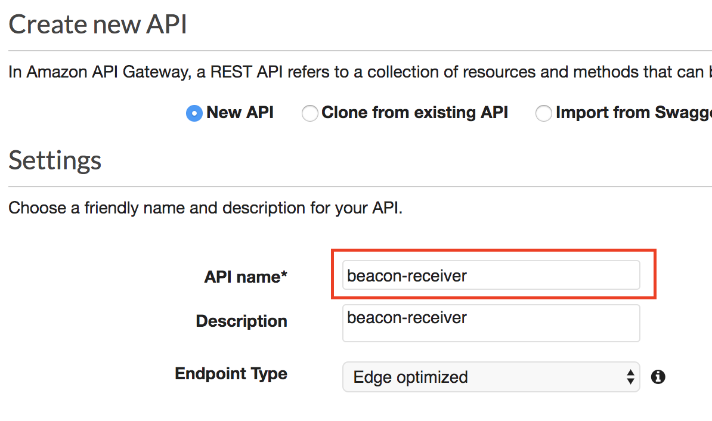

### Create resources and method

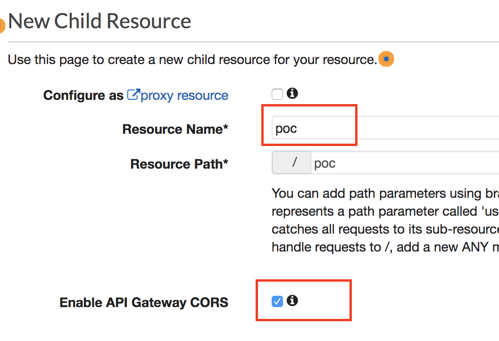

### Trigger lamdba

* Set the method `post` and proxy mode to lambda `apigw-log-body`


### Deploy API Gateway

* deploy the api gateway to stage `dev`

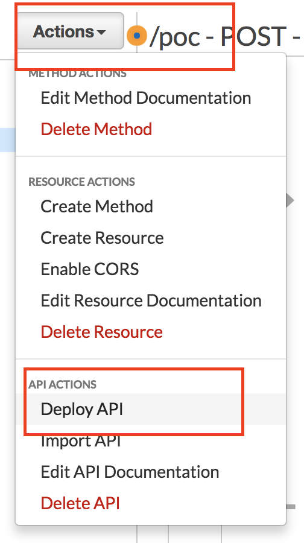

### Turn on the API Gateway log

* After deploy to `dev`. We need to setup the monitor log. Click on stage `dev` then click on the tab `logs/Tracing`

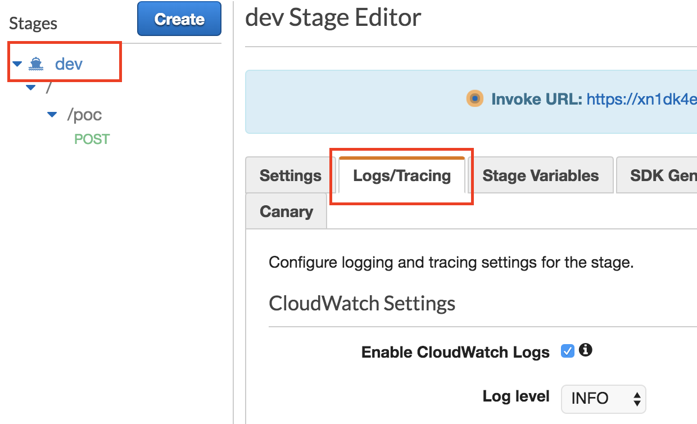 

#### Import! setup the detail log

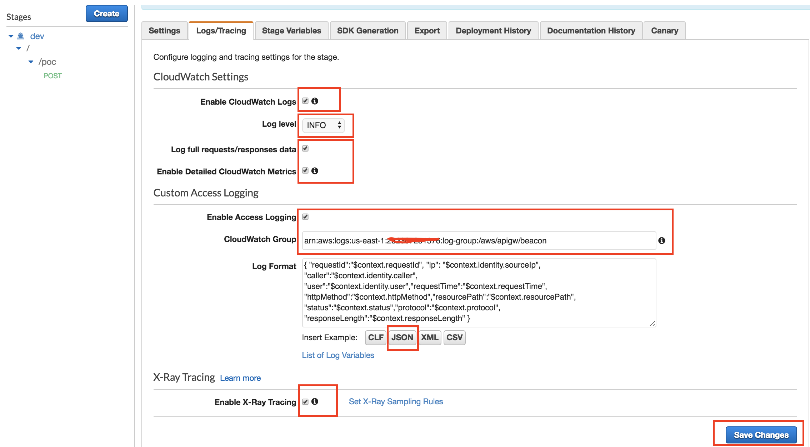 

* Enable CloudWatch Logs and set level to INFO. You can change to ERROR anytime.
* Enable Access Logging. Create a log group `/aws/apigw/beacon` in cloud watch log. The arn format is `arn:aws:logs:us-east-1:123456789012:log-group:my-log-group`

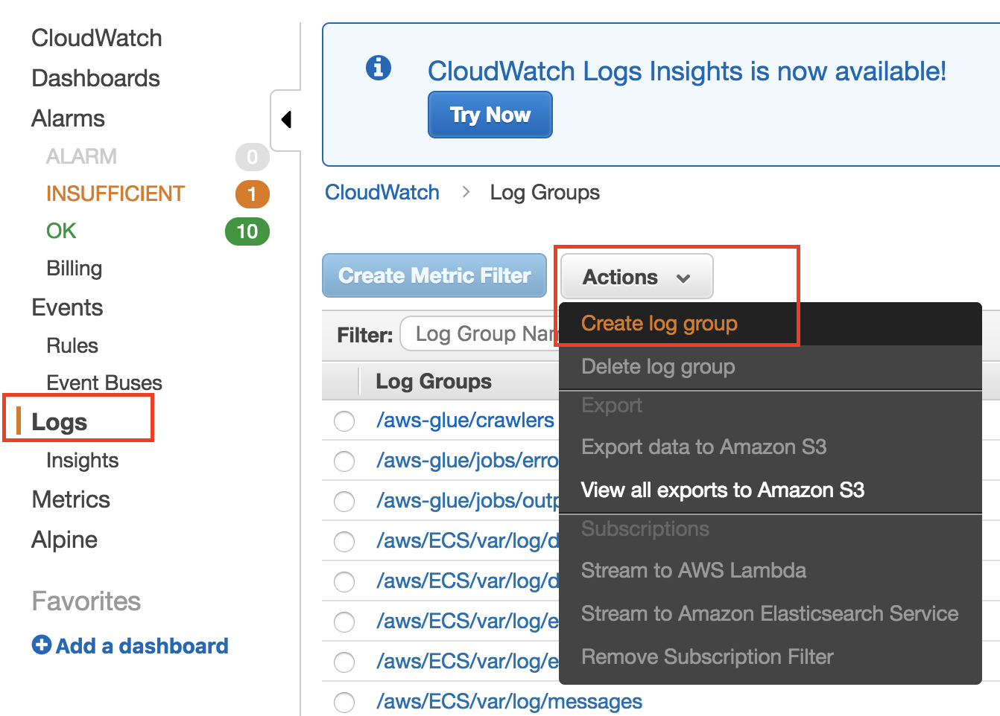 

* Logformat use `json`
* Enable X-Ray Tracing

## Mock beacon client

Use the mock client to send out the beacon.
The beacon information is like this kind of format:

```
{
    "custom_metric_float_value": "9.92114586405",
    "clientid": "user369",
    "page": "page_20.html",
    "custom_metric_name": "compute_render_time",
    "Referer": "referer_18",
    "event": "exception"
}
```

The mock client python code is [here](./post-beacon-body.py). Please use the following command to send out random beacon metrics to your api endpoint. 

Parameters:

* api gateway endpoint
* 1000 mean number of sending
* 0.5 means delay (second)

```
python post-beacon-body.py https://<your-endpoint>.execute-api.us-east-1.amazonaws.com/dev/poc 1000 0.5
```

## CloudWatch logs Insights

### Access Log
group: `/aws/apigw/beacon`
```
fields @timestamp, @message
| sort @timestamp desc
| limit 20
```
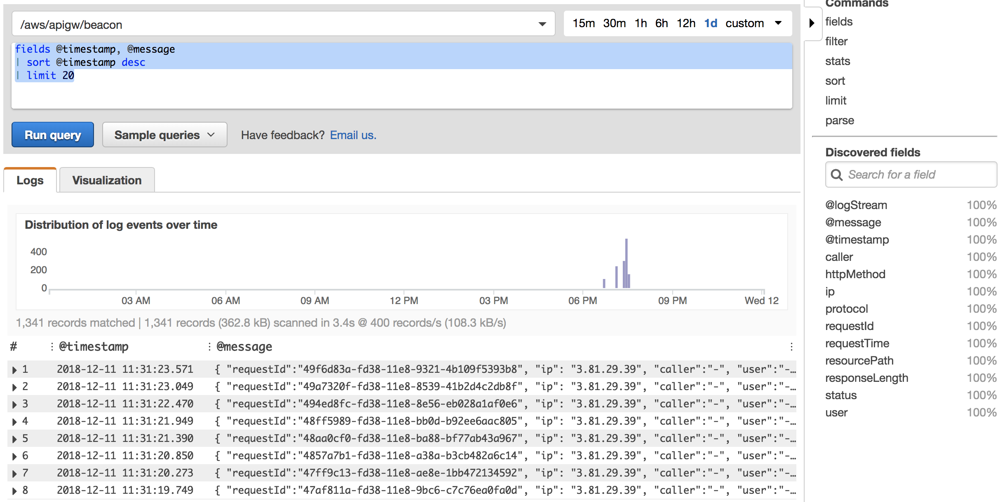 

### Beacon Log
group: `/aws/lambda/apigw-log-body`

```
fields event, page, clientid, Referer, custom_metric_name | filter @message like /event/
| limit 20
```
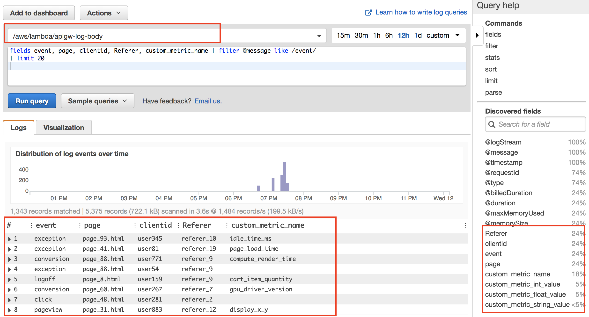 

#### see the viualization report

```
fields event | filter @message like /event/
| stats count(event) by bin(30s)
```
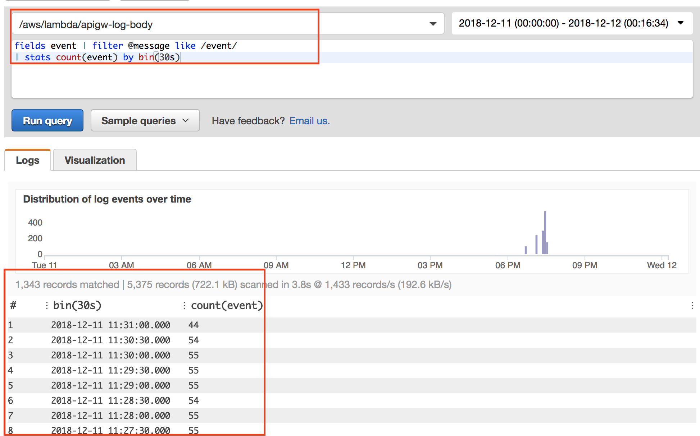 

Click on Visulazation

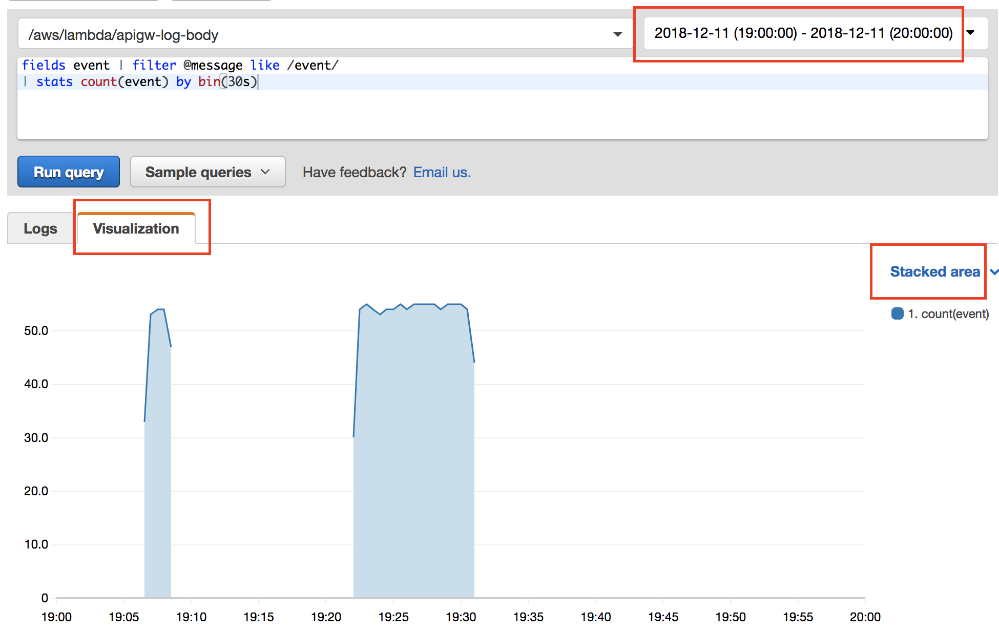 

## X-Ray

### Traces
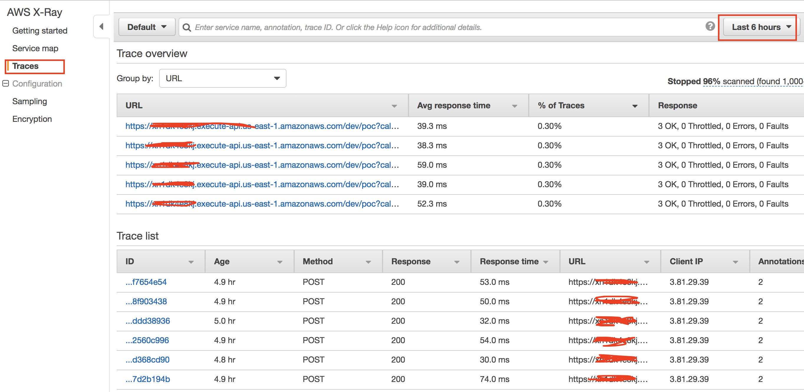 

### Detail trace
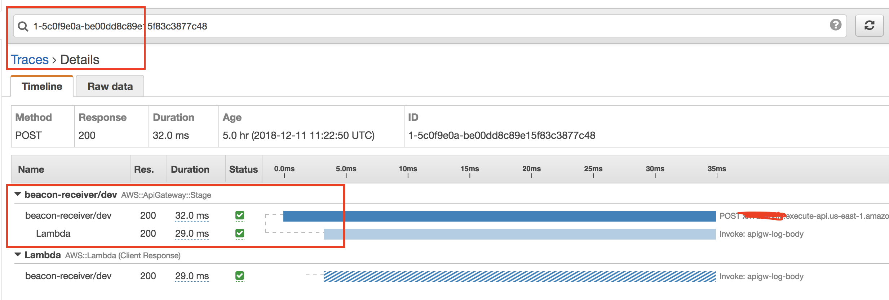 

### Service Map
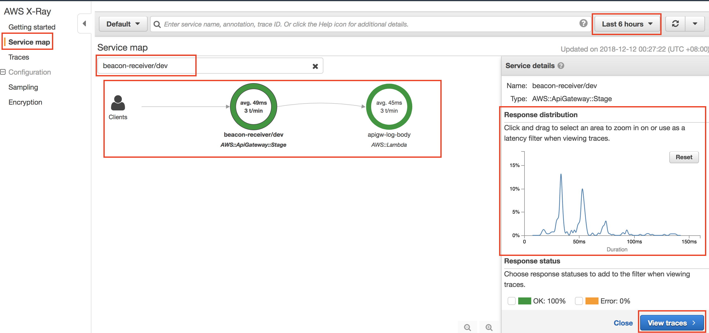 

Click on "View traces". It goes to detail traces to see the slow query

 