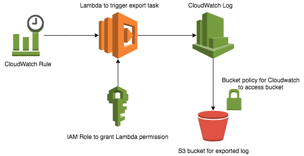
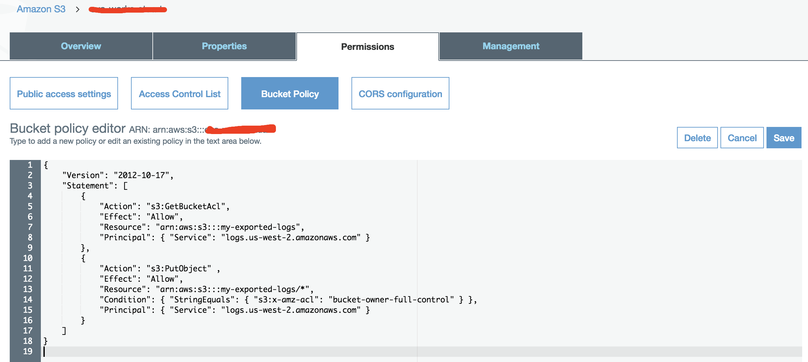
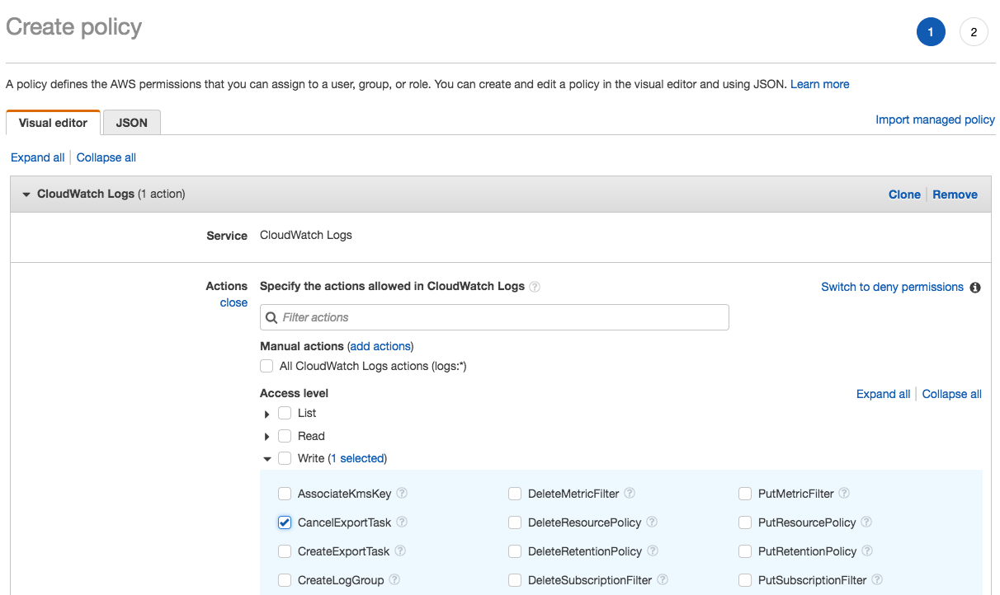
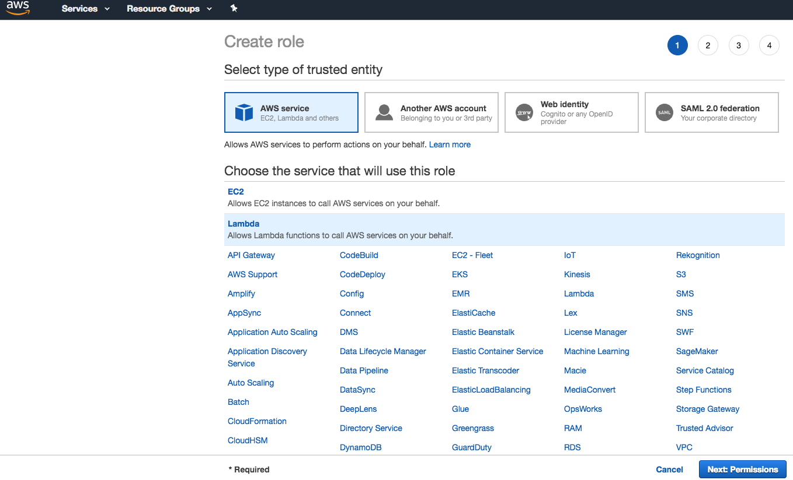
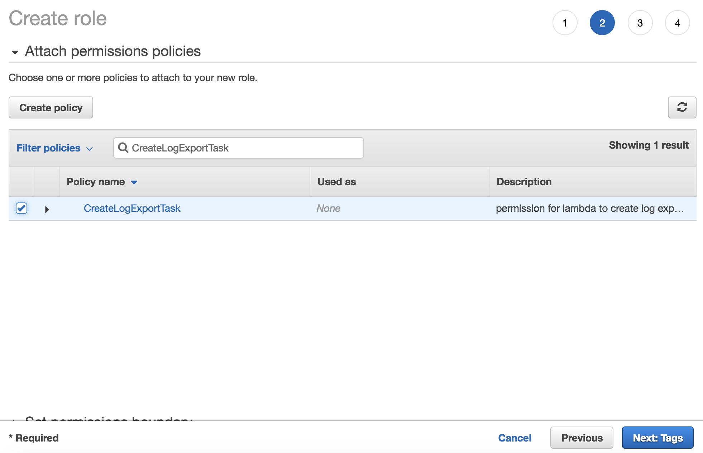
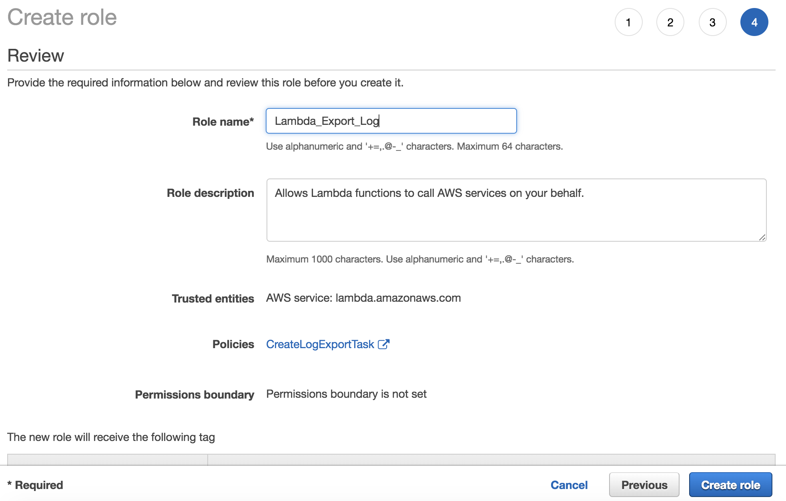
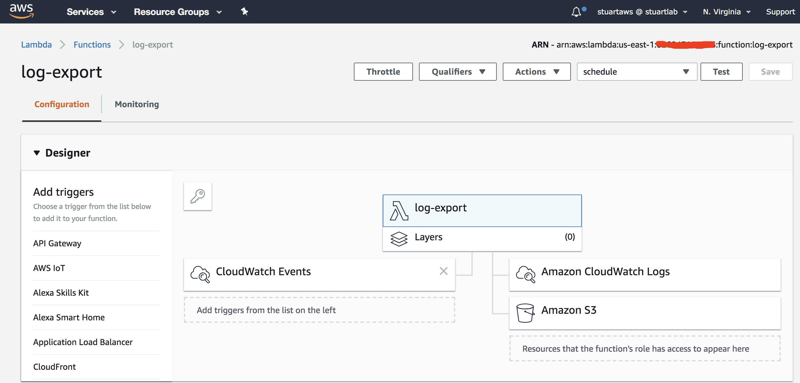
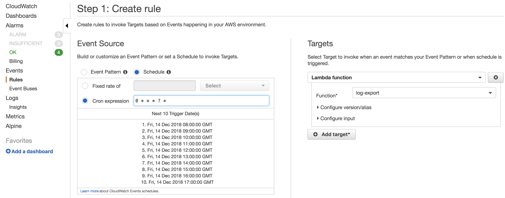
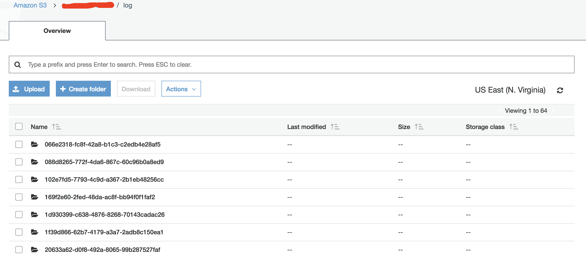

# Export cloudwatch log to S3 automatically

This workshop contains two way to export cloudwatch log to S3.
First one is using AWS Cli, which has detail step-by-step in this [AWS Guide](https://docs.aws.amazon.com/AmazonCloudWatch/latest/logs/S3ExportTasks.html). Another way is using Lambda to create log export task, and this Lambda can then be triggered by schedule setting in [CloudWatch Event](https://docs.aws.amazon.com/AmazonCloudWatch/latest/events/WhatIsCloudWatchEvents.html).

## Export cloudwatch log with lambda and cloudwatch event
We will create a lambda function which will be triggered by a schedule event, and then create a log export task to export specific time range log to S3 bucket.

### Create permission and log export function 
#### Step 1 Create policy and Role
IAM Policy: CreateLogExportTask
IAM Role: Lambda_Export_Log

1. Create a S3 bucket for log store.
2. Go to this S3 bucket policy setting and paste the policy show in "Step 2: Set Permissions on an Amazon S3 Bucket" of this [aws document](https://docs.aws.amazon.com/AmazonCloudWatch/latest/logs/S3ExportTasks.html). Make sure to update your bucket name and region.

3. Go to IAM and create policy "CreateExportTask" in service Cloudwatch Log.

4. In IAM create Role for Lambda use

5. Attach policy to Role (CreateExportTask)

Now we are ready configure our permission resources(IAM Role).

#### Step 2 Create Lambda function
Lambda: log-export
1. Create new function from scratch then copy [code](backup-cwlog-to-s3.py) to the function, and use the execution role we created(Lambda_log_export_task).

2. After function created, there are some value need to change in the code: EXPORT_BUCKET and CLOUDWATCH_LOG_GROUP. And also the EXPORT_PERIOD can be change if needed.

Now the lambda funtion is set up ready

#### Step 3 Set schedule(Cloudwatch Rule) to trigger Lambda

Go CloudWatch service, choose Rules and create one. Here we create a hourly trigger for example, and the Target choose Lambda function and find one we just created in Step2.

### Check exported log in S3
 Now the log will export to S3 every hour. We can check log in S3 bucket. The exported-log name are same as in CloudWatch log stream.

