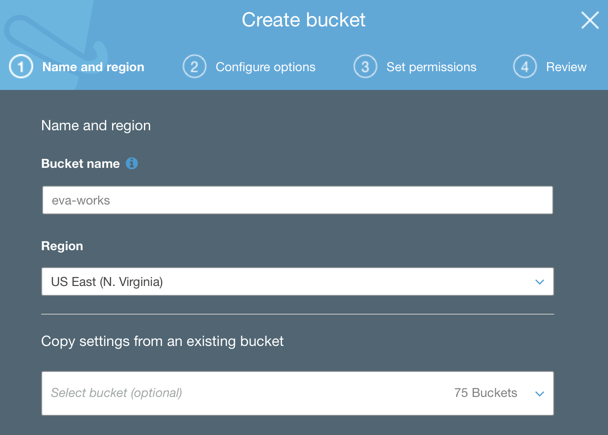
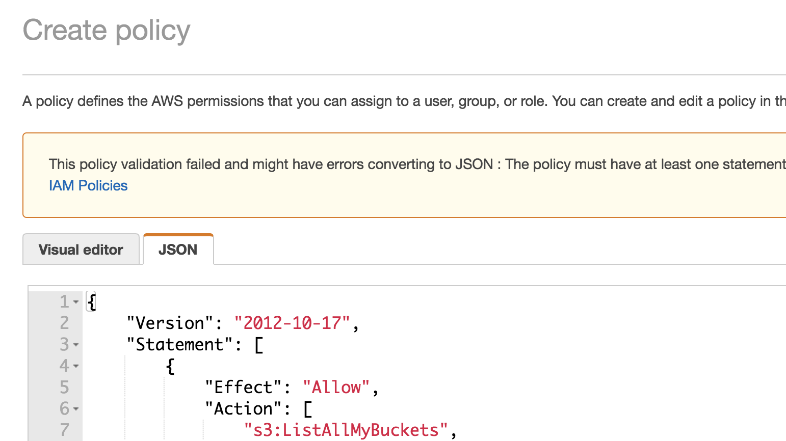
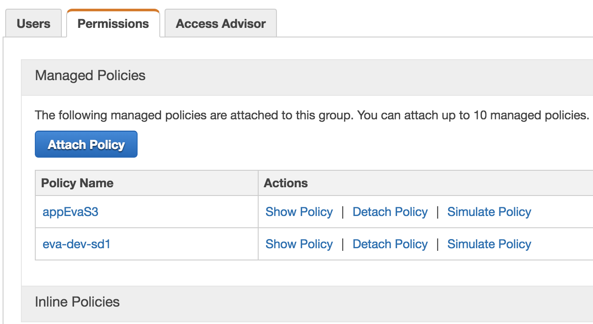
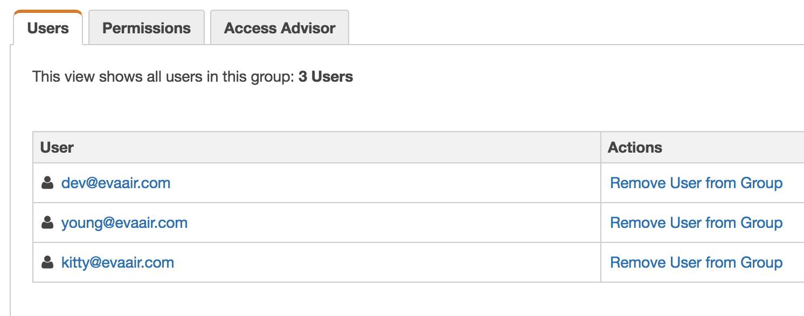
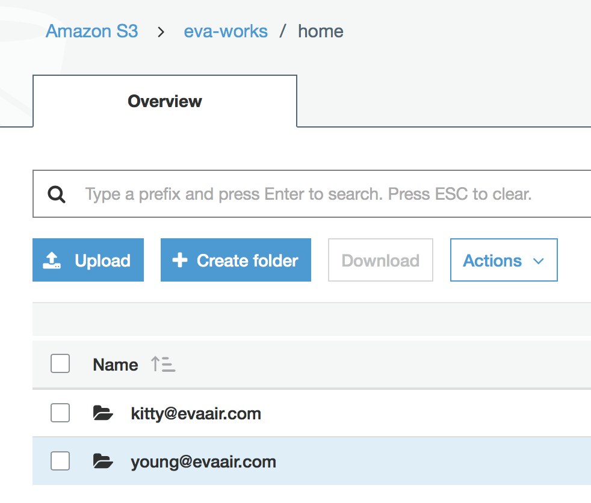
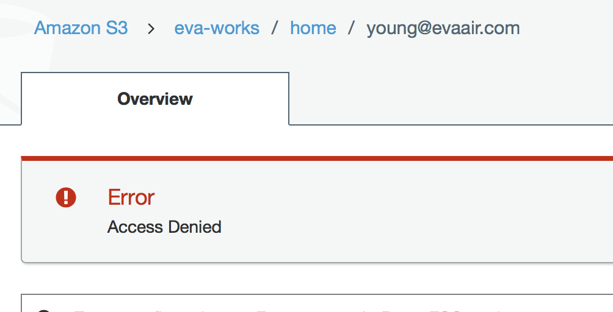

# AWS IAM Policy Ninja Workshop

### Part 2: s3

## Creation of Other Users and Groups

We would like to create a `eva-work` bucket:

- As employees, Young and Kitty each need to be able to create their own data in the company's bucket.
- They also need to read and write all developers' work.
- Only mangers group can read / write managers' work.

S3 key prefix scheme as the following:

```
/eva-works
    /home
        /young@evaair.com
        /kitty@evaair.com
    /share
        /developers
        /managers
```

### Step 1:

Administor's works:

1. create user accounts: `young@evaair.com` and `kitty@evaair.com`
2. go to s3 console: create s3 buckets name `eva-works` and related path.


3. go to IAM > create policy, paste the following in the iam policy:



```
{
    "Version": "2012-10-17",
    "Statement": [
        {
            "Effect": "Allow",
            "Action": [
                "s3:ListAllMyBuckets",
                "s3:GetBucketLocation"
            ],
            "Resource": "*"
        },
        {
            "Effect": "Allow",
            "Action": "s3:ListBucket",
            "Resource": "arn:aws:s3:::eva-works",
            "Condition": {
                "StringLike": {
                    "s3:prefix": [
                        "",
                        "home/",
                        "home/${aws:username}/*"
                    ]
                }
            }
        },
        {
            "Effect": "Allow",
            "Action": "s3:*",
            "Resource": [
                "arn:aws:s3:::eva-works/home/${aws:username}",
                "arn:aws:s3:::eva-works/home/${aws:username}/*"
            ]
        }
    ]
}
```

In the review policy, set the policy name: `appEvaS3`

Notes:

   - s3:ListAllMyBuckets: Returns a list of all buckets owned by the authenticated sender of the request.
   - s3:GetBucketLocation: Return a bucket's region

### Step 2:
attach the polich `appEvaS3` to group `eva-dev-sd1`



add users `young@evaair.com` and `kitty@evaair.com` into group `eva-dev-sd1`



### Step 3:
Login into `kitty@evaair.com`, go to S3 service. You can list the home directory



When you click on `young@evaair.com`, kitty will get the `access denied` errors:



Go to `kitty@evaair.com` folder and upload a picture into this folder.


### Reference

* [business case](https://docs.aws.amazon.com/IAM/latest/UserGuide/IAM_UseCases.html)
* [access policies example](https://docs.aws.amazon.com/IAM/latest/UserGuide/access_policies_examples.html)