# AWS IAM Policy Ninja Workshop

### Part 1: EC2

## Create users and group
Adminstor's works:

1. create a dev account without any access: dev@evaair.com
2. create a group `eva-developers-sd1` and add dev@evaair.com to this group

## Setting EC2

### Define the Resource tags

Adminstor's works:

* Read [AWS Tagging Strategies](https://aws.amazon.com/answers/account-management/aws-tagging-strategies/)
* Admin: create an EC2 with the following tags:
	* Business Tags:
		* eva:project: `starAlliance`
		* eva:costCenter: `softwareDept1`
	* Technical Tags:
	   * Name: `eva-demo-ec2`
		* eva:applicationID: `admPortal`
		* eva:appRole: `webServer`
		* eva:environment: `dev`

dev@evaair.com works:

* login aws console
* switch to ec2 > instances. dev does not see any ec2 instances.

### EC2 with different groups and different permissions:

Ref [IAM_UseCases](https://docs.aws.amazon.com/IAM/latest/UserGuide/IAM_UseCases.html), Usually, define the following three groups for EC2: 

* System administrators – Need permission to create and manage AMIs, instances, snapshots, volumes, security groups, and so on.

* Developers – Need the ability to work with instances only. Attaches a policy to the Developers group that allows developers to call DescribeInstances, RunInstances, StopInstances, StartInstances, and TerminateInstances.

* Managers – Should not be able to perform any Amazon EC2 actions except listing the Amazon EC2 resources currently available.

### Setting EC2 developers IAM policy
Admin's works: IAM > Create policy

* search the following actions:
	* TerminateInstances
	* StartInstances
	* RebootInstances
	* StopInstances
	* DescribeInstances
	* DescribeTags
	* DescribeInstanceStatus 

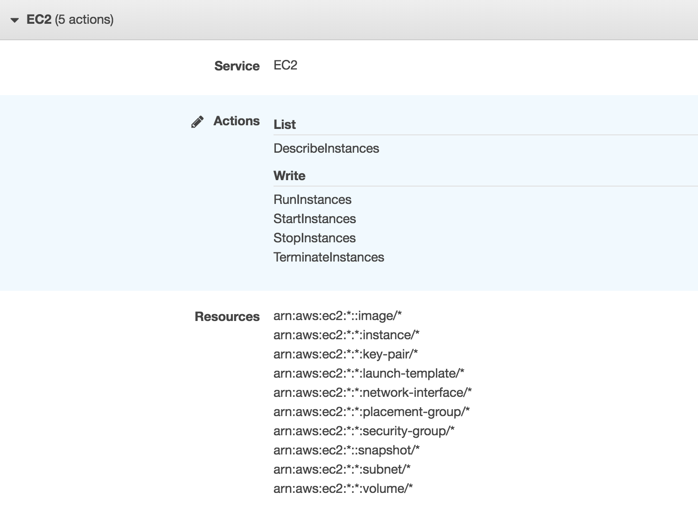

* Add request condition 
	* key: ec2:ResourceTag
	* Tag key: eva:costCenter
	* Operator: StringEquals
	* Value: `softwareDept1`

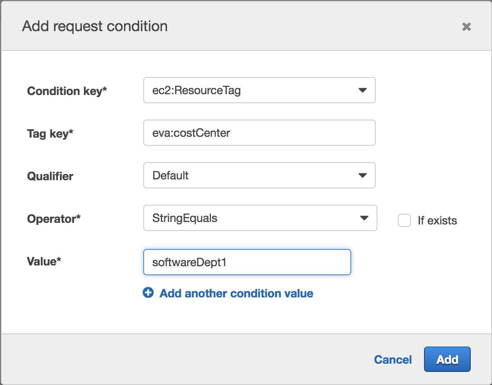

In the next page:

* policy name: `eva-dev-sd1`
* Decription: `Eva Airline Software Developer Div 1.`

After saved, view the eva-dev-sd1 again, you will see the warning message **There are no actions in your policy that support this condition key.**

* Remove the request conditions for `DescribeInstances, DescribeTags, DescribeInstanceStatus`

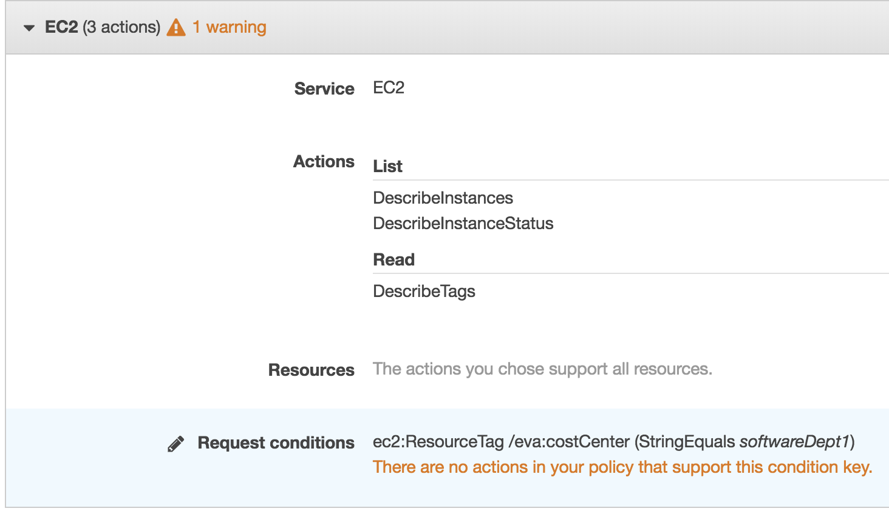

* **Notes:**  As of today, these Describe* (read-only) actions don’t support resource-level permissions. If you need to let different BU to see only their BU's machines in AWS console, you need to seperate by different AWS account. [Ref: AWS blogs-Demystifying EC2 Resource-Level Permissions](https://aws.amazon.com/blogs/security/demystifying-ec2-resource-level-permissions/)

#### Attach policy to developer gourp
* Select groups: `eva-developers-sd1` > Permissions tab > Attach Policy > `eva-dev-sd1`

### Login with dev@evaair.com
* In the EC2 Dashboard, navigate to **Tags** and type `eva:` in the **Filter** You will see the numbers of instances

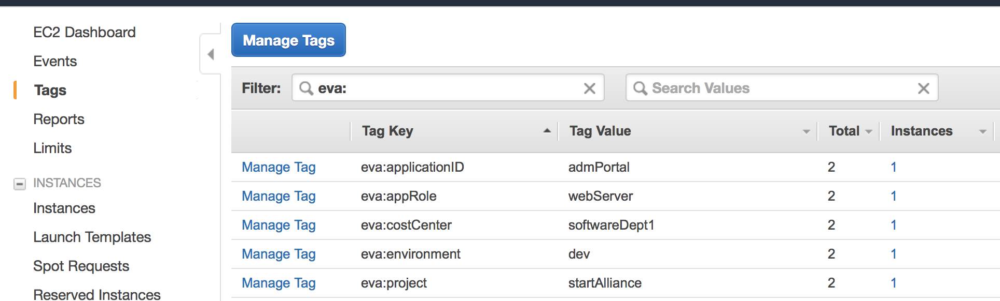

* Navigate to `Instances`, and filter with tags `eva:costCenter` value softwareDept1

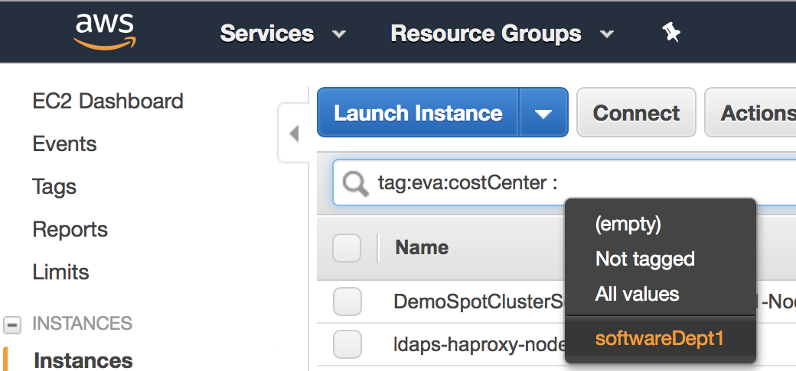

* select `eva-demo-ec2` instances. In the actions drop down menu, you can change instance state to `stop`.

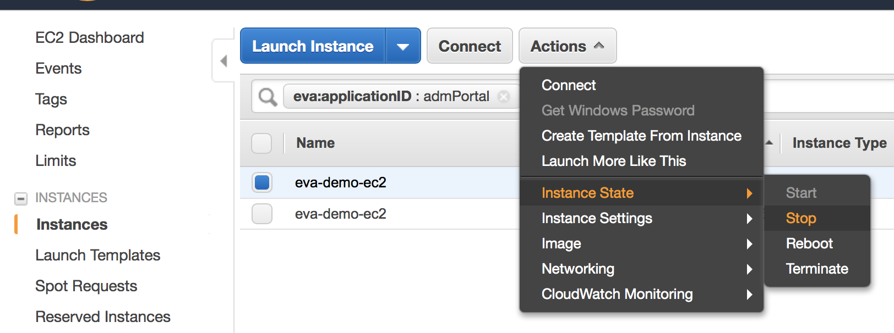

* If you stop other ec2 instances whithout tag: `eva:costCenter` and value: `softwareDept1`, you will get error messages: You are not authorized to perform this operation.

## Grant dev@evaair.com to create ec2

Goal: let developer can open ec2 machines but only for t2.* t3.* family and must with tag `eva:costCenter`, `Name`, and `eva:project`.

* edit policy `eva-dev-sd1`
* Add additional permissions
	* Service: `EC2`
	* Actions: `RunInstances`
	* Resources: related all

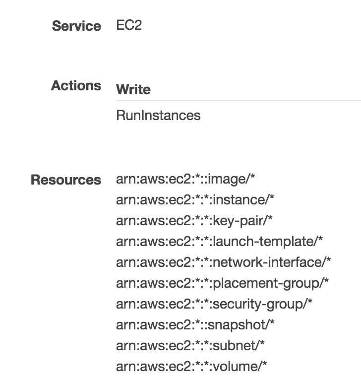

### Condition 1: 
When machine creates must has 3 tags: `eva:costCenter`, `Name`, and `eva:project` :

* Condition key: `aws:TagKeys`
* Qualifier: `For all values in request`
* Operator: `StringEquals`
* Value: `eva:costCenter`, `Name`, and `eva:project`.

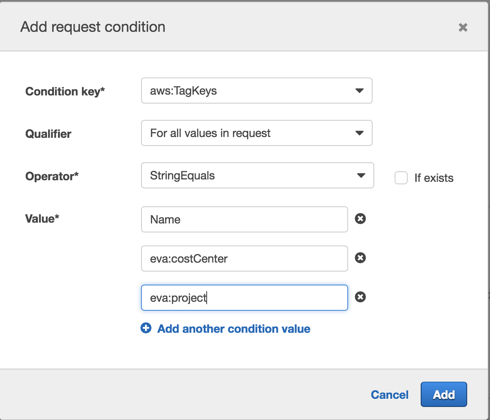

### Condition 2: 
limited ec2 instance types to t2* and t3*
 
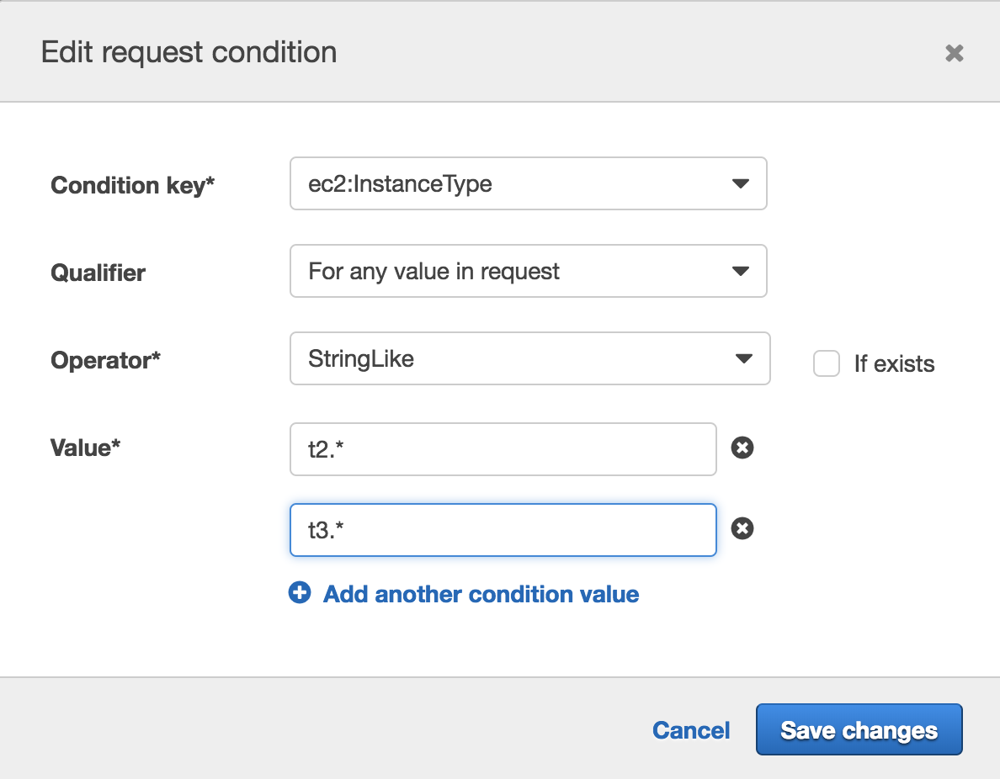

### Condition 3: 

Cost center `softwareDept1`

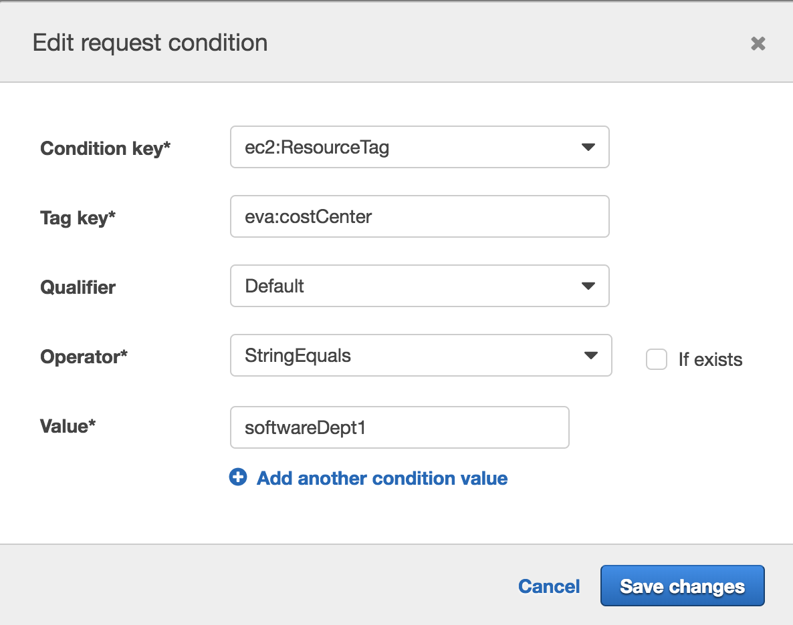

Click on review policy and finish.

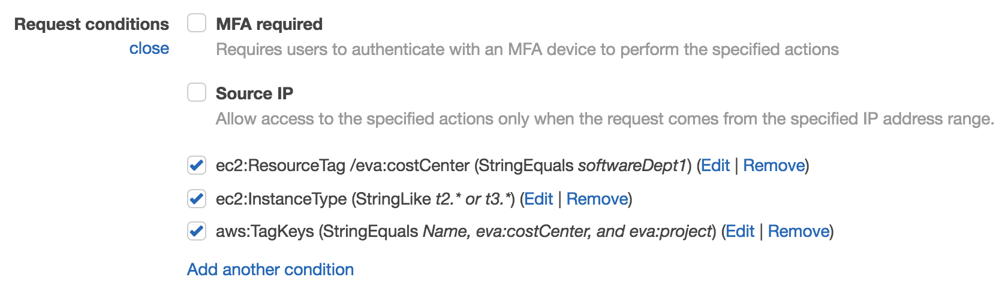

## Debug launch failures

Login `dev@evaair.com` account and launch ec2 instance. You will stop at the step 2. You can't go to `Step 3. Configure Instance`. Turn on the browser debug mode, you will see the follow HTTP 403 forbidden. 

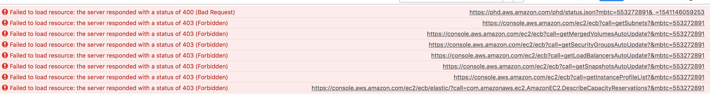

#### Switch to admin account and fixed the IAM policy

* edit policy `eva-dev-sd1`
* Modify policy
	* Service: `EC2`
	* Actions: 
		* List
			* DescribeAddresses
			* DescribeAvailabilityZones
			* DescribeImages
			* DescribeInstances
			* DescribeInstanceStatus
			* DescribeKeyPairs
			* DescribeRegions
			* DescribeSecurityGroups
			* DescribeSubnets
			* DescribeVolumes
			* DescribeVpcs
		* Read
			* DescribeTags
			* GetPasswordData
	* Resources: related all

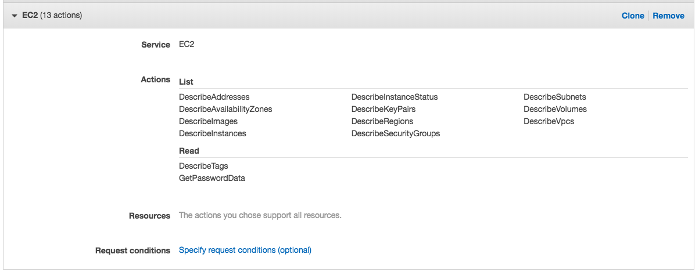

#### Debug launch failures again

Login `dev@evaair.com` account and in the last steps, you still see the following error screen.

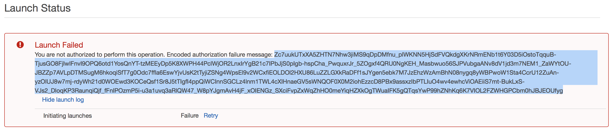

The error message is encoded and need to use the following command to decode the error messages.

`aws sts decode-authorization-message --encoded-message`

#### Switch back to Adminstrator

You can use cloud9 bash shell and decode the error message:

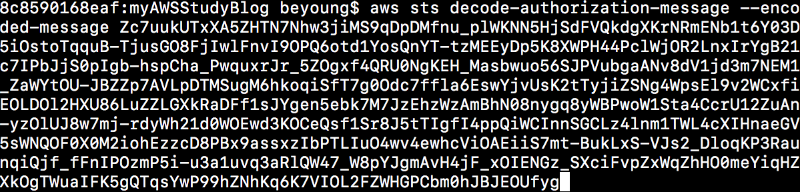

You will found the error at `"action\":\"ec2:CreateTags\"`

Back to IAM, edit policy `eva-dev-sd1`. click on`Add additional permissions`

* Services: `EC2`
* Actions: `CreateTags`
* Resources: click `any` on **instance** and **volume**

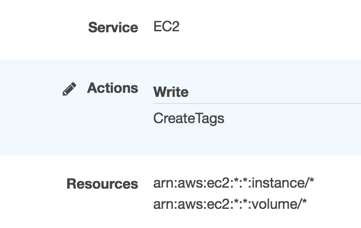

### Conditions 1 Cost Center:
When create the instance, the `eva:costCenter` must be `softwareDept1`

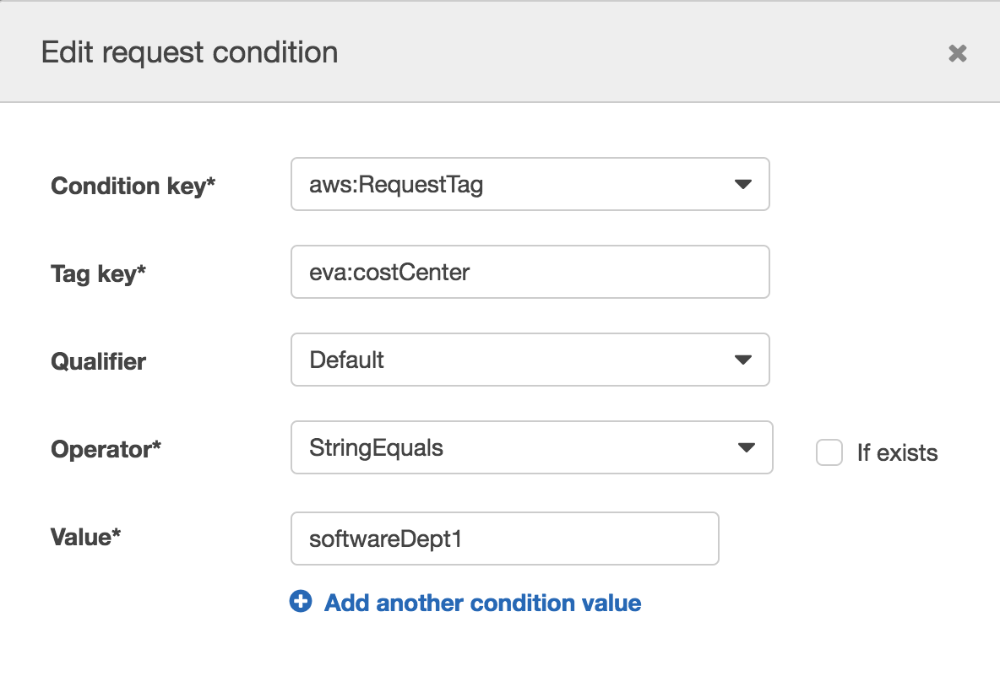

### Conditions 2 Project Name:
Project name should be `starAlliance` or `cloudTeam`

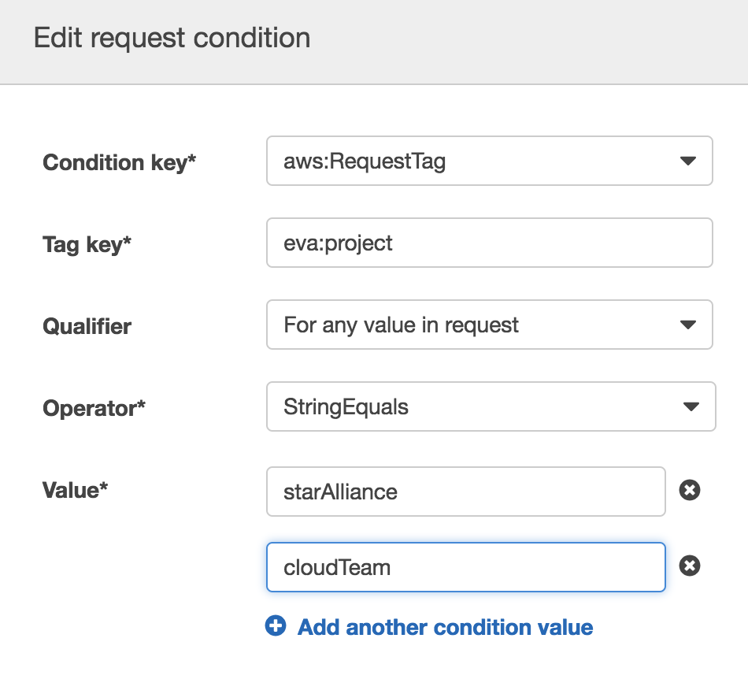

### Conditions 3 Tag Keys:
When create must contains 3 keys: Name, eva:

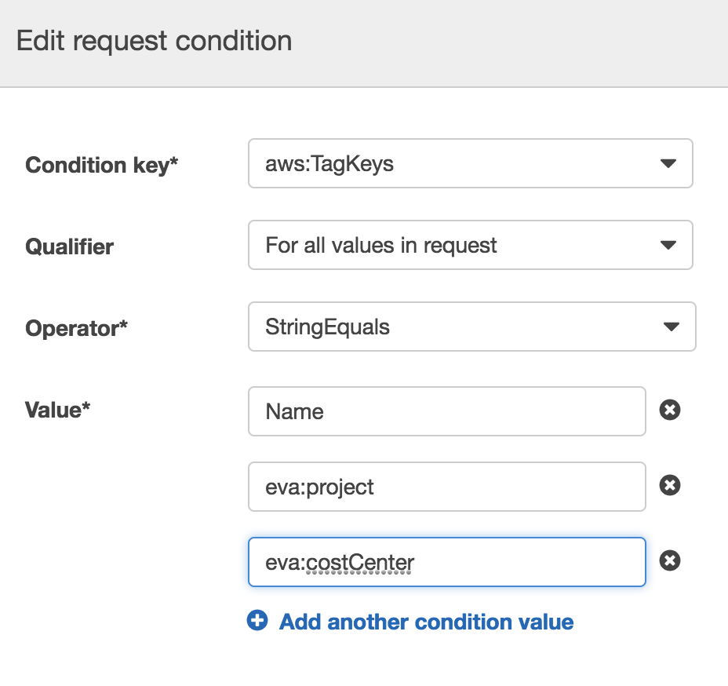

The `CreateTags` configuration is as the following:

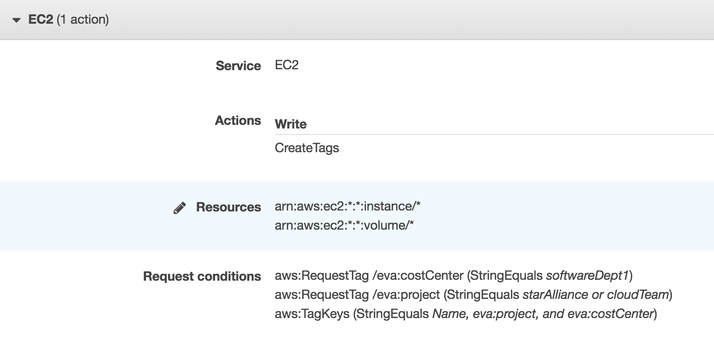

### Switch to dev1 account

Now, you can create a EC2 instance successfully with tags: `Name`,  `eva:costCenter`, and `eva:project`

## Change launched EC2 instance project name

If you change existing EC2 instance tag `eva:project` from `starAlliance` to `cloudTeam`, you will get the following error screen.

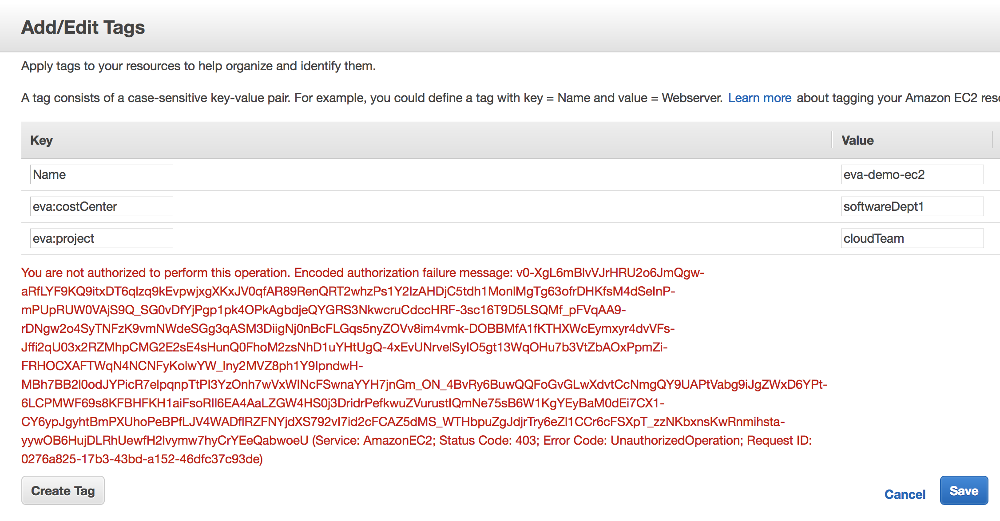

### Fix the modification issue. 

Add a new additional permissions:

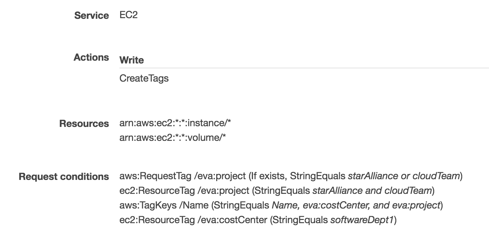

Now you can modify the launched EC2 instance project name.

