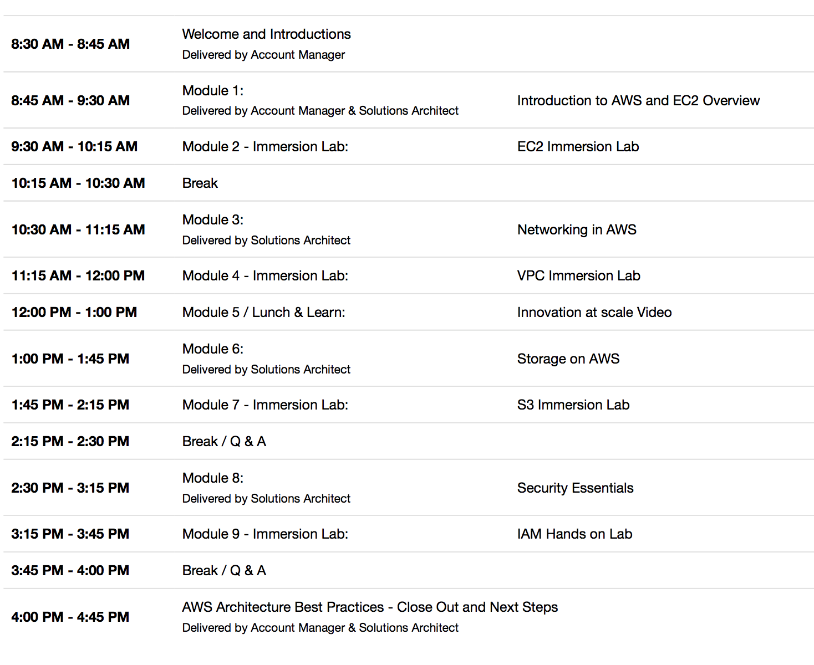

# Schedule
- date: 2017 / 11 / 13

# Module 1 - Introduction to AWS and EC2 Overview
- AWS Introduction
- AWS Global Infrastructure: Region, AZ, Edge Location
- EC2 (L100~200)
- Auto Scaling (L100~200)
- CloudWatch (L100) explained with auto scaling

# Module 2 - Immersion Lab: EC2 Immersion Lab

# Module 3 -  Networking in AWS
- Amazon VPC (L100~200), includes: subnet, route table, NACL, security group, IGW, VGW, NAT
- AWS Direct Connect (L100)
- ELB (L100~200), includes: ALB, NLB
- Route 53 (L100~200)
- Blue Green Deployment in AWS

# Module 4 - Immersion Lab: VPC Immersion Lab

# Module 5 / Lunch & Learn:	Innovation at scale Video

# Module 6 - Storage on AWS
- S3 (L100~200)
- EBS (L100~200)
- Glacier (L100)
- EFS (L100)
- RDS (L100~200)
- DynamoDB (L100)
- Database Migration Services (L100)

# Module 7 - Immersion Lab: S3 Immersion Lab

# Module 8 - Security Essentials
Security – Shared Responsibility Model
- IAM (L100~200): user, group, role. No need go deeper into id federation. Explain more on IAM role used on AWS services (ex. EC2) to prevent hard coding the credential information
- Security best practice
- Encryption: data at transit and rest option (L100~200)

# Module 9 - AWS Architecture Best Practice:
- scalability, design for failure, etc.

# Reference Links
- [AWS Immersion Day](http://www.immersionday.com/agenda/#)
