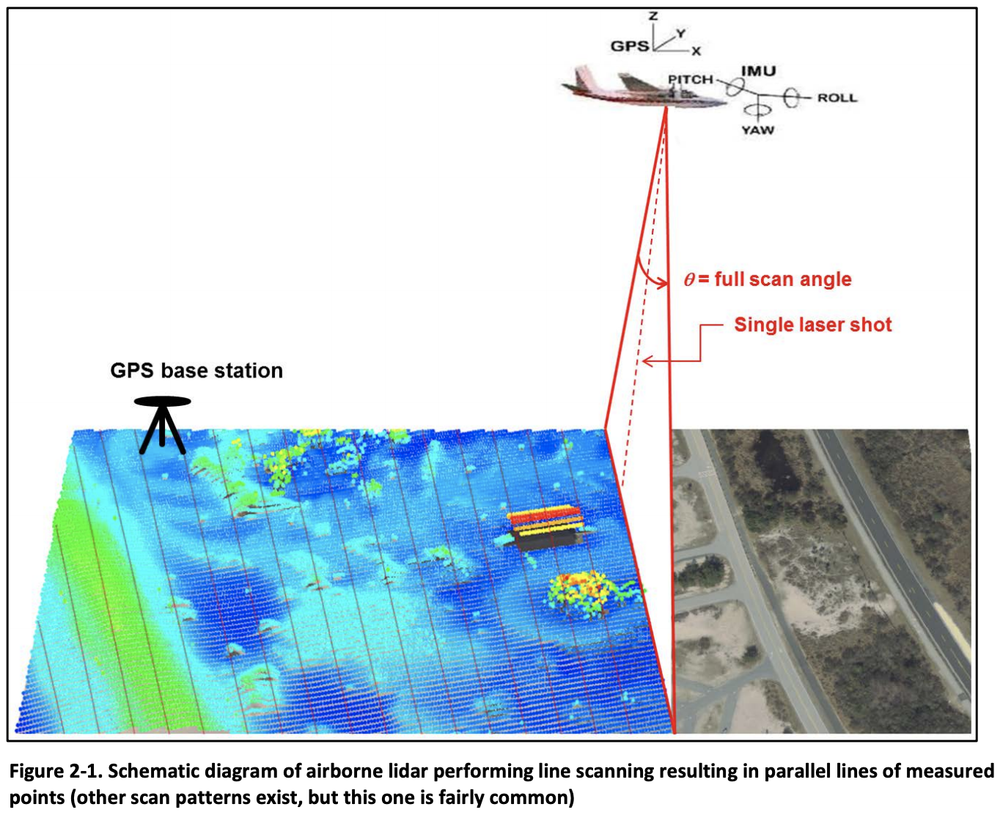

# LiDAR and 3D Point Cloud Task types and applications

It's a overview and working notes to get LiDAR applications, cloud solutions, open datasets, and state of arts research papers.

Summarize the application scopes:

* 3D model reconstruction
* Geometry / Localization
* 3D object detection
* 3D object tracking
* 3D semantic segmentation
* Safty & Security: people or object comming into a place.

Image source: Deep Learning for 3D Point Clouds: A Survey, Yulan Guo [link](https://arxiv.org/pdf/1912.12033.pdf) 


## Data process and visulization
### 1. Raw Data of Point Cloud

#### 1.1 Point cloud file formats

**.las .laz**: LASER (LAS)  or LiDAR FILE FORMAT EXCHANGE, a public file format for the interchange of 3-dimensional point cloud data data between data users. [spec](https://www.asprs.org/divisions-committees/lidar-division/laser-las-file-format-exchange-activities)

**.ply**: Polygon File Format or Stanford Triangle Format, specifies the elements of a mesh and their types such as edges, samples of range maps, and triangle strips with variety of properties: color and transparency, surface normals, texture coordinates and data confidence values. [spec](http://paulbourke.net/dataformats/ply/) [matlab](https://www.mathworks.com/help/vision/ug/the-ply-format.html)

**.pcd**: Point Cloud Data [PCD](http://pointclouds.org/documentation/tutorials/pcd_file_format.html) file format, which is used inside Point Cloud Library (PCL).

**.ept**: Entwine Point Tile [EPT](https://entwine.io/entwine-point-tile.html) is a simple and flexible octree-based storage format for point cloud data. Entwine is a data organization library for massive point clouds, designed to conquer datasets of trillions of points as well as desktop-scale point clouds:

- Entwine can index anything that is [PDAL](https://pdal.io/index.html)-readable, and can read/write to a variety of sources like S3 or Dropbox.
- Entwine output with [Potree](https://potree.entwine.io/), Plasio, and Cesium clients.
- LGPL License

**.xyz**: There is no official specification about the .xyz format for point clouds. It's a ASCII format, for example:

3D Point Cloud Tuple: (x, y, z, i, r, g, b)
	
* Three coordinates: x, y, and z.
* Intensity: i
* Color: red (r), green (g), and blue (b) 8-bit color channels.

#### 1.2 Coordinate systems

Applications: global path planning, localization, mapping, and driving scenario simulations.

World coordiante system (WCS):

1. Two and more LiDAR sensors with different point clouds data. 
2. Translate all point cloud frames into a single coordinate system.

We will introduce the following WCS:
		
##### 1.2.1 Vehicle Axis System(VAS)

[ISO 8855](https://www.iso.org/standard/51180.html):
x axis is forward toward the car’s movement, y axis is left, and the z axis points up from the ground.


	
##### 1.2.2 GPS/IMU - OxTS in AV KITTI dataset

Data format: **(latitude, longitude, altitude and roll, pitch, yaw)**

##### Roll Pitch and Yaw from WikiMedia


##### Drone: Roll Pitch and Yaw, mapping to (X, Y, Z)

	
[source: NOAA](https://spationetblog.files.wordpress.com/2016/01/an-introduction-to-lidar-technology.pdf)
	
##### 1.2.3 GPS/IMU OxTS vs VAS ISO 8855 
Notes: the Z-axis direction is different


##### 1.2.4 Indoor coordiation system
[AprilTags](https://april.eecs.umich.edu/software/apriltag): Fiducials are artificial features with a variety of uses in computer vision such as object tracking and localization. AprilTag detection software computes the precise 3D position, orientation, and identity of the tags relative to the camera. 
	
#### 1.3 Sensor fusion

3 different positions: LiDAR, Camera, and Ego-Vehicle pose. For example, project 3D point cloud to camera image plane:

- Step1: LiDAR Extrinsic: transforms 3D points from LiDAR's own coordinate system to a world coordinate system (WCS)
- Step2: Camera Inverse Extrinsic: transforms WCS to image plane.

Checking:

* AWS Ground Truth Sensor Fusion Transformations [link](https://docs.aws.amazon.com/sagemaker/latest/dg/sms-point-cloud-sensor-fusion-details.html#sms-point-cloud-extrinsic-intrinsic-explanation)
* Understand Coordinate Systems and Sensor Fusion [link](https://docs.aws.amazon.com/sagemaker/latest/dg/sms-point-cloud-sensor-fusion-details.html)

#### 1.4 Annotations:
3D Point Cloud Object Detection Output example [link](https://docs.aws.amazon.com/sagemaker/latest/dg/sms-data-output.html#sms-output-point-cloud-object-detection) and Compute Orientation Quaternions and Position [link](https://docs.aws.amazon.com/sagemaker/latest/dg/sms-point-cloud-sensor-fusion-details.html#sms-point-cloud-ego-vehicle-orientation)

LiDAR Extrinsic matrices:

* heading (qx, qy, qz, and qw) in quaternions [link](https://docs.scipy.org/doc/scipy/reference/generated/scipy.spatial.transform.Rotation.as_quat.html#scipy.spatial.transform.Rotation.as_quat)
* position (x, y, z) in WCS


```
"ego-vehicle-pose": {
    "heading": {
        "qx": -0.02111296123795955,
        "qy": -0.006495469416730261,
        "qz": -0.008024565904865688,
        "qw": 0.9997181192298087
    },
    "position": {
        "x": -2.7161461413869947,
        "y": 116.25822288149078,
        "z": 1.8348751887989483
    }
},
```

### 2. Processed Point Cloud

* Coordinate systems transform
* LiDAR processing tools: [LAStools](https://rapidlasso.com/lastools/)
* Conversion to 3D surfaces: polygon mesh, triangle mesh, CAD models.
* Building Information Model (BIM): 3D or 2D. Generating or reconstructing 3D shapes from single or multi-view depth maps or silhouettes and visualizing them in dense point clouds.


* GIS - Digital elevation model [DEM](https://en.wikipedia.org/wiki/Digital_elevation_model) [USGS](https://www.usgs.gov/faqs/what-are-digital-elevation-models-dems?qt-news_science_products=0#)


	
### 3. Visulized Point Cloud

* [Potree.org](https://github.com/potree/potree/): web-based point cloud viewer [example](http://potree.org/potree/examples/showcase/LDHI_module.html)

### 4. Geospatial Database
* [ESRI Geoportal Server](https://www.esri.com/en-us/arcgis/products/geoportal-server/overview), Apache 2.0

## Open source libraries
* [COLMAP](https://colmap.github.io/index.html): COLMAP is a general-purpose Structure-from-Motion (SfM) and Multi-View Stereo (MVS) pipeline with a graphical and command-line interface. BSD


* [Point Cloud Library (PCL)](https://pointclouds.org/): a standalone, large scale, open project for 2D/3D image and point cloud processing. BSD. [tutorial](https://pcl.readthedocs.io/projects/tutorials/en/latest/walkthrough.html#walkthrough)

* [Python-pcl](https://github.com/strawlab/python-pcl): a small python binding to the pointcloud library.

* [Point Data Abstraction Library (PDAL)](https://pdal.io/index.html): PDAL is a C++ BSD library for translating and manipulating point cloud data. It is very much like the GDAL library which handles raster and vector data.

* [Geospatial Data Abstraction Library (GDAL)](https://gdal.org/index.html): a translator library for raster and vector geospatial data formats.

* [OpenPCDet](https://github.com/open-mmlab/OpenPCDet): a clear, simple, self-contained open source project for LiDAR-based 3D object detection.

* [pyntcloud](https://github.com/daavoo/pyntcloud): perform 3D processing operations with minimum lines of code.


## Analytic and ML cases

Usually in the 3 areas: object detection, object tracking, and semantic segmentation.

### Papers
* **Deep Learning for 3D Point Clouds: A Survey** IEEE 2020 A good start point, including papers, datasets, and metrics. [link](https://arxiv.org/pdf/1912.12033.pdf) [github](https://github.com/QingyongHu/SoTA-Point-Cloud)
* Deep Learning for 3D Point Cloud Understanding: A Survey [link](https://arxiv.org/pdf/2009.08920.pdf) [github](https://github.com/SHI-Labs/3D-Point-Cloud-Learning)
* Deep Learning for LiDAR Point Clouds in Autonomous Driving: A Review IEEE 2020 [link](https://arxiv.org/pdf/2005.09830.pdf)
* PV-RCNN: Point-Voxel Feature Set Abstraction for 3D Object Detection. [CVPR 2020](https://openaccess.thecvf.com/content_CVPR_2020/papers/Shi_PV-RCNN_Point-Voxel_Feature_Set_Abstraction_for_3D_Object_Detection_CVPR_2020_paper.pdf)
* **NOAA - Lidar An Introduction to LiDAR Technology, Data, and Applications**: LiDAR on geo-spatial tech stock [link](https://spationetblog.files.wordpress.com/2016/01/an-introduction-to-lidar-technology.pdf)


## Open datasets
* KITTI cvlibs [link](http://www.cvlibs.net/datasets/kitti/)
* A2D2 Audi Autonomous Driving Dataset on AWS [link](https://registry.opendata.aws/aev-a2d2/)
* NuScenes [link](https://www.nuscenes.org/)
* Lyft 3D Object Detection [link](https://www.kaggle.com/c/3d-object-detection-for-autonomous-vehicles/overview)
* Large-Scale Point Cloud Classification Benchmark [link](http://semantic3d.net/)
* Open Topography [link](https://portal.opentopography.org/dataCatalog): facilitates community access to high-resolution, Earth science-oriented, topography data, and related tools and resources. Can query in ASCII or LAS binary point cloud formats. Also available is the option to generate custom derivative products such as digital elevation models (DEMs).

## Devices

* Robotis LDS-01 [link](https://emanual.robotis.com/docs/en/platform/turtlebot3/appendix_lds_01/)


## Solutions

### 1. AWS
* Labeling data for 3D object tracking and sensor fusion [blog](https://aws.amazon.com/blogs/machine-learning/labeling-data-for-3d-object-tracking-and-sensor-fusion-in-amazon-sagemaker-ground-truth/)

### 2. Apple iPad Pro
* Acess to the point cloud/mesh created by LiDAR with the new Ipad Pro [Link](https://developer.apple.com/forums/thread/131161) Currently, Apple ARKit don't provide simple way to export cloud points. Need to use ARKit to retrieve geometry object. Require iOS 13.4+ and Xcode 11.4+.

* Sample Code
	* Visualizing and Interacting with a Reconstructed Scene [link](https://developer.apple.com/documentation/arkit/world_tracking/visualizing_and_interacting_with_a_reconstructed_scene)
	* WWDC2020 ARKit4 [link](https://developer.apple.com/videos/play/wwdc2020/10611/) Sample code [link](https://developer.apple.com/documentation/arkit/visualizing_a_point_cloud_using_scene_depth)

## Other References

### Github summary

* awesome-point-cloud-processing [github](https://github.com/mmolero/awesome-point-cloud-processing)
* awesome-point-cloud-analysis [github](https://github.com/Yochengliu/awesome-point-cloud-analysis)

### Comercial Products

* [Weiss-AG](https://weiss-ag.com/): A Saas platform to create virtual assests in your browser.
* [MATLab](https://www.mathworks.com/help/vision/lidar-and-point-cloud-processing.html?s_tid=CRUX_lftnav): Lidar and Point Cloud Processing, which provide point cloud processing functionality for downsampling, denoising, and transforming point clouds.


