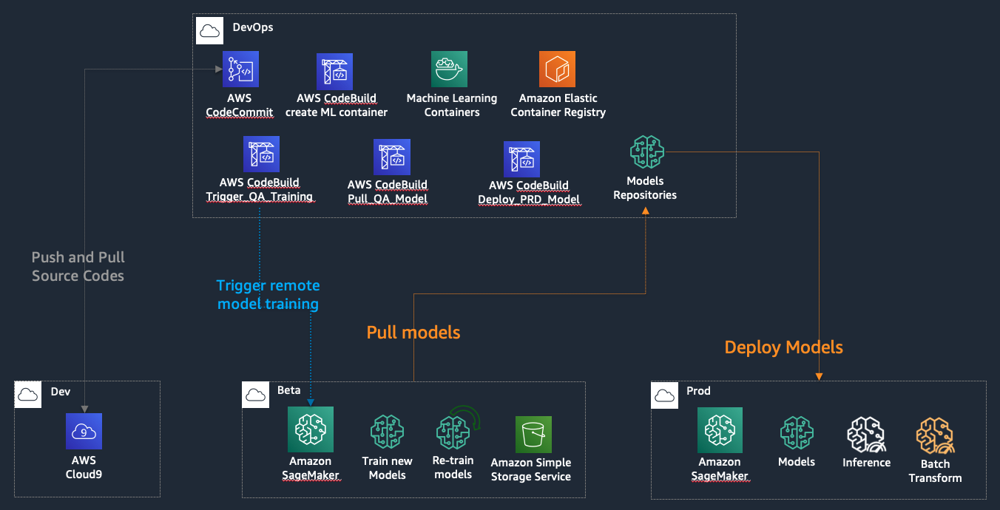

# MLOps Workshop

In this workshop, we will create the following architecture:

There are four accounts:

* developers: use SageMaker studio, jupyter notebook, or cloud9 to write the code. The code will commit inito devops account.
* devops: it's the "ML brain" and CI/CD control center. It keeps source codes of machine learning. Another important role is "model repository".
* beta: it is the training or re-traing environment. It keeps the some portion of production data such as one month or one quarter. You can use SageMaker autopilot to train up to 250 models but selected good fit models and push back into devops account.
* prod: it's the production environment. It can run batch or real time inferences.

# Requirement

* Prepare 4 aws accounts.
* It costs around $25 - $50.

# Reference
* [aws git cross accounts](https://aws.amazon.com/blogs/devops/using-git-with-aws-codecommit-across-multiple-aws-accounts/)
* [Training job json](https://docs.aws.amazon.com/sagemaker/latest/dg/API_CreateTrainingJob.html)
* [MLOps Workshop](https://github.com/awslabs/amazon-sagemaker-mlops-workshop)
* [SageMaker Python SDK](https://sagemaker.readthedocs.io/en/stable/estimators.html)
* [SageMaker Python SDK example](https://github.com/awslabs/amazon-sagemaker-examples/blob/master/advanced_functionality/scikit_bring_your_own/scikit_bring_your_own.ipynb)
* [Use API JSON example](https://github.com/awslabs/amazon-sagemaker-examples/blob/master/ground_truth_labeling_jobs/object_detection_augmented_manifest_training/object_detection_augmented_manifest_training.ipynb)
