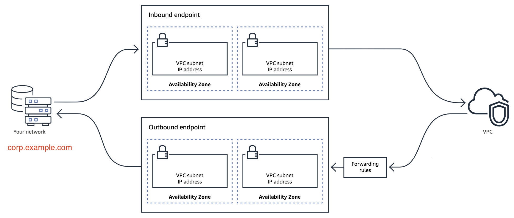
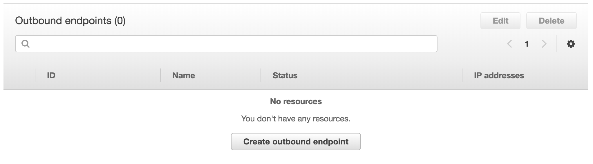
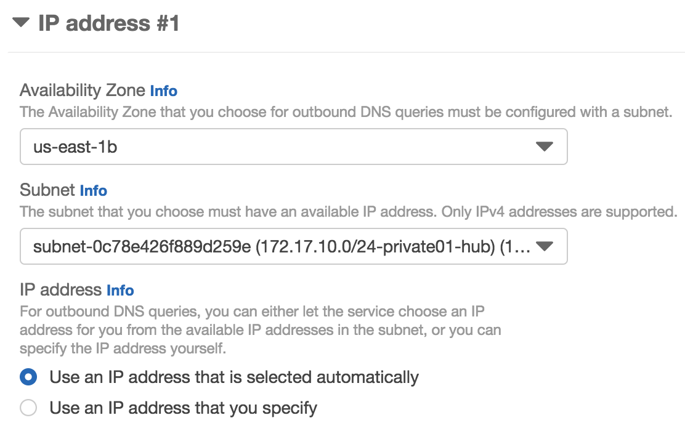
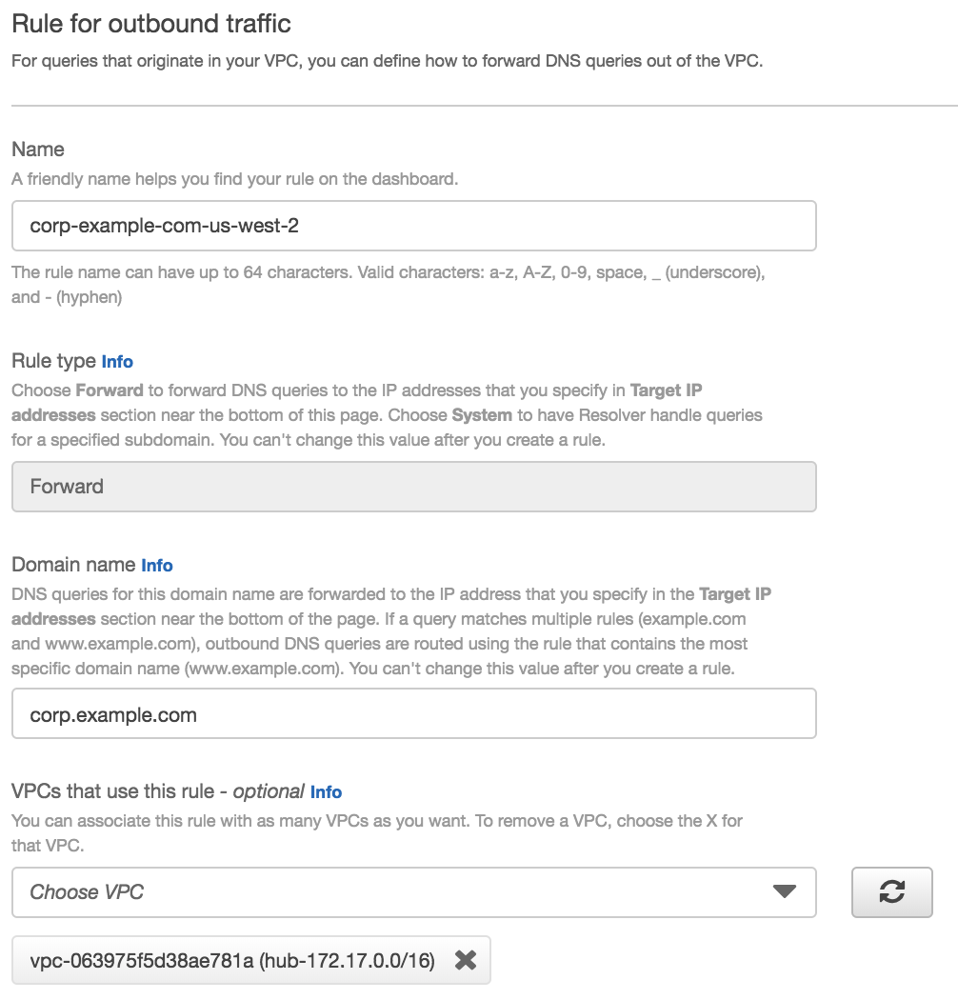
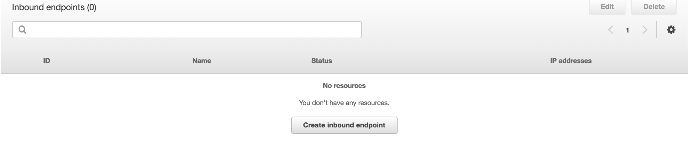
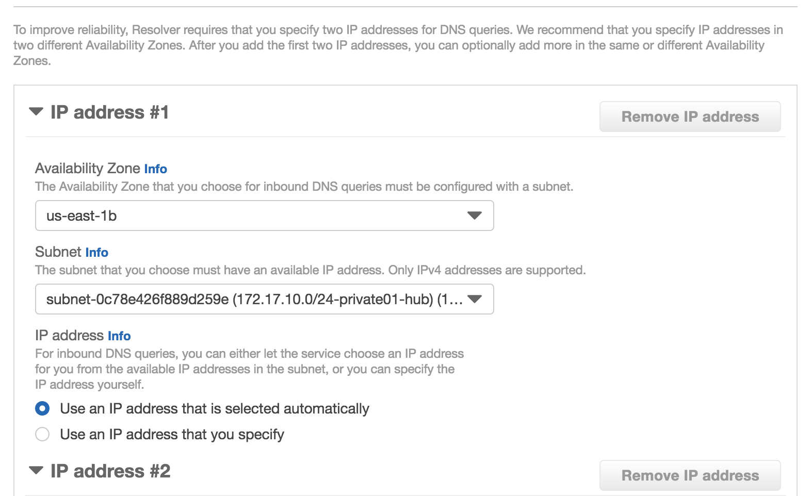

# AWS Route53 Resolver

In this section, you will setup a route53 resolver.

## Part1: Create outbound enpoints and forward rule

1. Click on the VPCs in the left nevigation. Then select related VPC.

	
	
2. Click on the create outbound endpoint.

	
	
3. Set name, related to VPCs, and IPs in 2 different subnets. Here, I put it in the private subnets.

	
	

4. For a while, you will see the outbound enpoints created.

	
	
5. Create rules for this outbound endpoints.
	- names: corp-example-com-us-west-2
	- domain name: corp.example.com
	- vpc: 172.17.0.0/16
	- target ip: <your windows id ip>

		
	
	
	
## Part2: Create inbound enpoints

1. Create security group for inbound
   - put DNS for private networks and VPN original CIDR.
	
	
	
2. Create inbound endpoints

	
		
	
	
## Part3: Testing

You can launch an ec2 instances. Use nslookup, then "server" command to change ip to outbound server. Query any `corp.example.com` server.