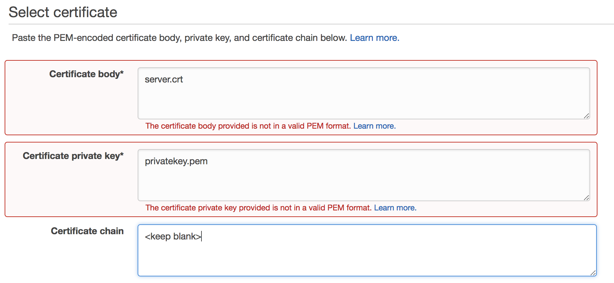
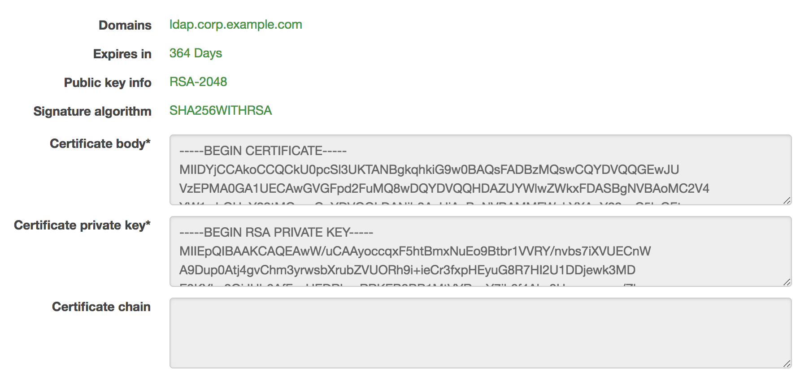

# How to Configure an LDAPS Endpoint for Simple AD

## Environment
### Ports List
* TCP/UDP 53 - DNS
* TCP/UDP 88 - Kerberos authentication
* UDP 123 - NTP
* TCP 135 - RPC
* UDP 137-138 - Netlogon
* TCP 139 - Netlogon
* TCP/UDP 389 - LDAP
* TCP/UDP 445 - SMB
* TCP 636 - LDAPS (LDAP over TLS/SSL)
* TCP 873 - Rsync
* TCP 3268 - Global Catalog
* TCP/UDP 1024-65535 - Ephemeral ports for RPC

### Create a certificate
#### Use OpenSSL self crt
* openssl version
* openssl genrsa 2048 > privatekey.pem
* openssl req -new -key privatekey.pem -out server.csr
	*  The **Common Name(cn)** is the **FQDN** for your LDAPS endpoint (for example, ldap.corp.example.com). The Common Name must use the domain name you will later register in Route 53. 
* openssl x509 -req -sha256 -days 365 -in server.csr -signkey privatekey.pem -out server.crt
* chmod 600 privatekey.pem

#### Import ACM
* server.crt file in the Certificate body box.
* privatekey.pem file in the Certificate private.
* leave the Certificate chain box blank.
  
  

# Reference
* [How to Configure an LDAPS Endpoint for Simple AD](https://aws.amazon.com/blogs/security/how-to-configure-an-ldaps-endpoint-for-simple-ad/)
* [Simple AD Prerequisites](https://docs.aws.amazon.com/directoryservice/latest/admin-guide/prereq_simple.html)
* [Deploy an EC2 instance to Manage AWS AD](https://docs.aws.amazon.com/directoryservice/latest/admin-guide/microsoftadbasestep3.html)