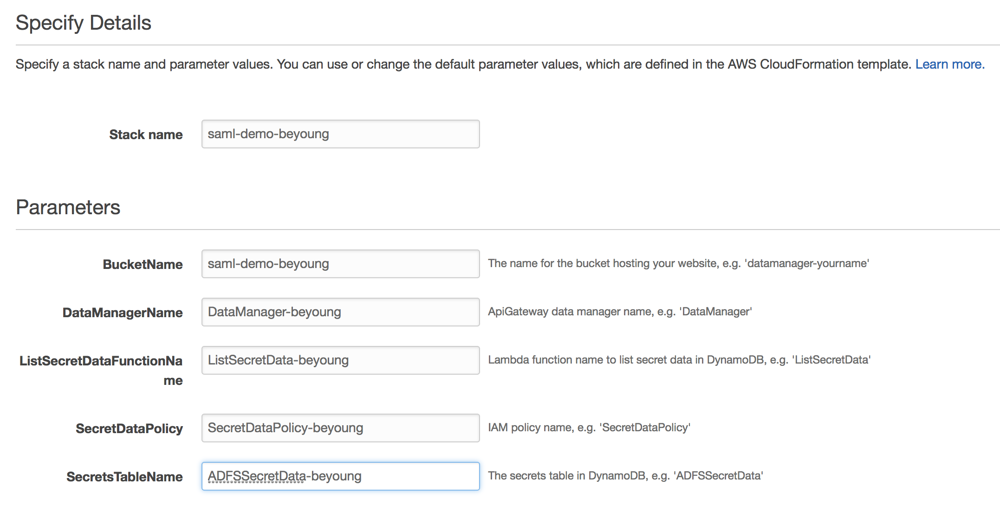
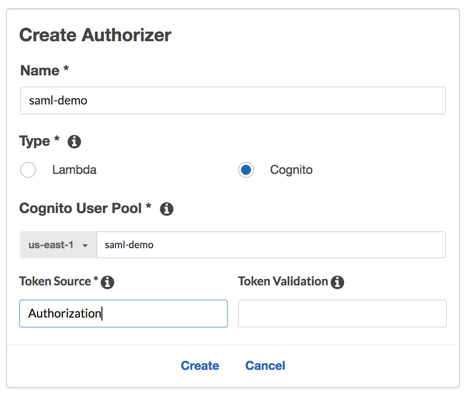
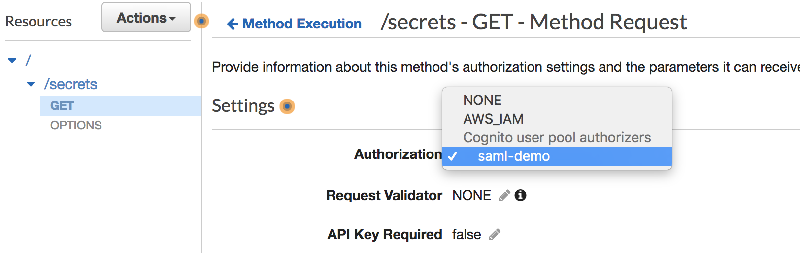
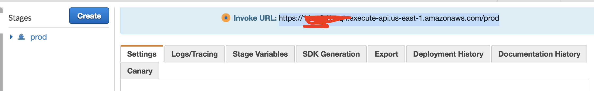
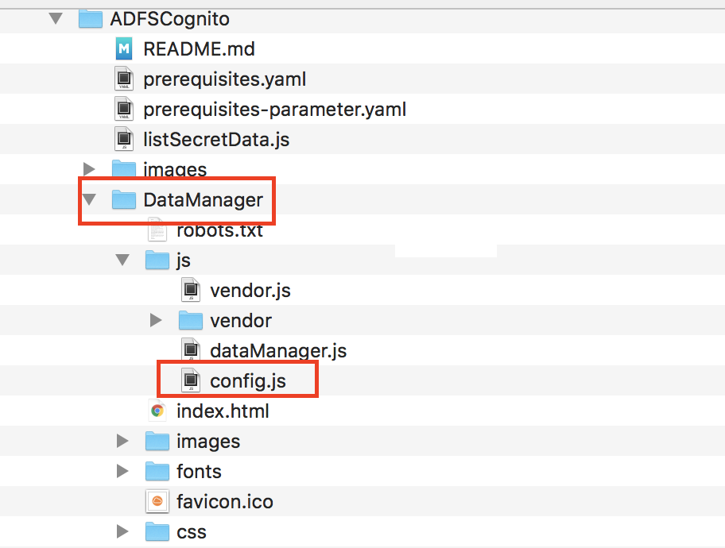
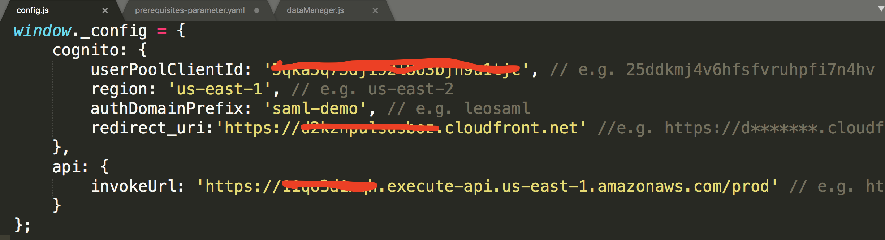

### Building ADFS Federation for your Web App using Amazon Cognito User Pools


#### Step 5: Deploy and configure the web app
clone this [repo](https://github.com/imyoungyang/ADFSCognito) to your local computer.

##### Step 5.1: Create the AWS CloudFormation stack
1. Use AWS CloudFormation, **create stack**, choose **Upload a template to Amazon S3**
2. Choose this [template file](https://github.com/imyoungyang/ADFSCognito/blob/master/prerequisites.yaml)
3. Fill the parameters: Stack Name and BucketName: `saml-demo-<yourNameID>`, add sufix `-<yourNameID>` for `ADFSSecretData`, `ListSecretData`, `DataManager`, and `SecretDataPolicy`.
4. Check **I acknowledge that AWS CloudFormation might create IAM resources with custom names.**. Then create.
   

##### Step 5.1: Manually integrate the Amazon Cognito user pool with API Gateway
1. create Authorization: **saml-demo** for `DataManager-<yourNameID>`
   

1. In Resources of `DataManager-<yourNameID>`, click on **Method Execution** for `/secrets - GET - Method Request`. Change Authorization to **
   

1. Choose **Actions->Deploy API** to `prod` stage
2. Copy prod Invoke URL 
   

##### Step 5.2 Add an item in DynamoDB
1. Switch to DynamoDB services
2. In Tables, select `ADFSSecretData-<yourNameID>`, then `Create item`
3. Change to **Text** and put the follow json

   ```json
   {
  		"email": "beyoung@example.com",
		"secretData": "This is secret data"
	}
	```
##### Step 5.3 Configuration for Amazon Cognito
1. Application redirect url

##### Step 5.4 Static web configuration and upload to s3
1. Modify `config.js` file in folder 
   
   
   
2. Upload static web to s3
   * `cd ADFSCognito/DataManager`
   * `aws s3 sync . s3://<saml-demo-<yourNameID>`


# Reference Links:
* [Choose Your Own SAML Adventure: A Self-Directed Journey to AWS Identity Federation Mastery](http://federationworkshopreinvent2016.s3-website-us-east-1.amazonaws.com/labguides/adfshour1/labguide-adfshour1.html)
* [Building ADFS Federation for your Web App using Amazon Cognito User Pools](https://aws.amazon.com/blogs/mobile/building-adfs-federation-for-your-web-app-using-amazon-cognito-user-pools/)