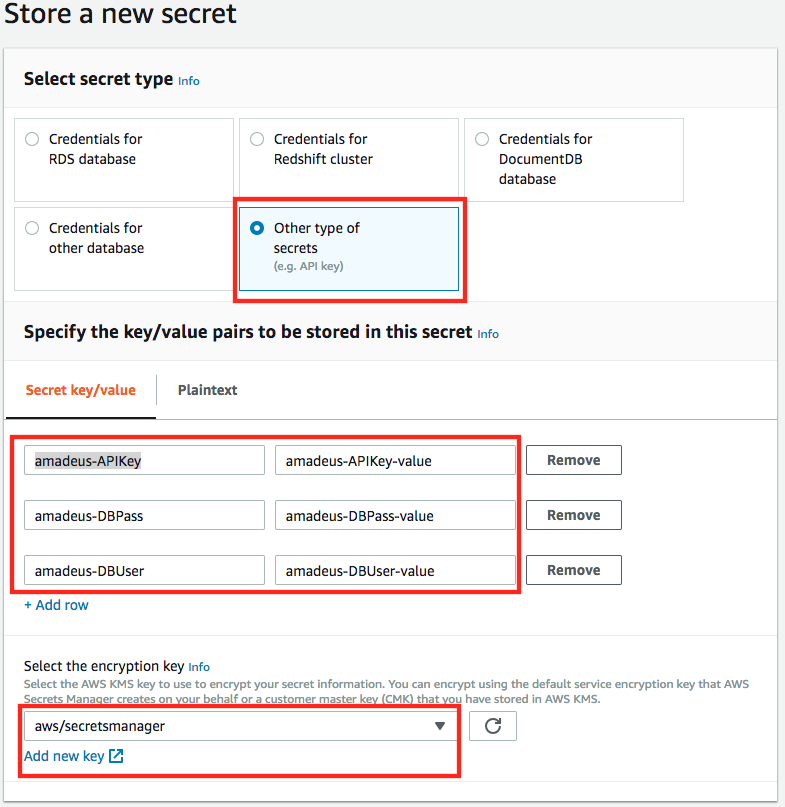
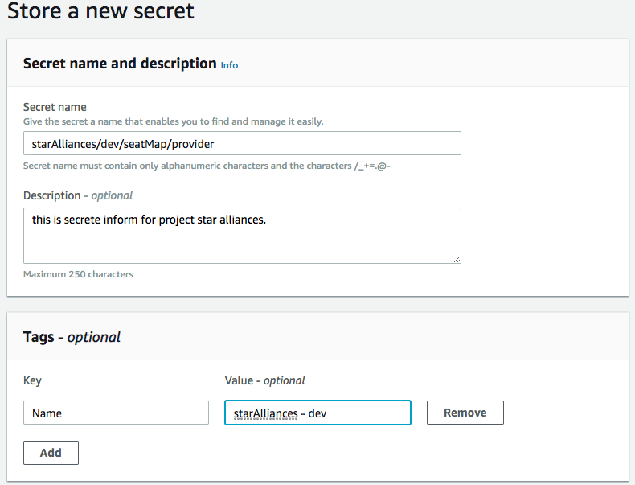
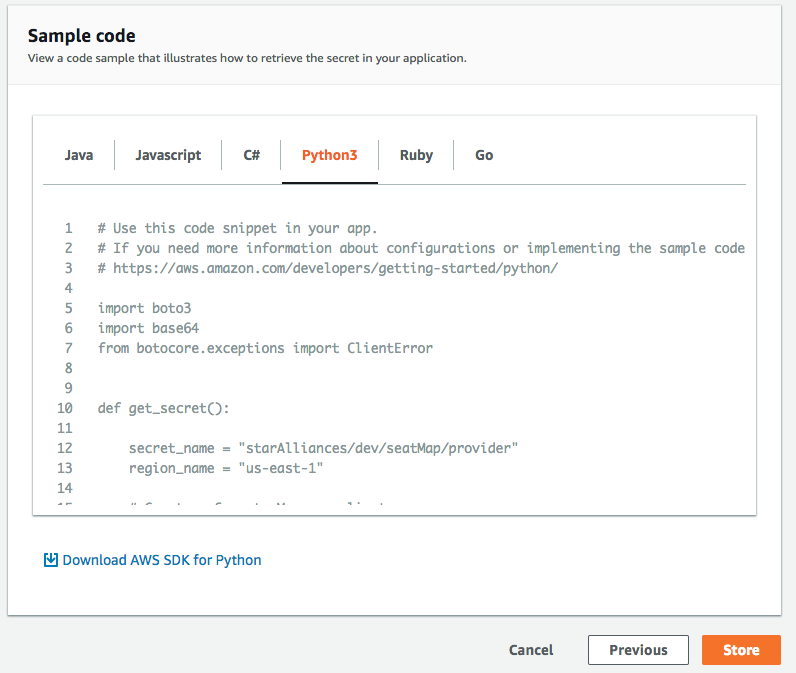
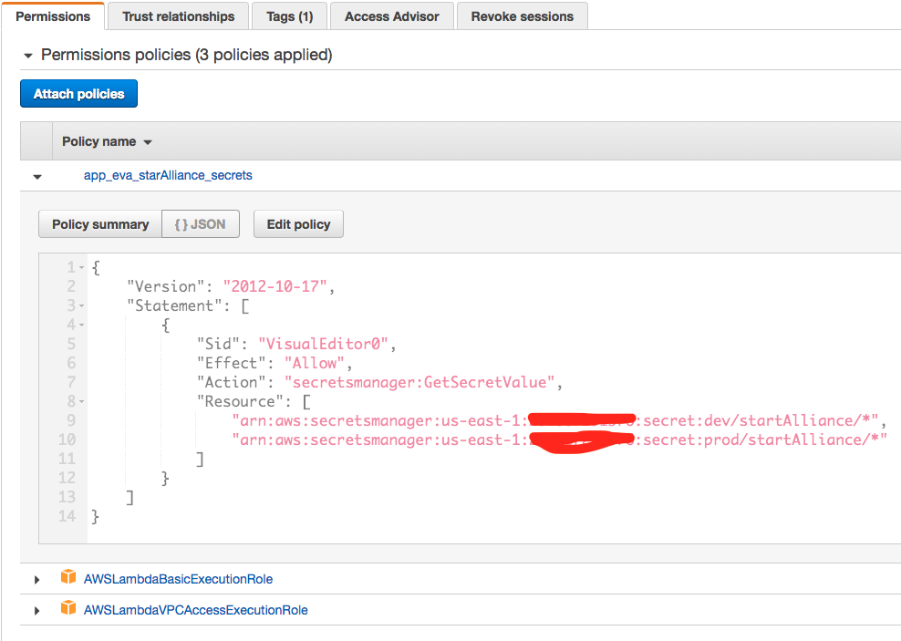
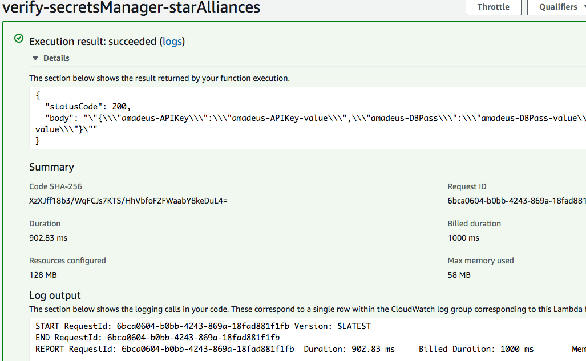

# AWS secrets manager

## Part 1: Store a new secret
1. Click on `Store a new secret`
2. Choose `Other type of secrets`
3. Screte key/value
	- key: `<system>-<key-name>`. eg. `amadeus-APIKey`
4. select encryption key

	

5. Secret Name: `<project>/<stage>/<app>/<box>`. eg: `starAlliences/dev/seatMap/provider`

	

6. Disable automatic rotation first. And next.
7. Copy the sample code and store.

	
	
## Part 2: Test the secrets manager
1. Create a lambda function with excution role, which can access this key of secrets manager. The manage secret manage policy as the following:

	```json
	{
    	"Version": "2012-10-17",
    	"Statement": [
        	{
            "Sid": "VisualEditor0",
            "Effect": "Allow",
            "Action": "secretsmanager:GetSecretValue",
            "Resource": [
                "arn:aws:secretsmanager:us-east-1:<aws-accountid>:secret:dev/startAlliance/*",
                "arn:aws:secretsmanager:us-east-1:<aws-accountid>:secret:prod/startAlliance/*"
	            ]
	        }
	    ]
	}
	```

2. Because the lambda function will be in a VPC, we need to attach the following policies in the role.

	
	
3. Setup the Network VPC and security group.

	
	
4. Test the lambda to make sure it can get the response from the secrets manager. The sample code is [here](./sample.py)

	
	
5. Publish your lambda code.