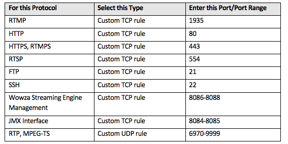

* HTTP live streaming (HLS) and Dynamic Adaptive Streaming over HTTP (DASH).

* adaptive bitrate (ABR) formats: HLS, HDS, MSS, and MPEG-DASH along with advanced video encoding features such as HEVC, Dolby Digital audio, and motion graphic insertion.

# Wowza Steup

* [EC2 User Guide](http://www.wowza.com/resources/WowzaStreamingEngineforEC2_UsersGuide.pdf)

* Security group

* Players: MPEG-DASH, Apple HLS, Adobe RTMP, Adobe HDS, MS Smooth, Mobile
  - Mobile iOS: use playlist m3u8
  - Android/Other: use mp4
  - Chrome need to add plugin to support m3u8 (Apple HLS)

* [How to use wowza gocoder video broadcasting ios app](https://www.wowza.com/docs/how-to-use-wowza-gocoder-video-broadcasting-ios-app)

# Other Streaming servers

* [Unified Streaming](http://docs.unified-streaming.com/documentation/vod/index.html)

* [Open source Red5](https://github.com/Red5/red5-server)

* [Wiki - Streaming media system](https://en.wikipedia.org/wiki/Comparison_of_streaming_media_systems)

# References

* [Streaming videos to millions of mobile app users via Amazon CloudFront CDN](
https://aws.amazon.com/blogs/mobile/streaming-videos-to-mobile-app-users-via-amazon-cloudfront-cdn/)

* [How to use Wowza GoCoder video broadcasting iOS app](https://www.wowza.com/docs/how-to-use-wowza-gocoder-video-broadcasting-ios-app)

* [Live HTTP Streaming Using Wowza Streaming Engine 4.2](http://docs.aws.amazon.com/AmazonCloudFront/latest/DeveloperGuide/live-streaming-wowza.html)

* [Using Amazon CloudFront for Video Streaming](https://aws.amazon.com/blogs/aws/using-amazon-cloudfront-for-video-streaming/)

* [How can I stream live video content on AWS?
](https://aws.amazon.com/answers/media-entertainment/live-streaming/)

* [Delivering HLS with Amazon CloudFront](https://www.jwplayer.com/blog/delivering-hls-with-amazon-cloudfront/)

* [Encoding HLS with Amazon Elastic Transcoder](https://www.jwplayer.com/blog/encoding-hls-with-amazon-elastic-transcoder/)

* [Demonstrates how to build a live broadcast app(Swift 3)](https://github.com/ltebean/Live)

* [Creating a Mobile Live-Streaming App
How Do I Get Started](https://www.wowza.com/solutions/powered-by-wowza/mobile-live-streaming-app-guide)
