# VPC Privatelinks and Route53 Resolver

In this lab, you will implement the following architecture diagram:

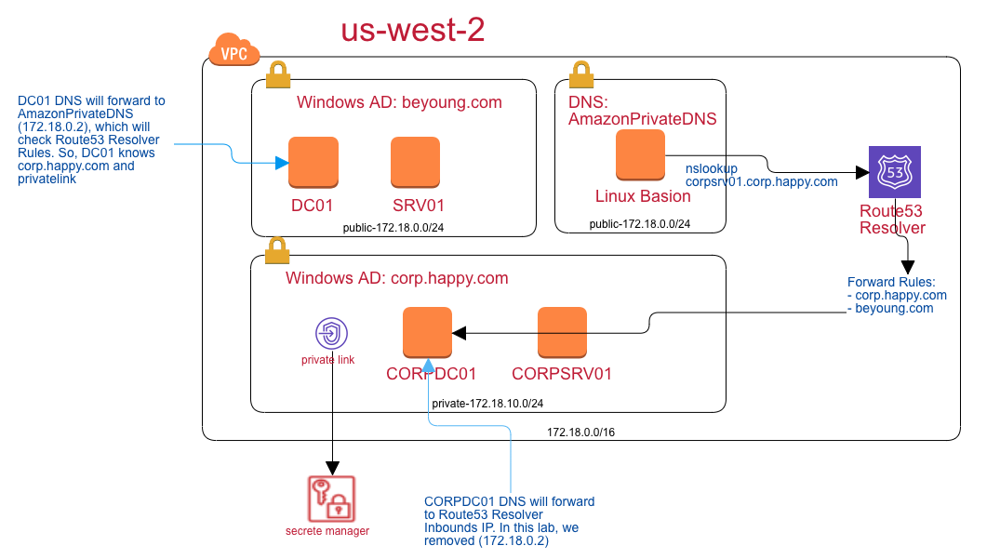

## VPC Setup
* Region: `us-west-2`
* IP: `172.18.0.0/16`
* public sub: `172.18.0.0/24` and turn on the auto-assign public ip


## Build your active directory in AWS EC2
* Images: `Microsoft Windows Server 2016 Base`
* t2.2xlarge
* Add customize scripts


```
<powershell>
Rename-Computer -NewName "DC01" -Restart
</powershell>
```

## Winodws AD Secruity Group
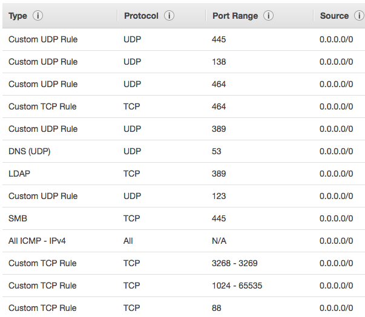


## Config the AD


PowerShell

```
Add-WindowsFeature AD-Domain-Services -IncludeManagementTools
```


* Command line to open Server Manager. In the right up corner. Promote this server as domain controller.

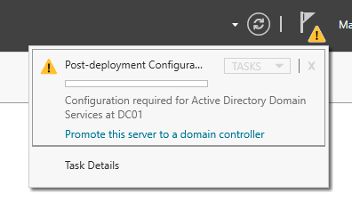


* NetBIOS name: `BEYOUNG`
* After completing the wizard, the server will be restarted and the server will be ready to be used. 


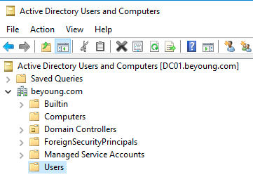

## Add a domain user


* Add DC user to the `Domain Admins` Group


* **Notes: You must create a new user here. Later on, you can't use local administrator to login your EC2.**

## Add a server into the DC


```
<powershell>
Rename-Computer -NewName "SRV01" -Restart
</powershell>
```

* Add to domain


* Control Panel > System and Security > System


* Change the network DNS record to the DC01 private ip.


* Join the domain again.


* Restart your computer

## Use the domain name to login

In the DC, make sure the login format of the domain user.


In the remote desktop configuration, change to the domain user login:


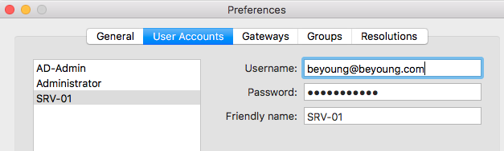

Now, you can login to your SRV01 using the DC users.


## Deep Dive on the DNS setting

You will found that Windows AD can resolve the private link. The major reason is at the DNS Forwarder.


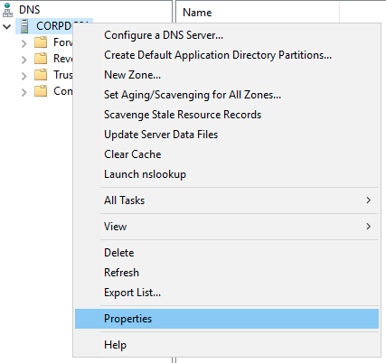


If you remove the forwarder `.2` server, you found that you can not get the private link information:


## Route 53 resolver

### Setup Rout53 Resolver

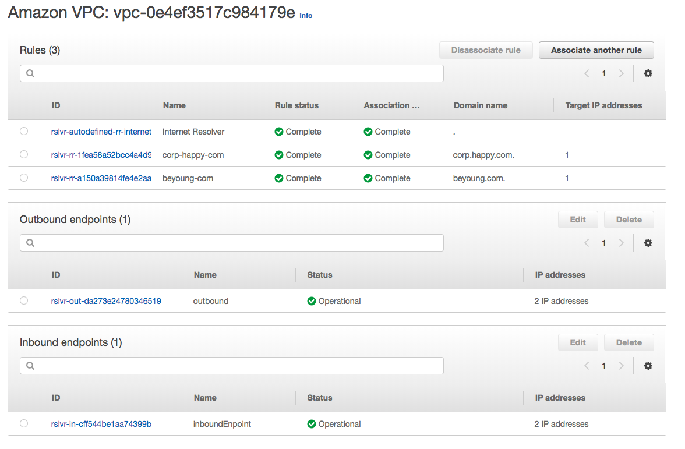

### create the outbounds roles

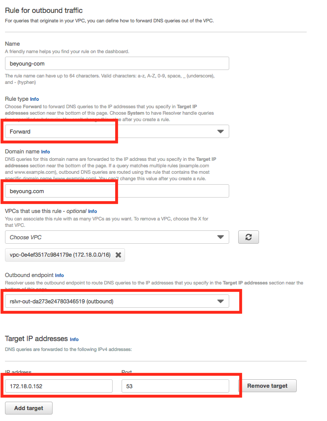

Now, you can get information for private AD information

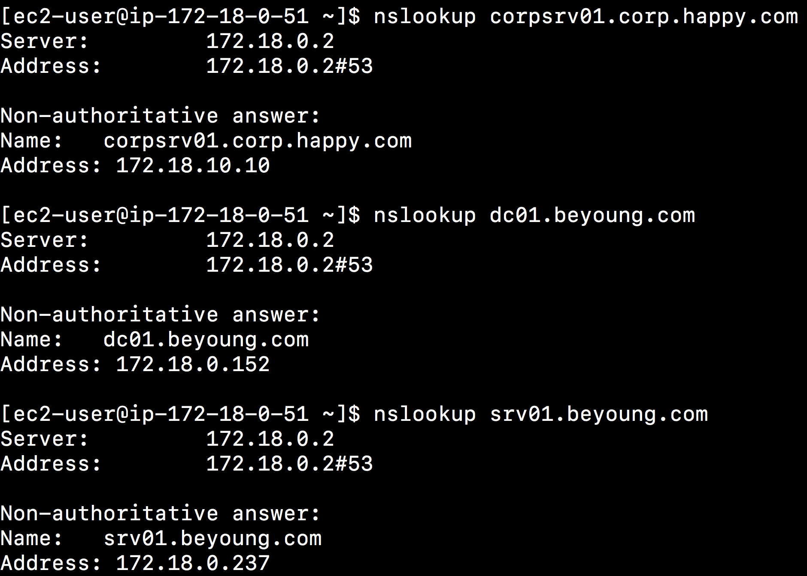

Also, when you query about the private links, you can get the correct results

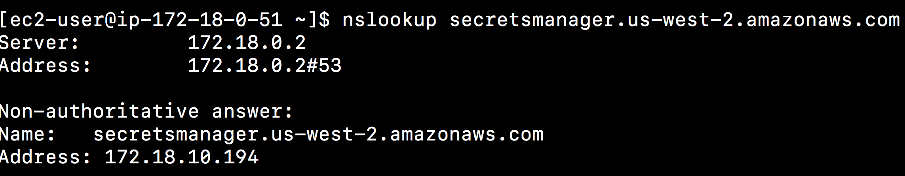

### Change CORP DNS forwarder to Route53 resolver inbound

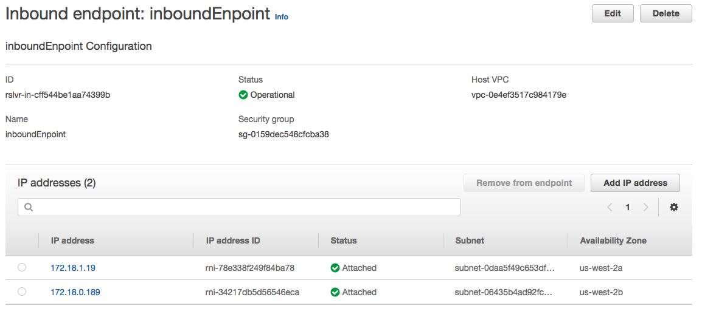

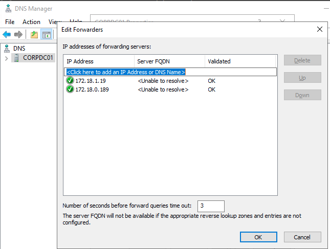

Now, the corp machine can query AWS private links and private domain of AD such as `beyoung.com`

