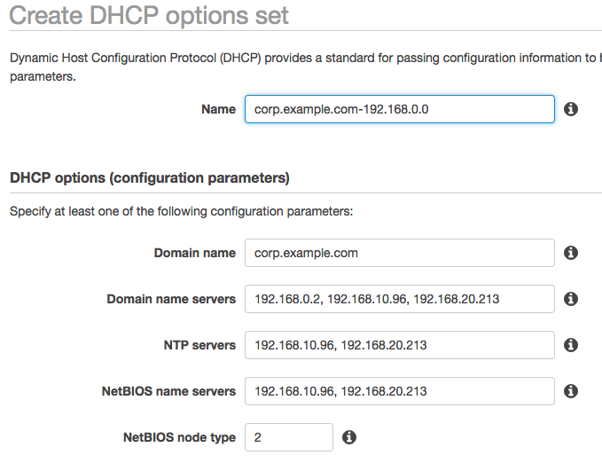
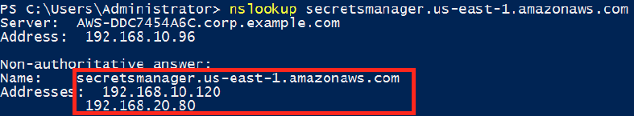

# PrivateLink and Secrets manager

## Setup DHCP Options

* Create DHCP Options Sets
  
  

We use the secrets manager as the example to verify the private link setting.

* Service endpoint: `secretsmanager.us-east-1.amazonaws.com`
* check the `ipconfig/all`
  

* the result of `nslookup secretsmanager.us-east-1.amazonaws.com`
  

## Setup the private links

Go to the service `VPC`
  
  
* Create the endpoint
  
  
  

* Now, the secrets manager becomes the local ip. The AWS AD server can know the ip.
  

