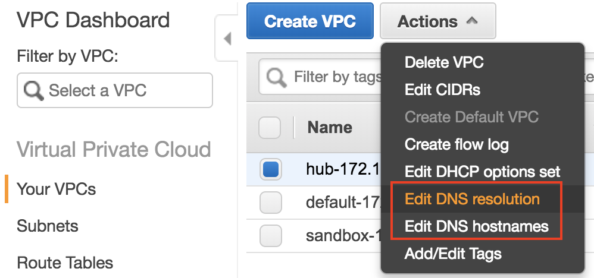
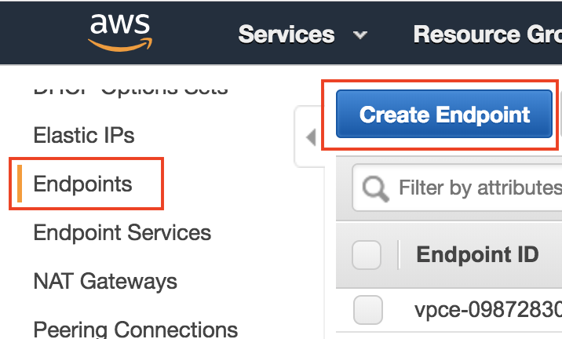
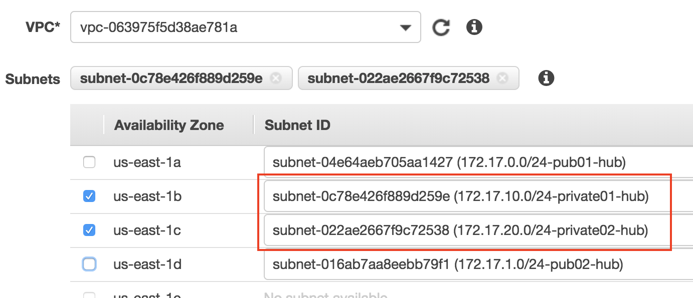
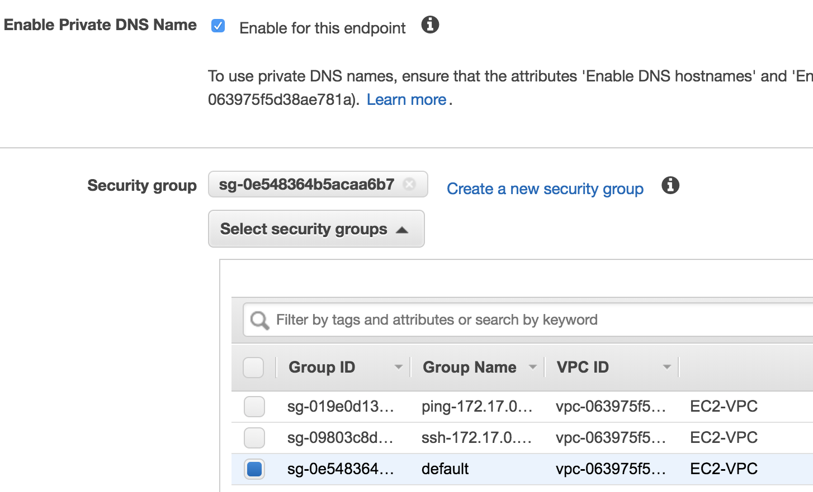
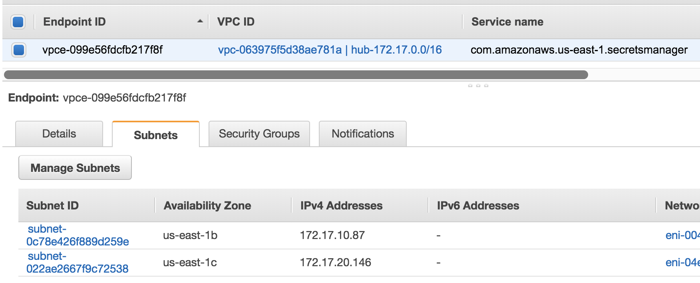

# VPC Private Links

In this section, we will create a vpc private link for secrets manager.

## Part1: Enable DNS setting on VPC

Select the VPC and then click on `Actions` to enable DNS resolution and DNS hostnames.

## Part2: Create Endpoints

1. Click `Endpoints` in left navigation, then `Create Enpoints`.

	
	
2. Choose AWS Services, and then secrets manager.

	
	
3. Select VPC and then put the endpoints to the private subnets.

	
	
4. Enable Private DNS Name and set default security group.

	
	
5. Click on the create endpoints. Then you will see the private link IPs in the console.

	

## Part3: Test the endpoints

You can launch an EC2 instance in the endpoints of VPC. Use the command `nslookup secretsmanager.us-east-1.amazonaws.com` and you can get the private IP as the same as in the console.
