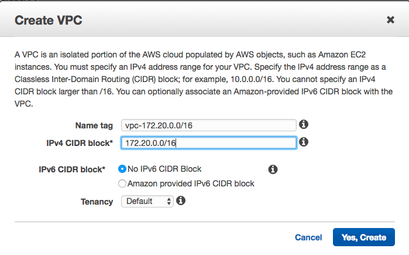
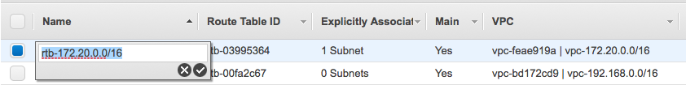
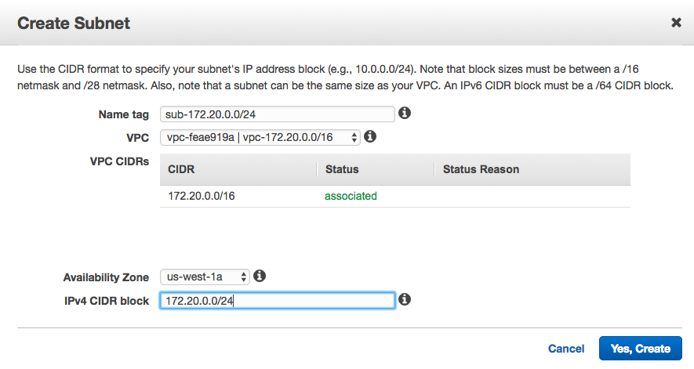
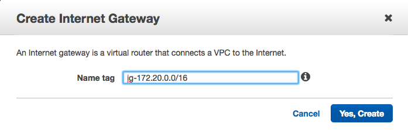
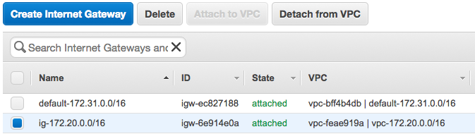
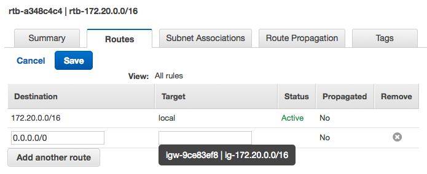
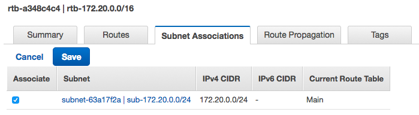
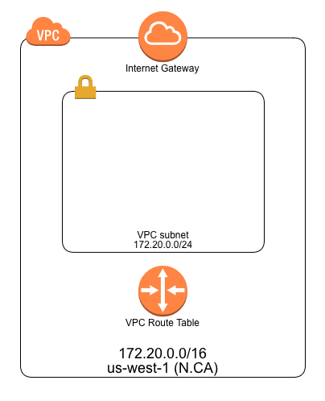

# AWS VPC Deep Dive Lab

## Objectives

At the end of this assignment you will have created a Shared services VPC using the following Amazon Web Services: EC2, VPC, VPC Peering, VPN Connections, Customer Gateway, and Virtual Private Gateway.

## Stage 1: Building the VPC, subnet, routing table and Internet Gateway

Launch aws console and switch to `us-west-1` N.Califoria and select `VPC` services. Do the following steps:

1. create VPC:
	- Name tag: vpc-172.20.0.0/16
	- IPv4 CIDR block: 172.20.0.0/16
	
2. After created the VPC, AWS also created a route table, network ACL, and security group for you. For the best practices, add the name tag for your route table and network ACL:
	- route table: rtb-172.20.0.0/16
	- network ACL: acl-vpc-172.20.0.0/16
	- security group: sg-172.20.0.0/16
	
3. create Subnet:
	- Name tag: sub-172.20.0.0/24
	- VPC: vpc-172.20.0.0/16
	- Availability Zone: us-west-1a
	- IPv4 CIDR block: 172.20.0.0/24
	
4. create Internet Gateway:
	- Name tag: ig-172.20.0.0/16
	
	- Attach to VPC: vpc-172.20.0.0/16
	
5. edit route table: choose `rtb-172.20.0.0/16` and then select `Routes` tab
	- Add Internet access: Destination `0.0.0.0/0` and Target `ig-172.20.0.0/16`
	
	- Add Subnet Associations: select `subnet associations` tab and click/save with subnet sub-172.20.0.0/24
	
6. Now, you finished the following architecture diagram:

   

## Take aways
1. Follow the [RFC 1918 - Address Allocation for Private Internets](https://tools.ietf.org/html/rfc1918)
2. Ensure that your VPC network ranges (CIDR blocks) do not overlap one another or other private network ranges.
