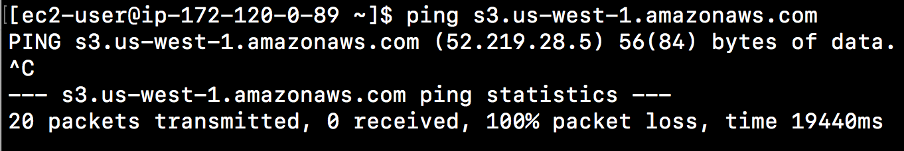
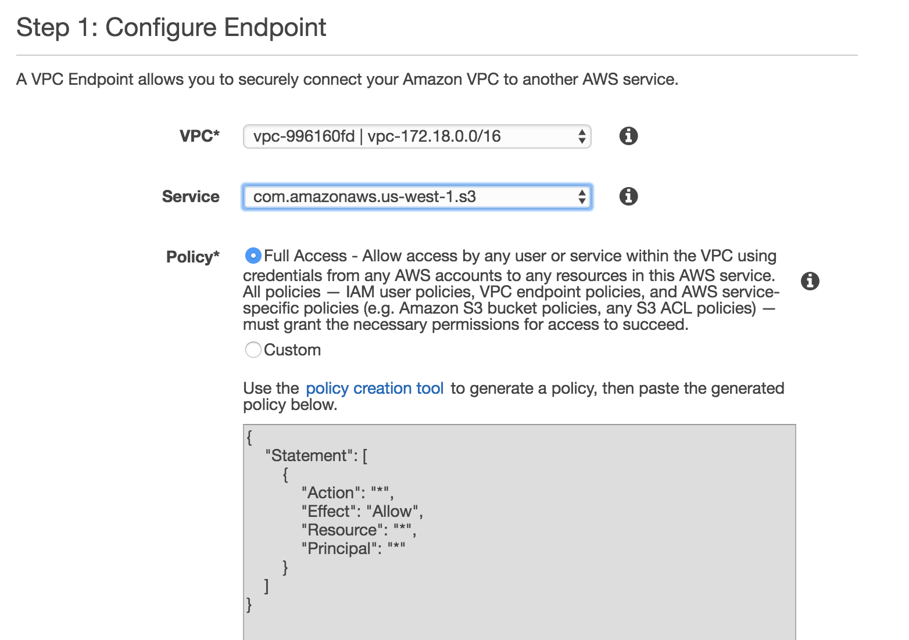
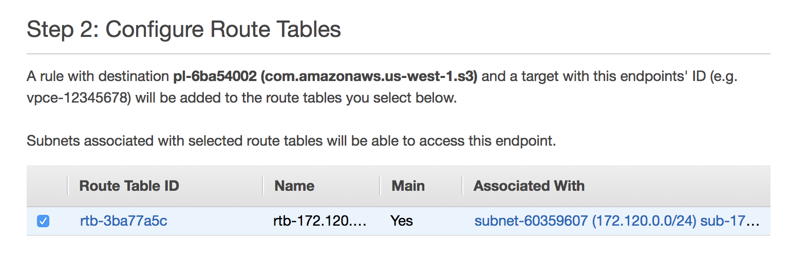
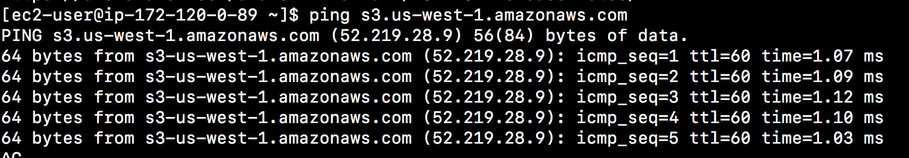
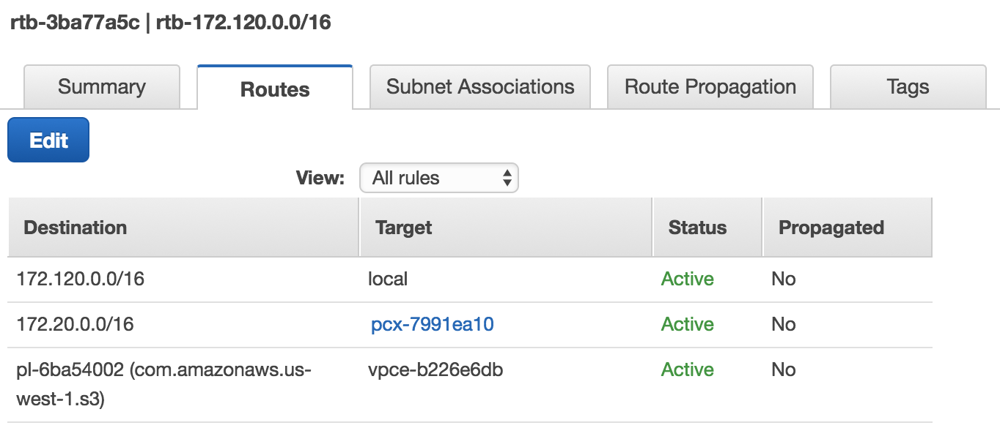
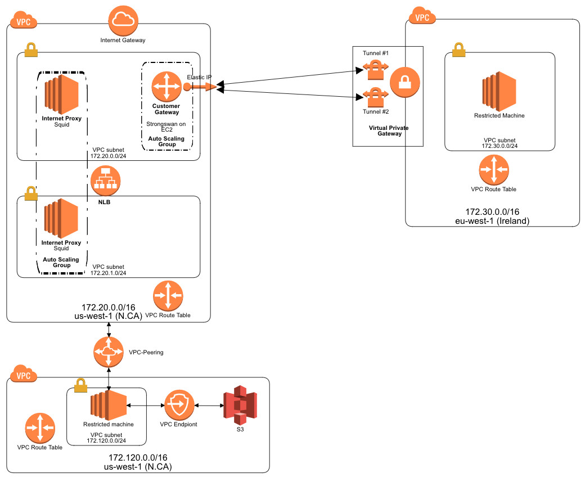

# Stage 11: VPC Endpoint

### Before S3 endpoint

1. ssh to restricted machine in the vpc-172.120.0.0/16
2. ping s3 region endpoint and you will get timeout

	

### S3 endpiont

1. create S3 endpoint
	- vpc: vpc-172.120.0.0/16
	- service: S3

	
	
2. setup to the route table

	
	
3. Notes that
	
	When you use an endpoint, the source IP addresses from your instances in your affected subnets for accessing the AWS service in the same region will be private IP addresses, not public IP addresses. Existing connections from your affected subnets to the AWS service that use public IP addresses may be dropped. Ensure that you don’t have critical tasks running when you create or modify an endpoint
	
### Verify the S3 endpoint

Now, login into restricted machine in vpc-172.120.0.0/16. Ping S3 endpoint again and you will get the package response.

You can see route table `rtb-172.120.0.0/16` with the `vpce` in the target.

Now, in then end of this stage, you have the following architecture diagram:

# Take away

Many customers have legitimate privacy and security concerns about sending and receiving data across the public internet. VPC endpoints for Amazon S3 can alleviate these challenges. You can use a private IP addresses to access Amazon S3 with no exposure to the public internet. 

And, you don't need an internet gateway, a NAT device, or a virtual private gateway in your VPC. You use endpoint policies to control access to Amazon S3. Traffic between your VPC and the AWS service does not leave the Amazon network.