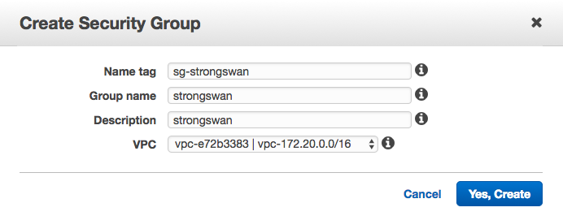
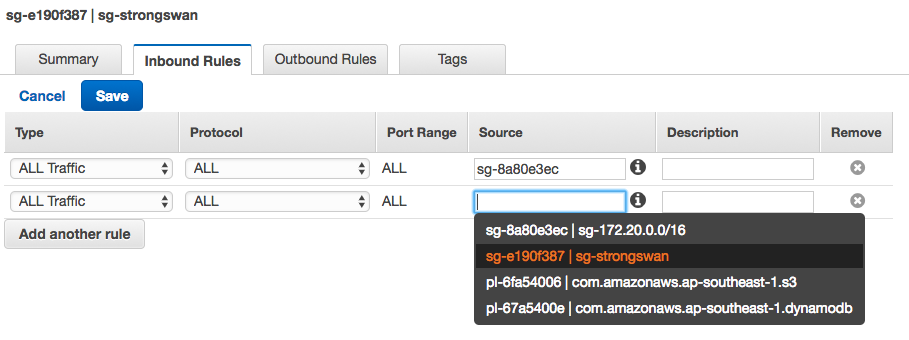
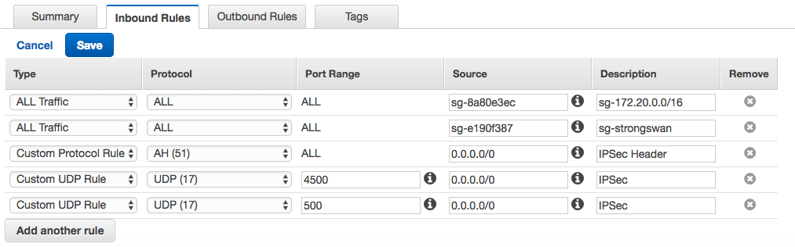
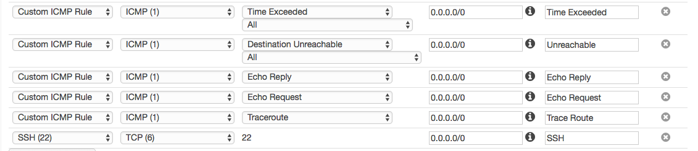
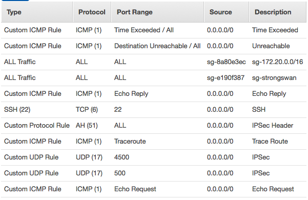

## Stage 2: Setup Customer Gateways Secruity Group

At the end of this stage, you will create a software customer gateways, strong swan. You will use the following AWS services: Elastic IPs, security group, and EC2.

### Create and config security group

1. Create a security group for strong swan
	- name tage: sg-strongswan
	- group name: strongswan
	- description: strongswan
	- VPC: vpc-172.20.0.0/16
	

2. Config the secruity group - VPC and self routing
	- **Important**: first add `All Traffic` for security group: `sg-strongswan` and `sg-172.20.0.0/16`. Let in the same VPC network can routes each other.
	
3. Add IPSec rules:
	- Custom Protocol AH(51)	IPSec Header
	- Custom UDP Rule UDP 4500	IPSec
	- Custom UDP Rule UDP 500	IPSec
	
4. Add Debug rules:
	- Custom ICMP Rule - IPv4	Time Exceeded
	- Custom ICMP Rule - IPv4	Destination Unreachable
	- Custom ICMP Rule - IPv4	Echo Reply
	- Custom ICMP Rule - IPv4	Echo Request
	- Custom ICMP Rule - IPv4	Traceroute
	- SSH (22)
	
5. At the end, the strong swan security group configuration as the following:
	
	
### Take aways
1. A security group acts as a virtual firewall for your instance to control inbound and outbound traffic.
2. Security groups act at the **instance level**, not the subnet level. Therefore, each instance in a subnet in your VPC could be assigned to a different set of security groups.
3. Best practices: Create different security group for your special function instances. Don't add too much rules on your default security group for the VPC.
4. Security group specify **allow rules**, but not deny rules. When you create a security group, it has no inbound rules but allow all outbound traffic.
5. Security group is **stateful** configuration.