# Stage 3: Setup Customer Gateway

In the end of this stage, you will setup a software customer gateway using `strongswan`. It will cover the following AWS services: EC2 and ElasticIPs.

## Create an EC2 instance

1. Select `ec2` services in the `us-west-1` region.
2. Launch EC2 instance. Choose `CentOS 7 (x86_64) - with Updates HVM` from AWS marketplace.

	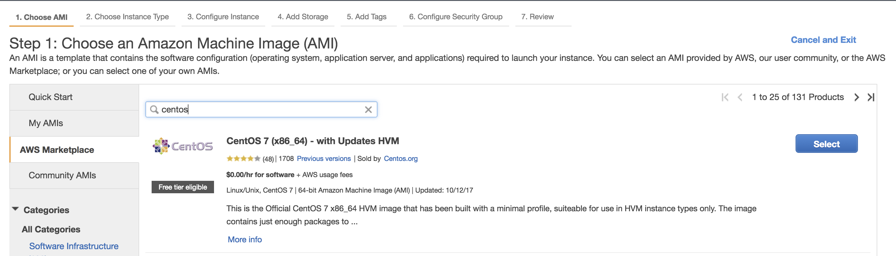

3. Select instance type `t2.micro` for free tier lab. In production environment, please select `m4.10xlarge` because of the network performance is `10Gigibit`.

	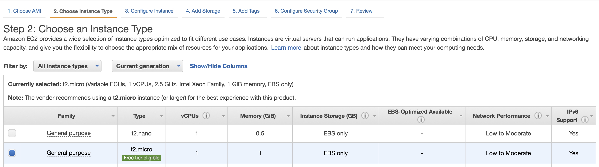

4. Configurate EC2 instances
	- network: vpc-172.20.0.0/16
	- subnet: sub-172.20.0.0/24

	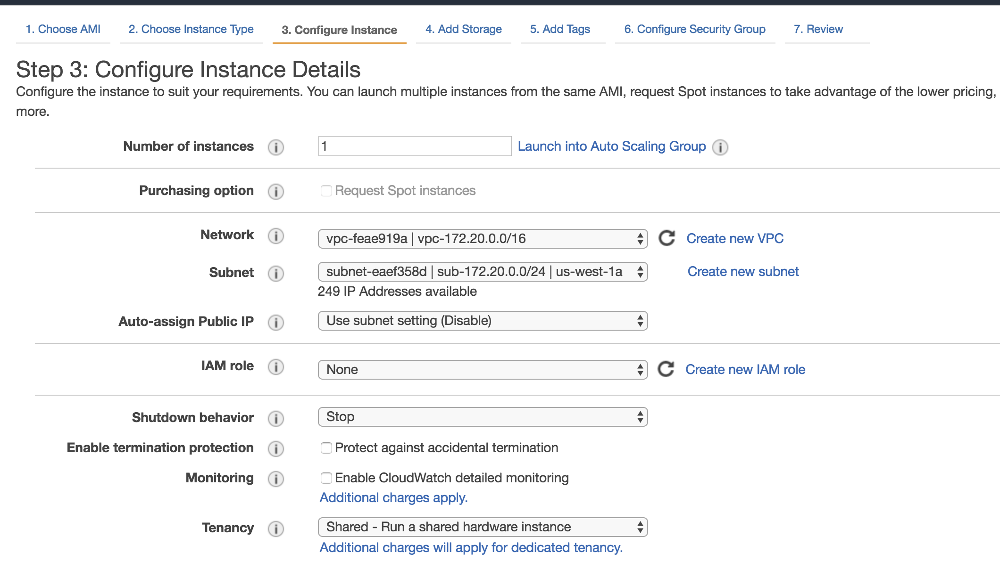

5. Add Storage
	- Delete on Termination: uncheck
	
	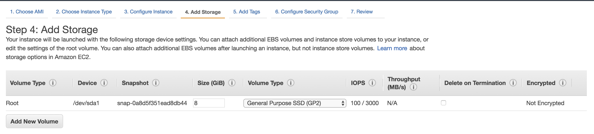
	
6. Add Tag
	- Name: strongswan
	
	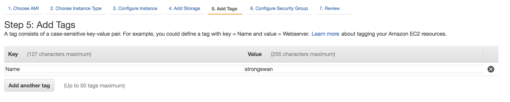

7. Chose security group
	- select an existing security group: strongswan, which created in stage 2. And then go to final `7.Review`.
	
	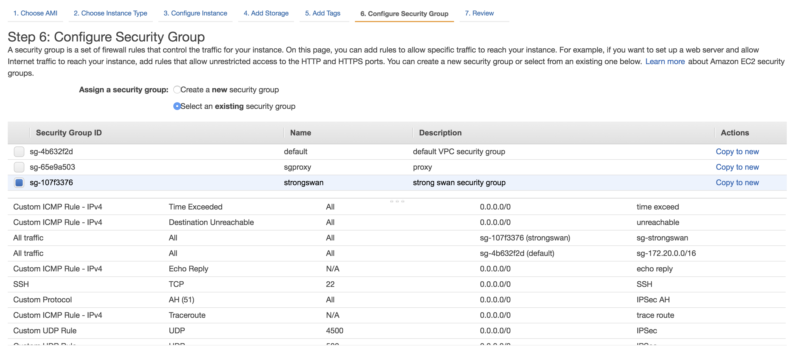

8. Click on `Launch` button. Then, select an existing key pair or create a new key pair. `Checked` the I acknowledge.

	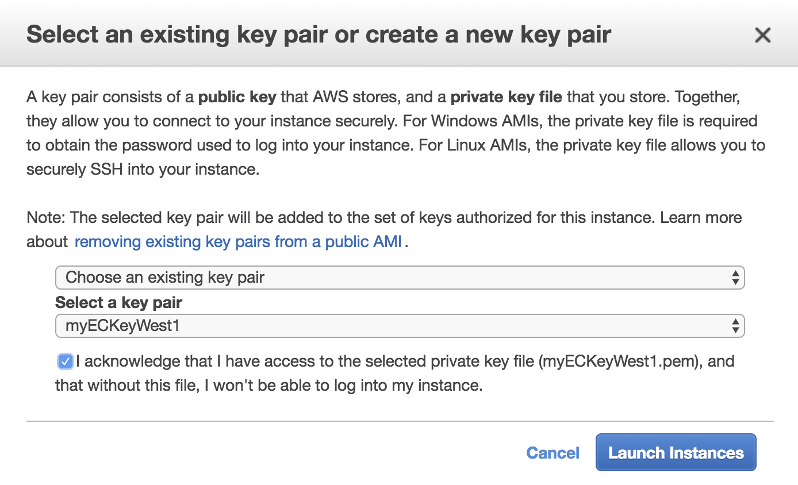
	
## Create Elastic IP

1. Allocate a new elastic IP.

	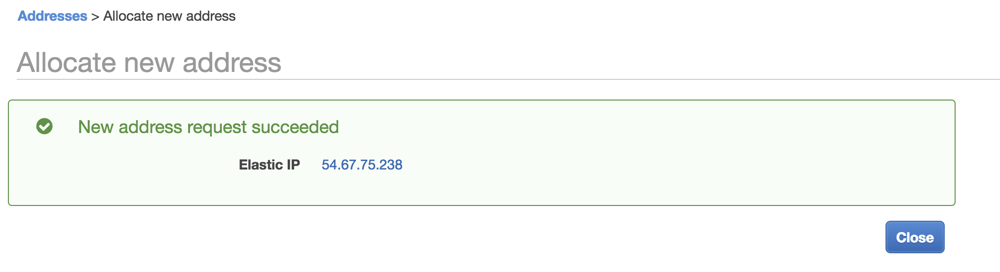

2. Associated elastic IP to instance strongswan.

	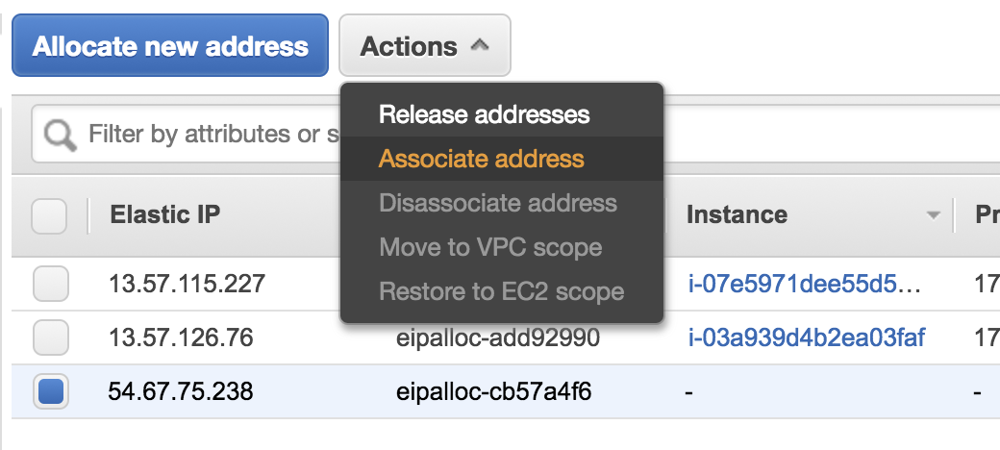

	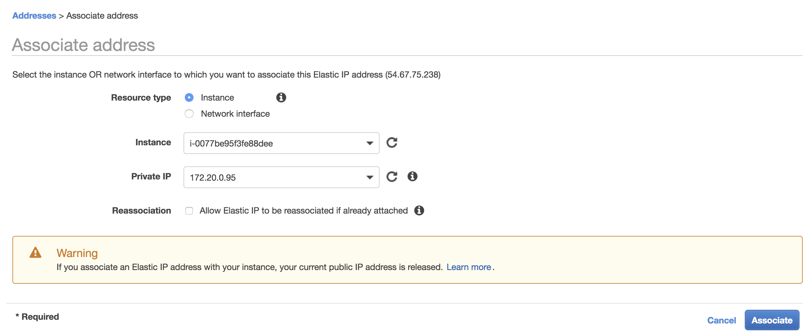

3. Change the strongswan instance tag name as `strongswan-<elastic ip>`

	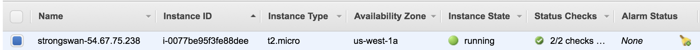

## Configure Customer Gateway

### ssh to instance
1. ssh -i `<us-west-keypar>` centos@`<elastic ip>`
2. change to root: `sudo su`

### turn on ipv4 forward
1. `vi /etc/sysctl.conf` and then add the following line:

	`net.ipv4.ip_forward = 1`
	
2. `sysctl -p /etc/sysctl.conf` to let config take effects.

### install NTP to sync up time

1. `yum install -y ntp`: install ntp package
2. `vi /etc/ntp.conf`: change NTP Server pool:

	```
	server 0.amazon.pool.ntp.org iburst
	server 1.amazon.pool.ntp.org iburst
	server 2.amazon.pool.ntp.org iburst
	server 3.amazon.pool.ntp.org iburst
	```

3. enable nptd service

	```
	systemctl enable ntpd
	systemctl restart ntpd
	```
4. Verify nptd servier `systemctl status ntpd`

	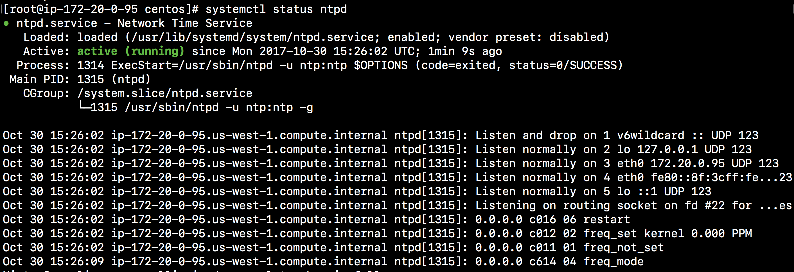
	
### install strongswan

```
yum install -y epel-release
yum repolist
yum update -y
yum install -y strongswan
systemctl enable strongswan
```

Now, we stop here for the `us-west-1` configuration. We need to setup Virtual Private Gateway and VPN channel in other region. In the end, we have the following architecture diagram:

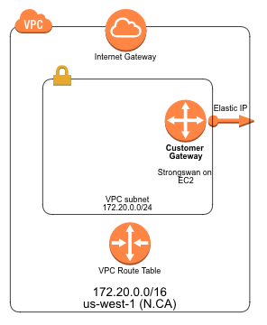


## Take aways
1. Different EC2 instances provide different capacities such as memory, vCPU, and network.
2. We use ElasticIP to bind EC2 instance. It is a decouple design.
3. Best practices: must setup `ntpd` services to synchronize network time clock.