# Stage 4 - Setup Virtual Private Gateway and VPN Connections

In the end of this stage, you will create virtual private gateway and vpn connection to other aws region. You will use AWS VPC, subnets, virtual private gateway, and VPN connections.

## Build up a restricted network environment

You can reference [stage1](stage1.md) for the detail VPC configuration and related screenshot.

1. Login AWS console, select `VPC` service to `eu-west-1` region.
2. Create a VPC:
	- Name: vpc-172.30.0.0/16
	- IPv4 CIDR: 172.30.0.0/16
3. Change name tags:
	- Route table: rtb-172.30.0.0/16
	- Network ACL: acl-172.30.0.0/16
4. Change security group:
	- Name tag: sg-172.30.0.0/16
	- Edit `Inbound Rules`: we restricted the echo and ssh from source `172.20.0.0/16`
	
	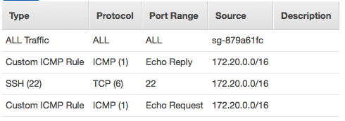
	
5. Create a subnet:
	- Name tag: sub-172.30.0.0/24
	- VPC: vpc-172.30.0.0/16
	- AZ: eu-west-1a
	- IPv4 CIDR block: 172.30.0.0/24

## Setup VPN connections

### Config Virtual Private Gateway
1. create virtual private gateway
	- Name tag: vpg-172.30.0.0/16
	- ASN: Amazon default ASN
	
	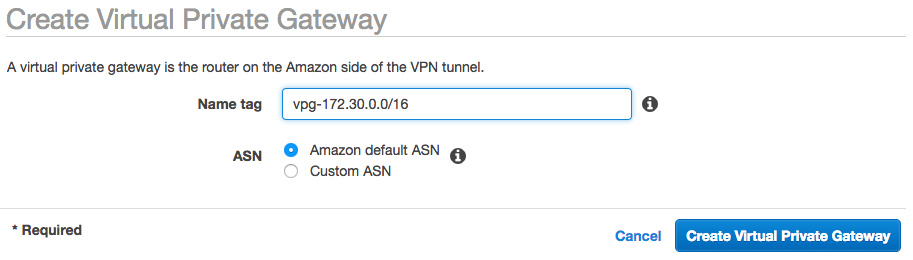
	
2. Attach to VPC: `vpc-172.30.0.0/16`

	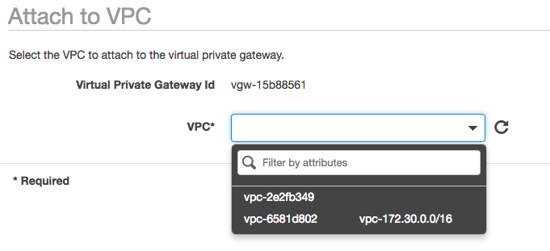

### Create Customer Gateway
1. Create customer gateway: I would like to use region name to know where is the destination.
	- Name: cgw-us-west-1
	- Routing: static
	- IP Address: `<elastic ip>` which we create in the previous stage.
	
	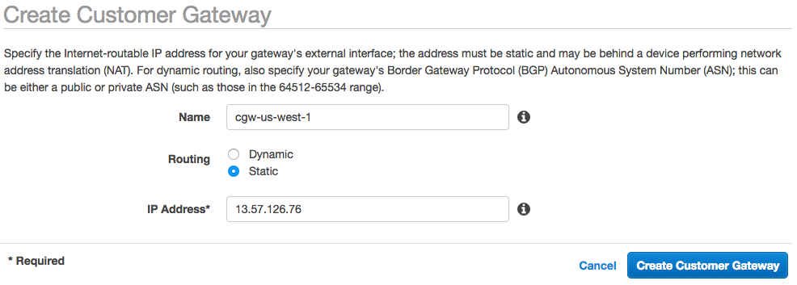
	
### Create VPN Connection

1. Create VPN connection, choose existing customer gateway
	- Name tag: vpn-us-west-1
	- Virtual Private Gateway: vpg-172.30.0.0/16
	- Customer Gateway ID: cgw-us-west-1
	
	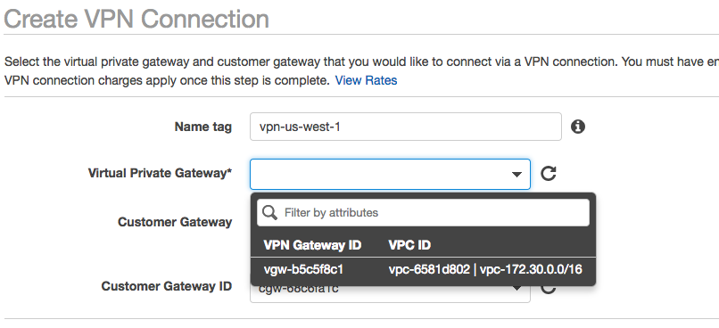
	
2. Routing setting:
	- Choose static
	- Add prefixes: `172.20.0.0/16` and `0.0.0.0/0` to let internet and the other side CIDR.
	
	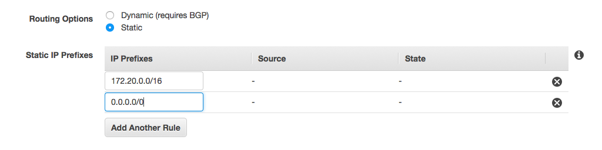
	
### Download VPN Configuration

1. On the menu, click download configuration.

	

2. Select vendor `generic`, then download.

	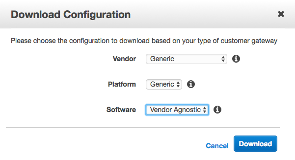
	
3. In the configuration file, you can find Pre-Shared Key for tunnel 1 and tunnel 2.

	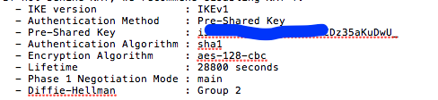
	
4. You can reference the configuration file [here](config/vpn-13.57.126.76.txt)

### Setup Routes

1. Select routes table `rtb-172.30.0.0/16`. Add `0.0.0.0/0` and `172.20.0.0/16` to your virtual private gate way, `vpg-172.30.0.0/16`

	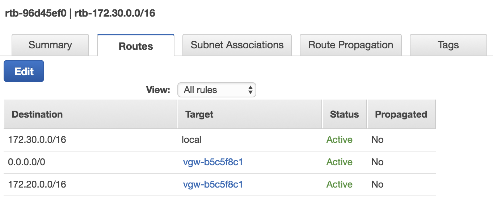

2. change the subnet associations in the route table `rtb-172.30.0.0/16` 

	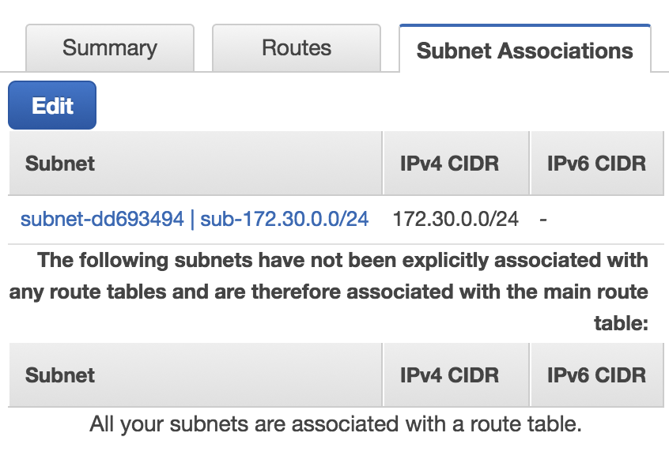

3. Launch an EC2 instance at subnet `sub-172.30.0.0/24` with name tag `restricted-machine`.

## Take away

Now, you have the following architecture diagram in the region `eu-west-1`. In the next stage, you will connect the VPN tunnels.

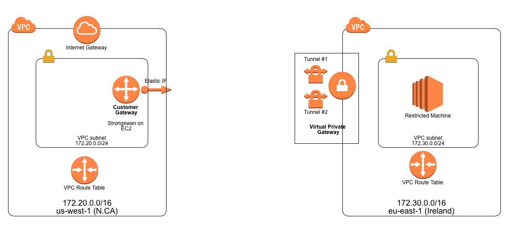