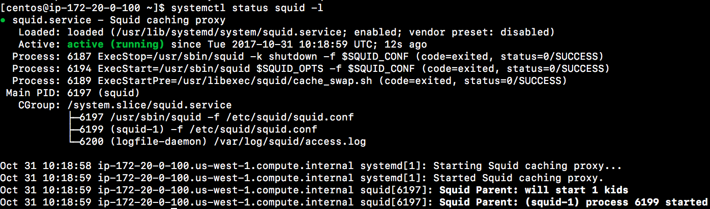
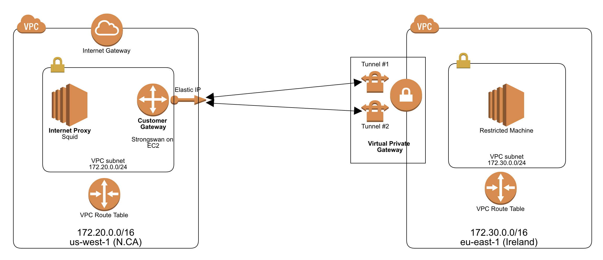

# Stage 6: Setup Proxy

In the end of this stage, you can create a proxy server. And the, you will config http_proxy on the restricted machine so that restricted machine can execute `yum update` to upgrad the packages.

## Setup Squid Proxy

1. Create an EC2 instance using centos7. The name tag is `proxy`.
2. Create an ElasticIP and assicate to `proxy` instance.
3. ssh to `proxy` server.
4. run the following commands to install:

	```
	yum -y install epel-release
	yum -y update
	yum -y install squid
	```

5. modify `/etc/squid/squid.conf`

	```
	acl localnet src 172.20.0.0/16  # RFC1918 possible internal network
	acl localnet src 172.30.0.0/16  # RFC1918 possible internal network
#acl localnet src 172.16.0.0/12 # RFC1918 possible internal network
	```

6. start squid service

	```
	systemctl enable squid
	systemctl start squid
	```
7. verify squid `systemctl status squid` and `tail -f /var/log/squid/access.log` 

	

## Configure HTTP_Proxy

1. ssh to restricted machine at `eu-west-1`
2. modify `/etc/yum.conf`. Add proxy server setting. Currently, we does not setup username and password. So, add `proxy=http://172.20.0.100:3128`.

	```
	# The proxy server - proxy server:port number
	proxy=http://mycache.mydomain.com:3128
	# The account details for yum connections
	proxy_username=yum-user
	proxy_password=qwerty
	```
3. run `sudo yum update -y` to verify that you can update your packages.

## Take away

In our case, the restricted server uses VPN tunnel to a proxy server for the package download. The current architecture diagram is as the following:



Normally, to enable access to or from the Internet for instances in a VPC subnet, you must do the following:

- Attach an Internet gateway to your VPC.
- Ensure that your subnet's route table points to the Internet gateway.
- Ensure that instances in your subnet have a globally unique IP address (public IPv4 address, Elastic IP address, or IPv6 address).
- Ensure that your network access control and security group rules allow the relevant traffic to flow to and from your instance.


