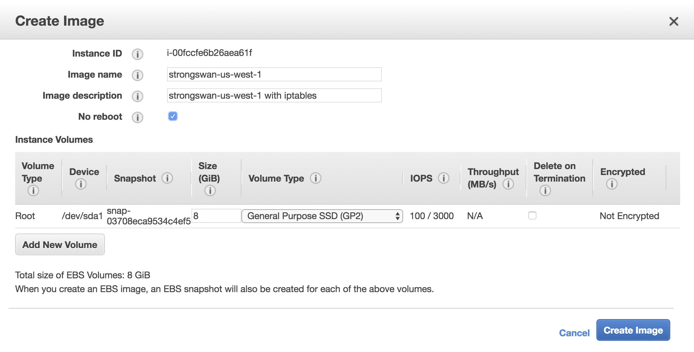
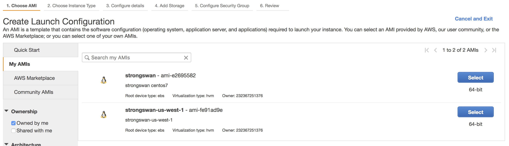
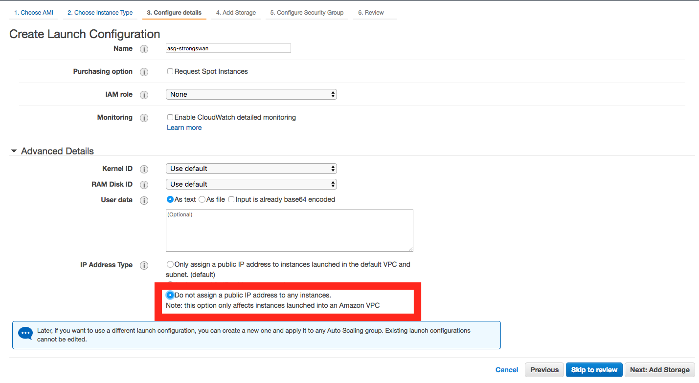
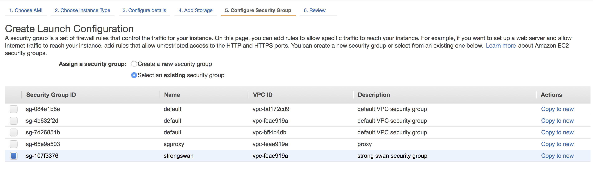

# Stage 7: Auto scaling group

Now, we will setup a auto scaling group for strongswan for the HA setting.

## Launch Configuration

#### My AMIs

1. Select your `strongswan` ec2 instance.
2. In actions >> image >> create image
	

### Create launch configuration

1. Choose AMI from My AMIs.

	
	
2. Choose Instance
3. Configure details
	- name: ag-lc-strongswan

	
	
4. Configure security group. select strongswan security group.

	
	
5. Then save the launch configuration.

### Create Auto Scaling Group

### Change Routes

1. Route table: `rtb-172.20.0.0/16`
	- set 172.30.0.0/16 to the new instance
2. 
