# Stage 7: Auto scaling group

Now, we will setup a auto scaling group for strongswan for the HA setting.

## Launch Configuration

#### My AMIs

1. Select your `strongswan` ec2 instance.
2. In actions >> image >> create image.

	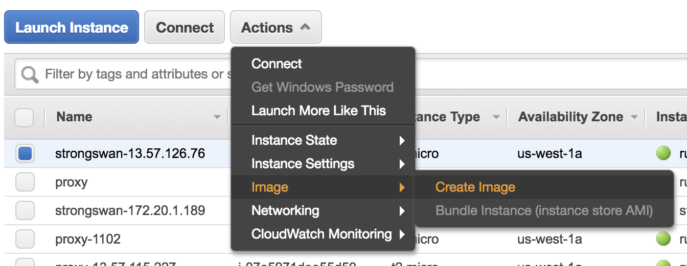
	
	Here, we click on `no reboot` to avoid the connection broken.
	Name: strongswan-us-west-1
	
	

### Create launch configuration

1. Choose AMI from My AMIs. select `strongswan-us-west-1` image.

	
	
2. Choose Instance
	- t2.micro
3. Configure details
	- name: asg-strongswan
	- choose do not assign a public address. Becuase strongswan need use static ip, so we need to bind a EIP.

	

4. choose default storage: 8GB SSD. click on `delete on termination`.

5. Configure security group. select strongswan security group.

	
	
6. Then save the launch configuration.

7. After save, you will go to create auto scaling group page.

	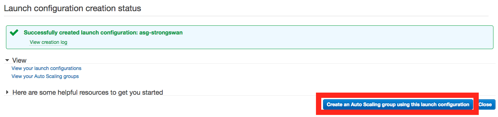

### Create Auto Scaling Group

1. In the configuration page:
	- name: asg-strongswan
	- group size: put `0` here first because we will attach current running strongswan into this group.
	- Network: choose `vpc-172.20.0.0/16`
	- Grace period: 30 seconds

	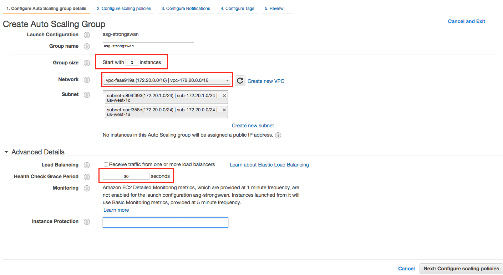 
	
2. In the next page, choose `Keep this group at its initial size`.
3. Skip notification. We can add it in the future.
4. Add Name tag: `asg-strongswan` so that we will know this instance is created by auto scaling group.
5. Review and create the auto scaling group.

	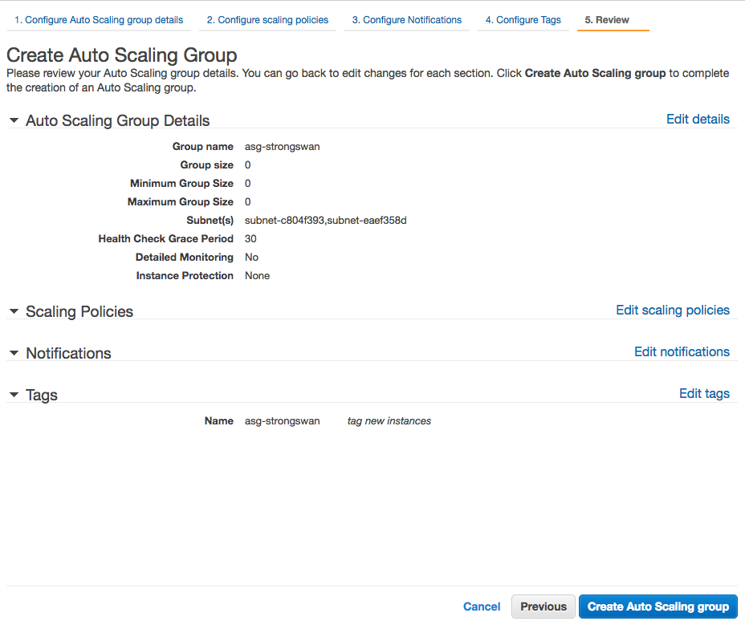

### Attach an instance to auto scaling group

1. Edit the asg-strongswan. Set Max 1

	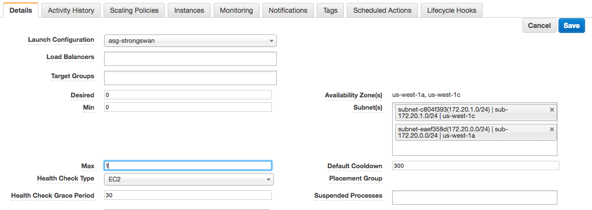

2. Select running strongswan instance. Choose actions >> instance setting >> attach to auto scaling group.

	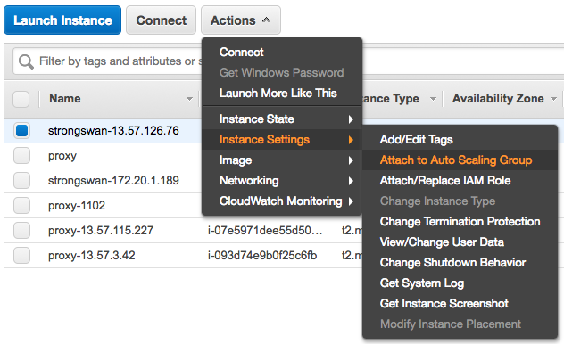
	
3. Attach to existing `asg-strongswan` group:

	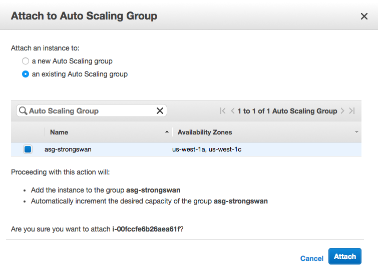
	
4. Now, edit the asg-strongswan again. Set the Min 1

	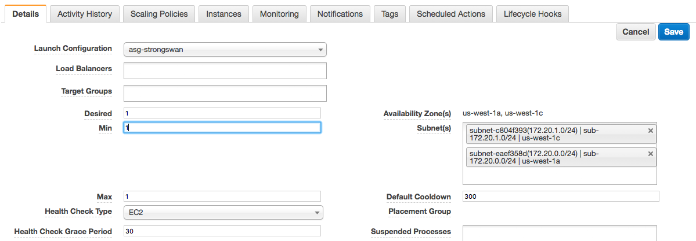
	
5. You finished the auto scaling group setting:
	- Min: 1
	- Max: 1
	
	Also, important thing is without interrupts current running tunnel.
	
### Testing auto scaling

1. Stop current running strongswan instance.

	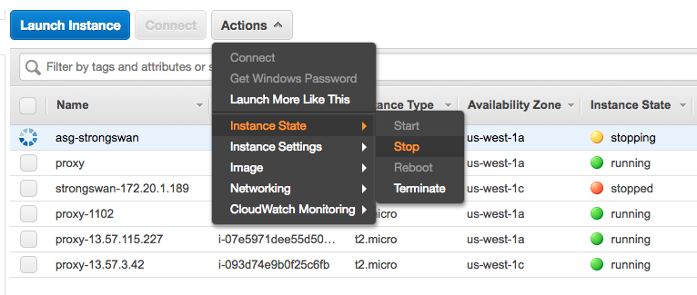
	
2. Later on, auto scaling group will start launch a new strongswan instnace.

	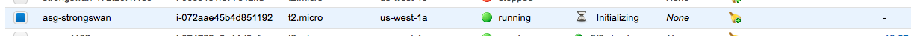
	
3. Change the ec2 without checking the source/destination

	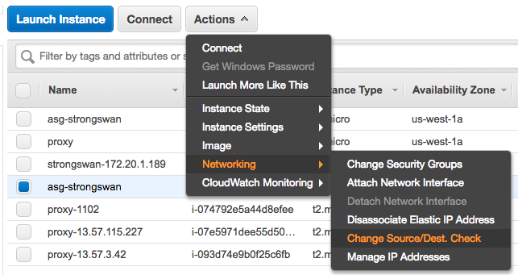
	
4. Modify the route table: `rtb-172.20.0.0/16`. Set 172.30.0.0/16 to the new instance.
	
	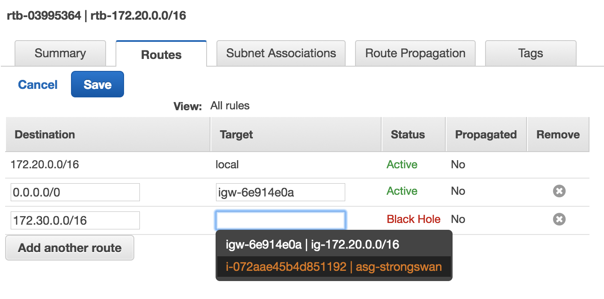


5. Attach static ip to the new instance.

	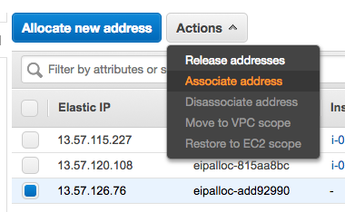
	
6. ssh to the new instance via EIP and `sudo su`.
7. modify `/etc/strongswan/ipsec.conf`. Change left to current private ip.

	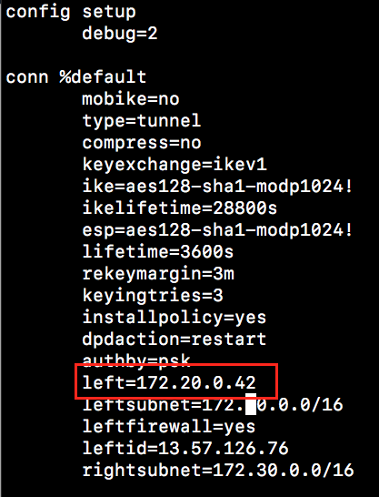
	
8. Run the following command to start strongswan
	```
	iptables -t nat -A POSTROUTING -s 172.30.0.0/16 -m policy --dir out --pol ipsec -j ACCEPT
	iptables -t nat -A POSTROUTING -s 172.30.0.0/16 -j MASQUERADE
	systemctl restart strongswan
	strongswan up vpg-34.240.82.0
	```
	
	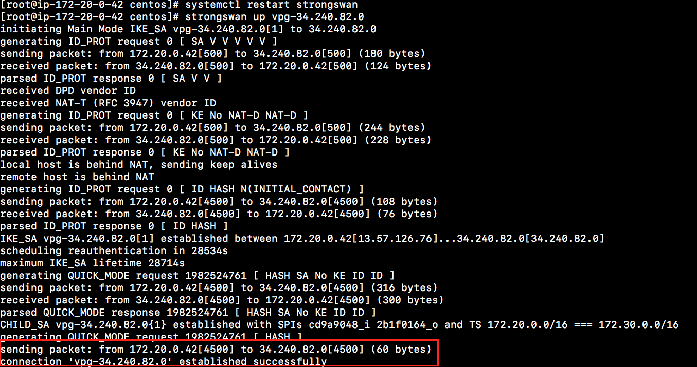

# Take Away

Now, we have a auto scaling group for the strongswan. The benefit is when strongswan has issues. The auto scaling group will create a new instance for you.

But, because we have **stateful** configuration for strongswan such as

	- ElasticIP binding
	- Routing table
	- Strongswan configuration

The better solution is triggered notificaiton event. Use event call a lumbda function to change the above things.

Now, we have the following architecture diagram:

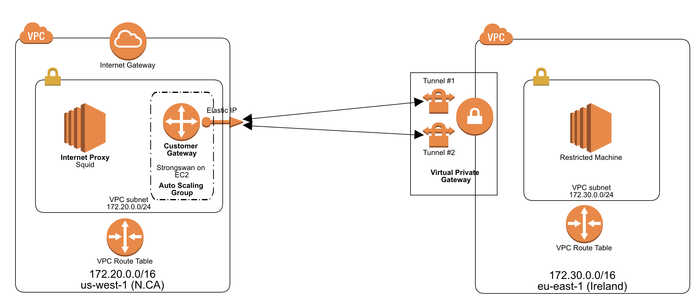
