# Stage 8: Load Balancer for Proxy

In the end of this lab, you will create a AWS classical load balancer for squid proxy.

Please reference the [comparison of elastic load balancing](https://aws.amazon.com/elasticloadbalancing/details/#compare) to understand Application Load Balancer(ALB), Network Load Balancer(NLB), and Classic Load Balancer(CLB). In this stage, we will use NLB.


## Setup Network Load Balancer

#### Preparation

1. Create subnet `sub-172.20.1.0/24`
	- Name: sub-172.20.1.0/24
	- IPv4 CIDR: 172.20.1.0/24
	- VPC: vpc-172.20.0.0/16
	- Availability Zone: us-west-1c

2. Enable auto-assign Public IP for `sub-172.20.1.0/24` and `sub-172.20.0.0/24` because NLB needs two subnets and squid proxy needs public IP.

	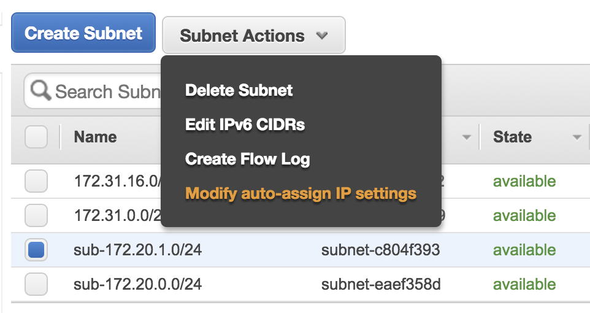

3. Create squid proxy AMI images.

	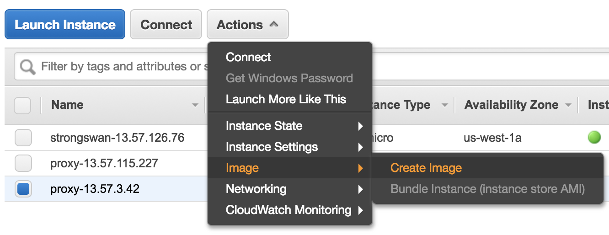

#### Network Load Balancer

1. Create Network Load Balancer

	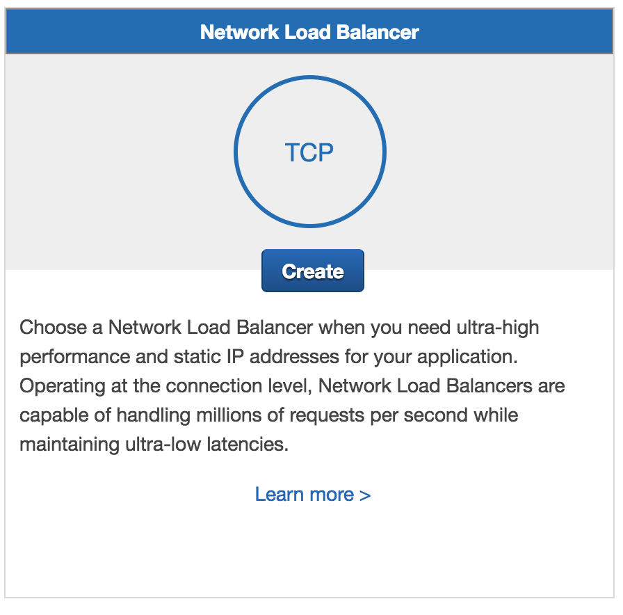

2. Configure Load Balancer
	- Name: nlb-proxy
	- Scheme: internal
	- Listeners: TCP/3128
	
	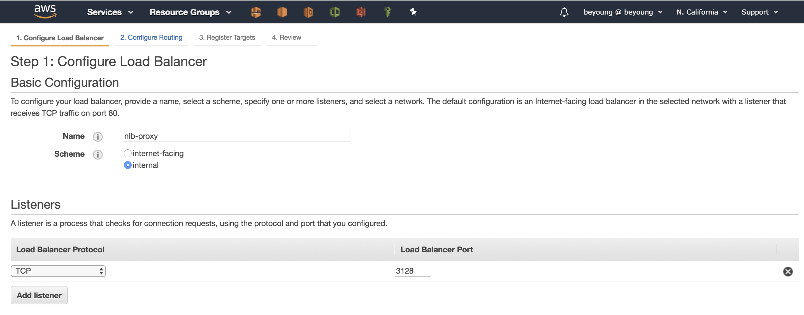
	
	- VPC: vpc-172.20.0.0/16
	- AZ: us-west-1a and us-west-1c
	- Name: nlb-proxy

	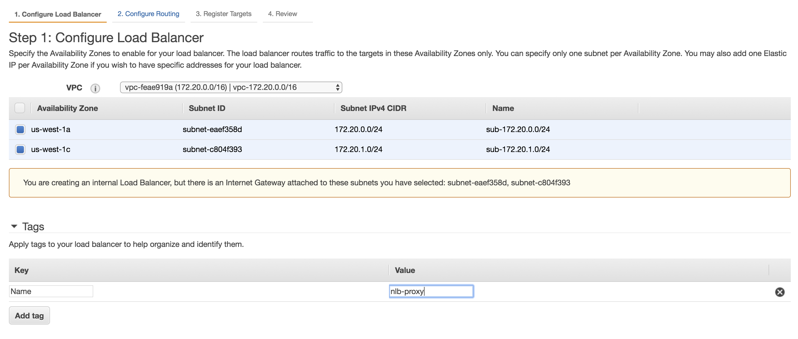
	
3. Configure Routing
	- Target group: New target group
	- Name: nlb-proxy
	- Protocol: TCP
	- Port: 3128
	- Target type: instance
	- Health Checks
		- TCP
		- override port: 3128
		- Healthy threadhold 3
		- Interval: 10 seconds
	
	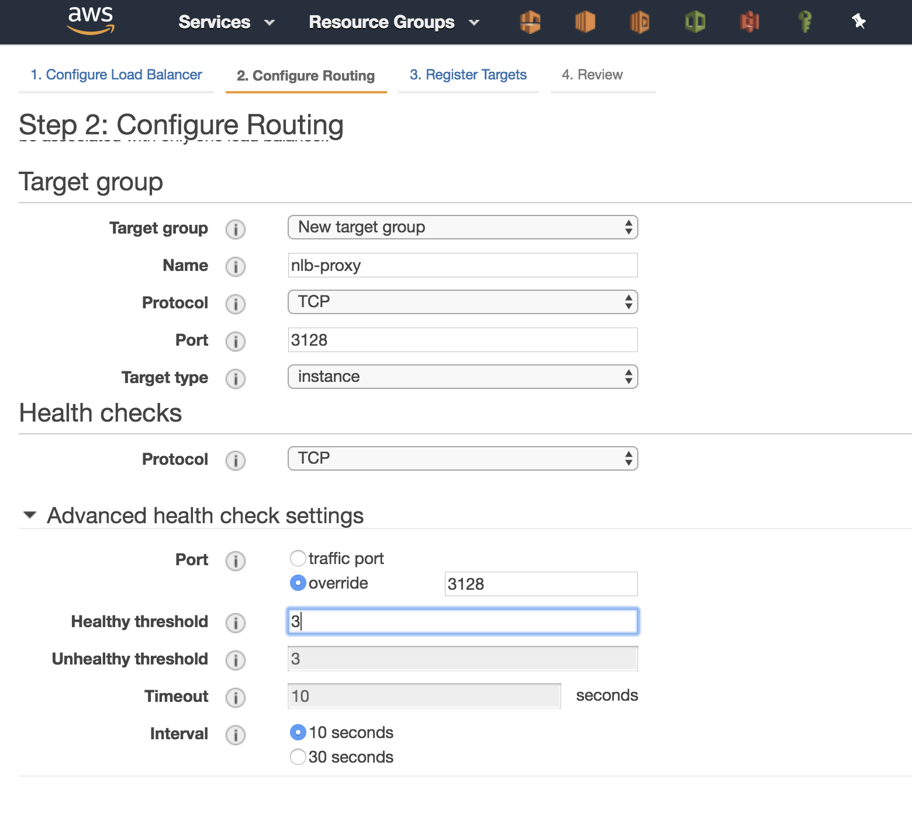
	
4. Register Targets
	- select proxy instance
	
	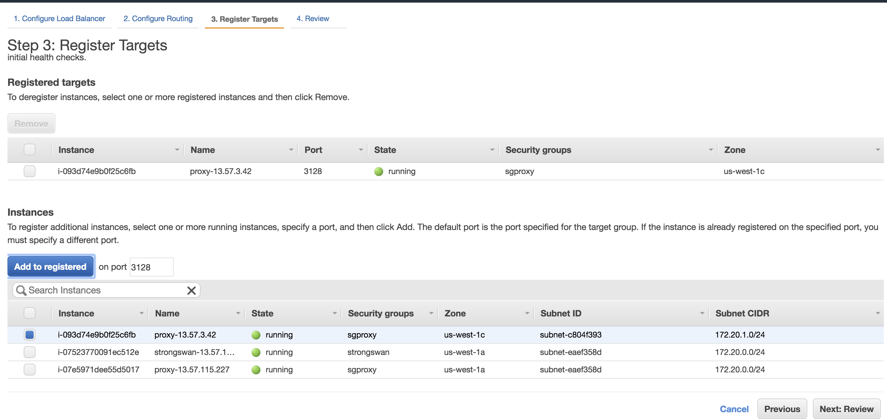
	
5. Review and create

	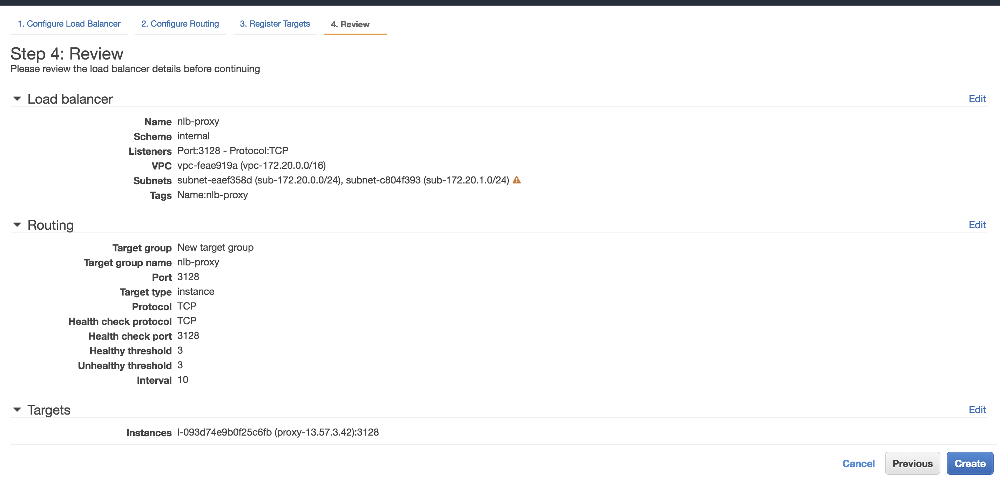
	
6. Verify the system is running

	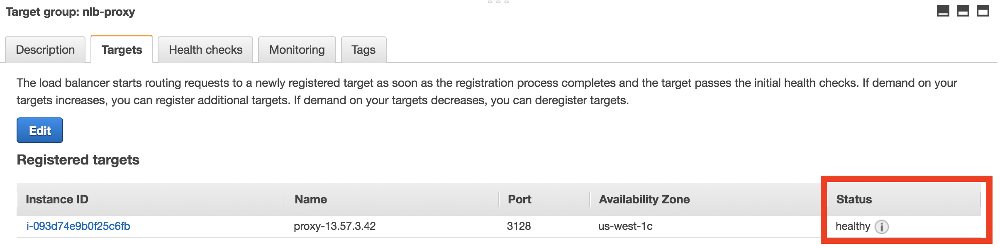

7. Copy DNS name for nlb

	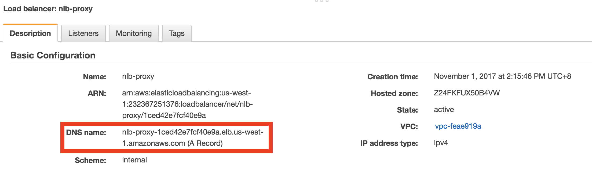

#### Verify NLB proxy

1. ssh to restricted manchine
2. `sudo vim /etc/yum.conf` to set up the proxy to your nlb dns name such as:
	
	```
	proxy=http://nlb-proxy-1ced42e7fcf40e9a.elb.us-west-1.amazonaws.com:3128
	```

3. `sudo yum update -y` to verify it is correct.

## Apendix

### Use classical load balancer in front of Squid

If you use clasical elb, you need to do two things:

1. turn on the `proxy` policy on elb 
2. turn on proxy protocal on squid

#### Turn on proxy mode on elb
1. run the following command `create-load-balancer-policy` from aws-cli. Please remember to set these parameters:
	- load-balancer-name: put your `<elb-name>`
	- policy-name: put your policy name
	- region

	```
	aws elb create-load-balancer-policy --load-balancer-name clb-proxy --policy-name my-ProxyProtocol-policy --policy-type-name ProxyProtocolPolicyType --policy-attributes AttributeName=ProxyProtocol,AttributeValue=true --region us-west-1
	```

2. run the following command `set-load-balancer-policies-for-backend-server` to set your classical load balancer. Change the following parameters:
	- instance-port: squid is 3128
	- policy-names: the policy name
	- region

	```
	aws elb set-load-balancer-policies-for-backend-server --load-balancer-name clb-proxy --instance-port 3128 --policy-names my-ProxyProtocol-policy --region us-west-1
	```

3. Verify the result:

	```
	aws elb describe-load-balancers --load-balancer-name clb-proxy --region us-west-1
	```
	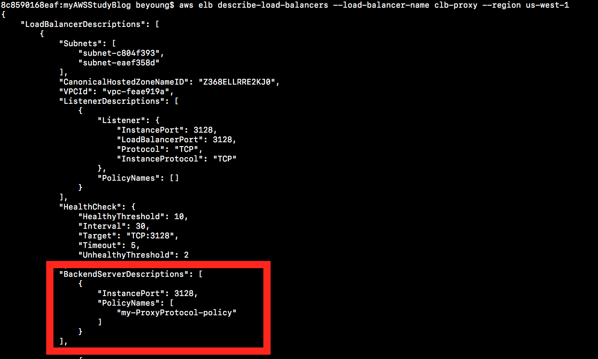
	
**Important** Please read [enable proxy protocol](http://docs.aws.amazon.com/elasticloadbalancing/latest/classic/enable-proxy-protocol.html) for detail information.

#### Turn on proxy protocol in squid
1. modify `/etc/squid/squid.conf` add the following line to let squid accept the proxy protocol.

	```
	acl frontend src nlb-proxy-1ced42e7fcf40e9a.elb.us-west-1.amazonaws.com
	http_port 3128 require-proxy-header
	proxy_protocol_access allow frontend
	```
2. `sudo systemctl restart squid` and `sudo tail -f /var/log/squid/access.log` to verify the package is correct.

**Important** you can reference squid configuration file [here](ftp://ftp.arnes.si/packages/squid/squid-3.5.3-RELEASENOTES.html#ss2.7) for more detail information.

### wget proxy

1. create `~/.wgetrc` file:

```
use_proxy=yes
http_proxy=127.0.0.1:8080
https_proxy=127.0.0.1:8080
```

2. Or, use `-e`

`wget -e use_proxy=yes -e http_proxy=127.0.0.1:8080 <url...>`