# Stage 9: network load balancer + Auto Scaling

In the end of this stage, you will integrate network load balancer and auto scaling group on proxy servers.

## Create auto scaling group

1. Create AMI images for squid. AMI Name: `squid-us-west-1`

	
	
2. Create Launch Configuration
	- select MyAMI: `squid-us-west-1`
	
	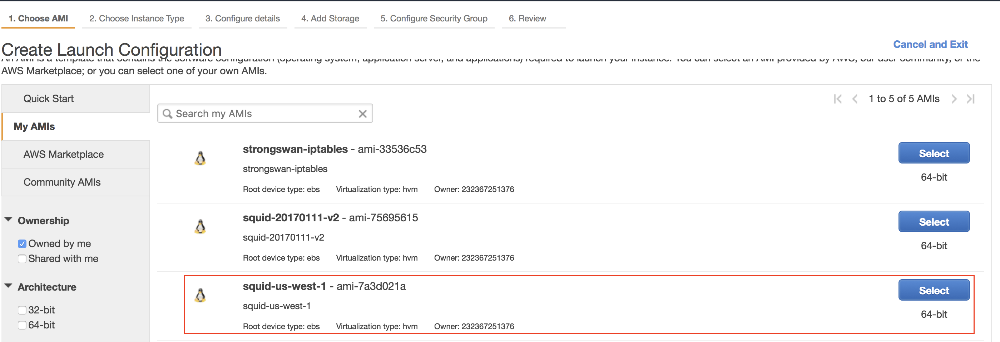
	
3. select ec2 instance: t2.micro
4. Launch configuration
	- Name: asg-proxy
	- Auto give public ip
	
	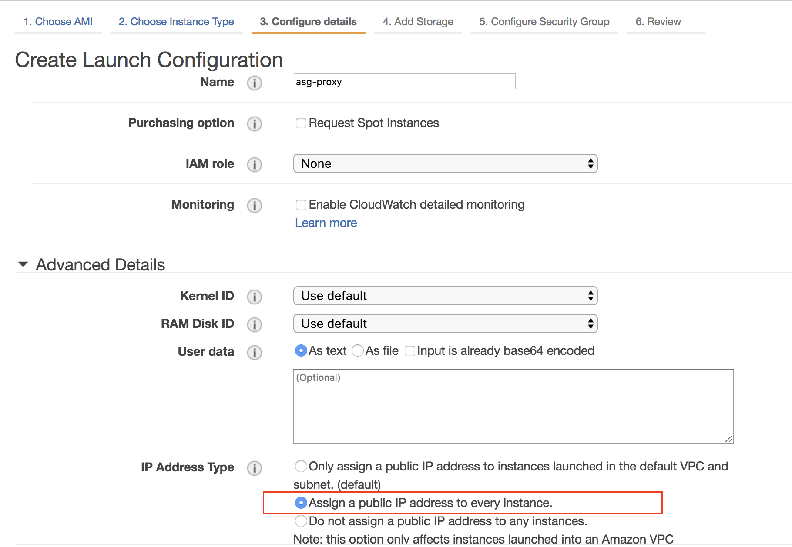
	
5. Checked delete on termintion for EBS storage.
6. Security group: select exisiting `sg-proxy`

	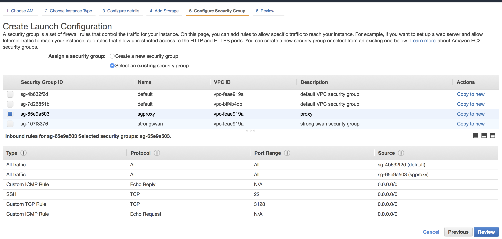

7. Review and create launch group.

## Create Auto Scaling Group

1. config auto scaling group
	- Name: asg-proxy
	- Group size: start 0
	- Network: vpc-172.20.0.0/16
	
	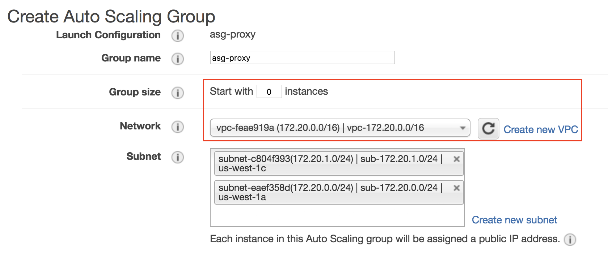
	
2. In the advance details
	- target group: nlb-proxy
	- Healthy type: ELB

	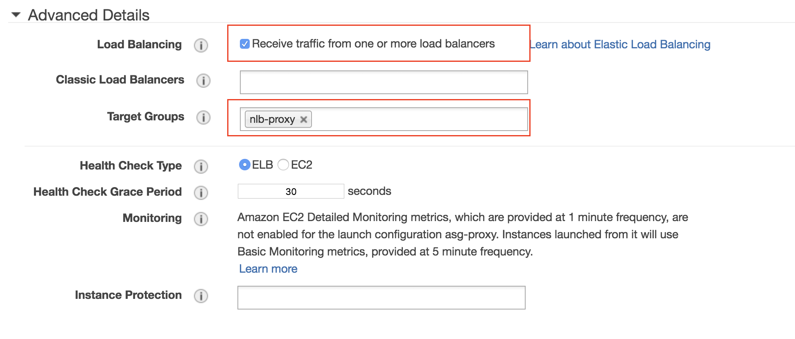

3. define the scale out policy

	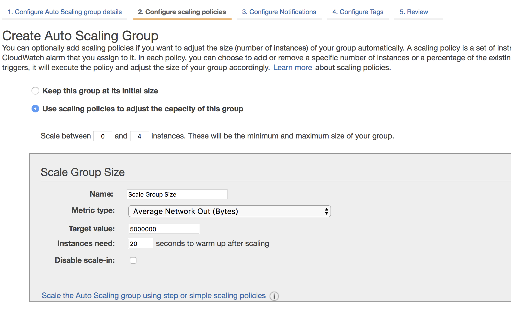

4. Use default notifcation and Notification
5. Name tag: asg-proxy
6. Done: create the asg-proxy

	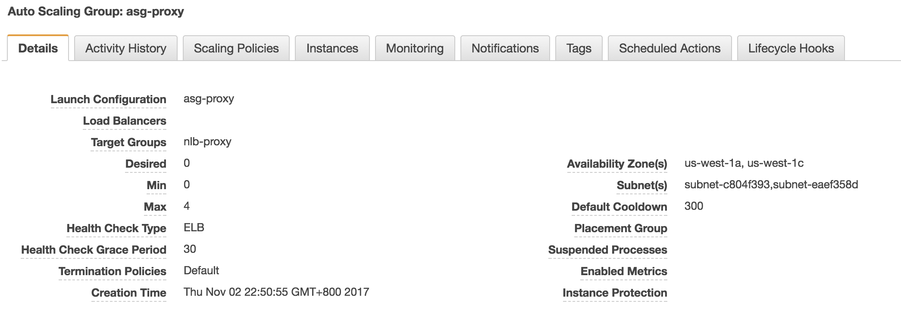
	
## Verify Auto Scaling Group with NLB

7. Change the asg-proxy, desire 2.

	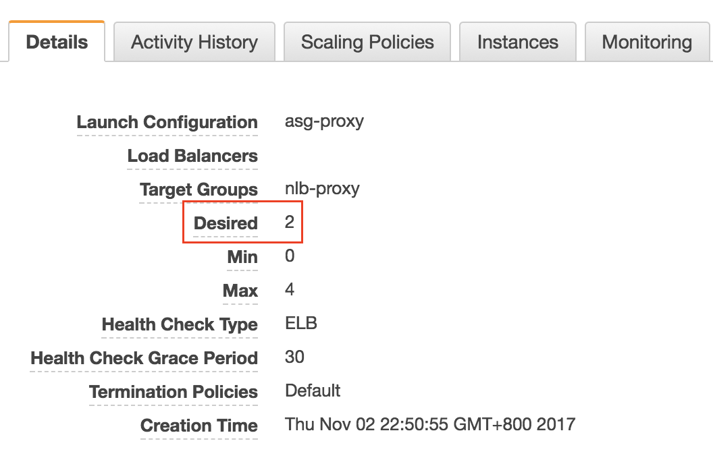

8. In the instances, you will see two instances are creating.

	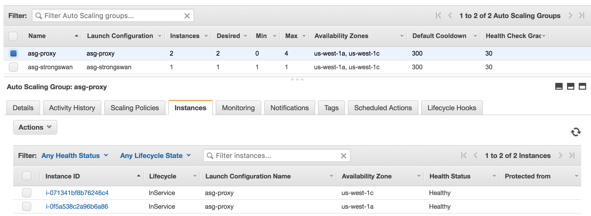
	
9. In the target group: nlb-proxy, you will see **three** instances are in the group.

	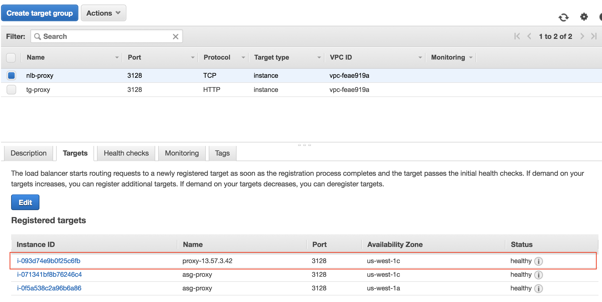	

10. You can edit and remove `proxy-13.57.3.42` machine. You will see the status become **draining**.

	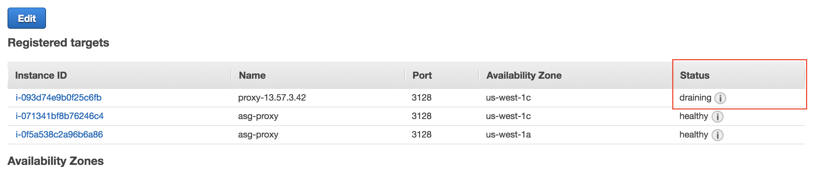
	
11. Testing the NLB and autoscaling group at the restricted machine. Run `yum update` at the restricted machine:

	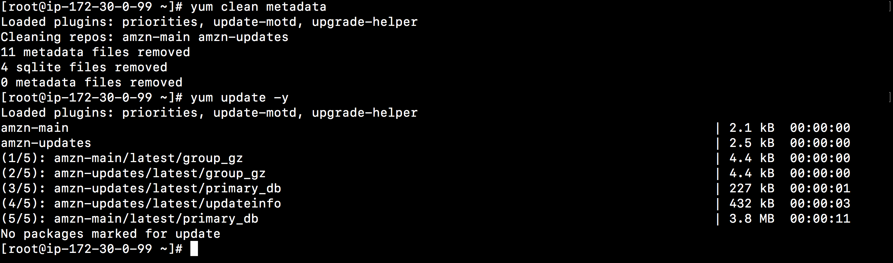
	
12. In the nlb monitoring tab, you can see the cloud watch with traffic records.

	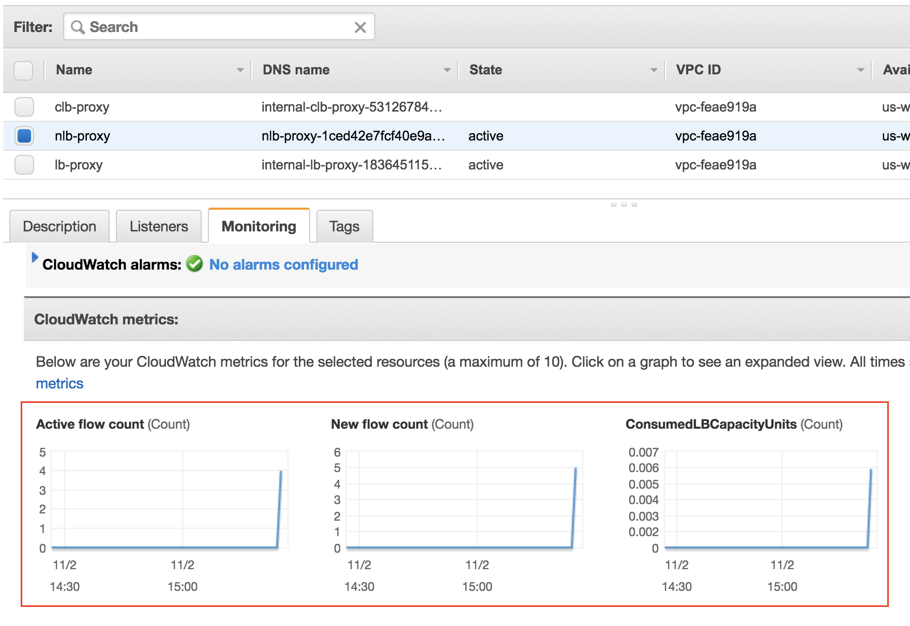
	
# Take away

Now, you have the following architecture diagram:

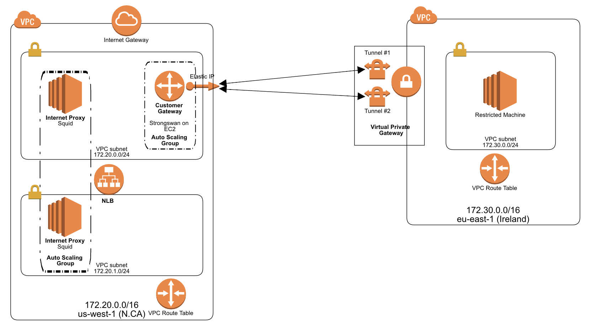

Congradulations! You learn a lot of key things for AWS VPC.