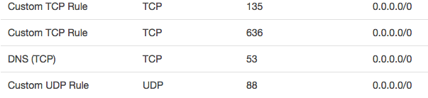
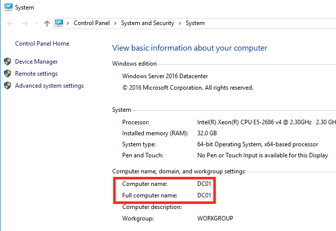
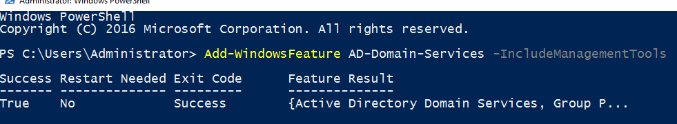
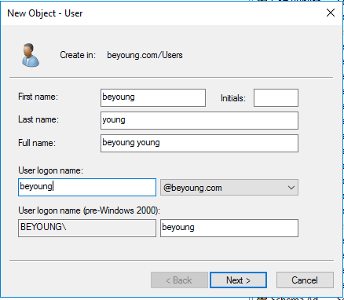
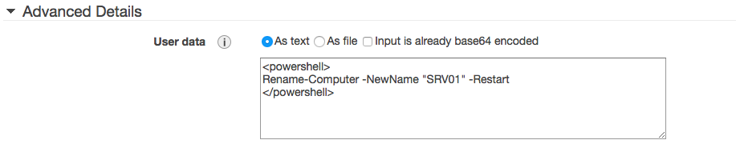
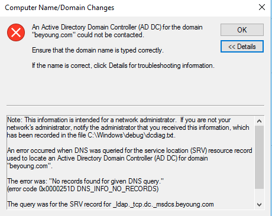
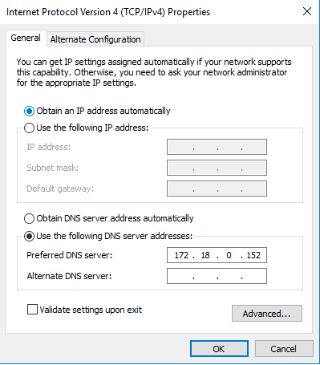
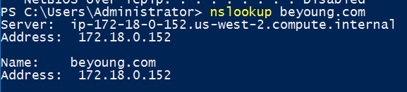
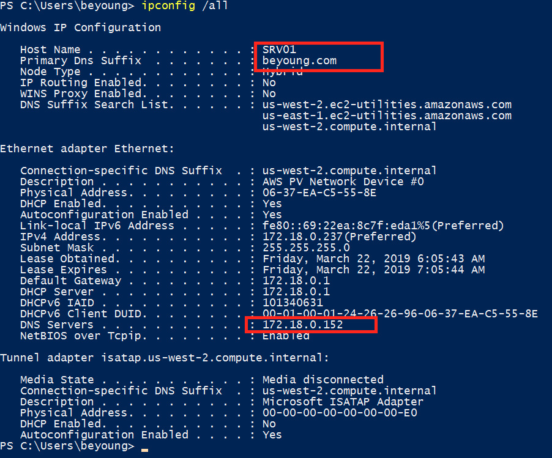

# Build your active directory in AWS EC2

## Part1: Launch EC2
* Images: `Microsoft Windows Server 2016 Base`
* t2.2xlarge
* Add customize scripts

	```
	<powershell>
	Rename-Computer -NewName "DC01" -Restart
	</powershell>
	```


## Part2: Winodws AD Secruity Group



## Part3: Config the AD

1. Logon the EC2 windows server. Verify the computer name.

	

2. run PowerShell command:

	```
	Add-WindowsFeature AD-Domain-Services -IncludeManagementTools
	```

	

3. Command line to open Server Manager. In the right up corner, promote this server as domain controller.

	
	
4. Deploy a new forest
	
	

	* NetBIOS name: `BEYOUNG`

5. After completing the wizard, the server will be restarted and the server will be ready to be used. 

## Part4: Add a domain user

1. Command line to open Server Manager. In the right up corner `Tools`, choose Active Directory Users and Computers.
	
	
	

2. Add a user
	
	

3. Add DC user to the `Domain Admins` Group

	

* **Notes: You must create a new user here. Later on, you can't use local administrator to login your EC2.**

## Part5: Add a server into the DC

1. Launch an windows EC2 instance. In the Advanced Details add user data script: 

	```
	<powershell>
	Rename-Computer -NewName "SRV01" -Restart
	</powershell>
	```
	
	

2. Logon to the windows EC2. Open file manager, right click properties on 'This PC`.

	

	* Control Panel > System and Security > System

	

3. Get the following error messages:

	

4. Change the network DNS record to the DC01 private ip.

	
	

5. Join the domain again.

	
	
	
6. Restart your computer to take the effection.

## Part6: Use the domain name to login

1. In the DC, make sure the login format of the domain user, which can use email format as login.

	
	

2. In the remote desktop configuration, change to the domain user login:

	
	

3. Now, you can login to your SRV01 using the DC users.

	
	
