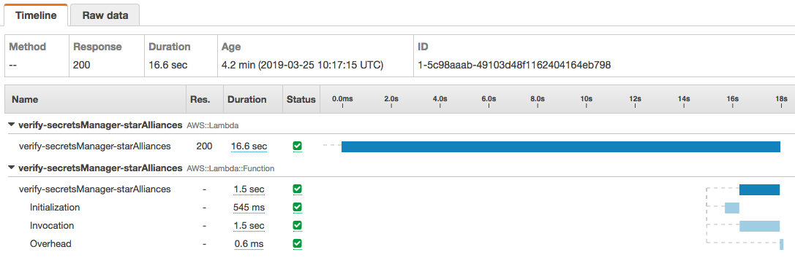

# AWS X-ray

AWS X-Ray provides tracing and monitoring capabilities for your Lambda function. Click here to learn more.

## Part 1: Enbale lambda active tracing

1. Find your lambda function. In the debugging and error handling section, enbale active tracing box. Save lambda function.

	
	
2. Test your lambda execution. Click on "Monitoring Tab" and View traces in X-Ray.

	
	

## Part 2: Create Lambda Layer for X-Ray

### Installing virtualenv and create a folder

1. `python3 -m pip install virtualenv`
2. `mkdir x-ray; cd x-ray`

### Create virtual environment and install packages

2. `python3 -m virtualenv env`
3. `source env/bin/activate`
4. `pip install aws-xray-sdk`
5. `pip show aws-xray-sdk`, it tells the package installation path, version, and required packages.
4. `deactivate`

### Packaging lambda layers

5. `mkdir python`
6. `cp -r env/lib/python3.6/dist-packages/aws_xray_sdk* python/.`
7. `cp -r env/lib/python3.6/dist-packages/jsonpickle python/.`
7. `cp -r env/lib/python3.6/dist-packages/wrapt python/.`
7. `zip -r x-ray.zip python/`
8. `aws s3 cp x-ray.zip s3://<your s3 bucket>/`

### Create a layers in Lambda console.
1. layer name: x-ray
2. upload file from s3 bucket
3. runtime environment: python3.6 and python3.7


	
## Part 3: Instrumenting X-Ray code in AWS Lambda

1. Add x-ray layer in your lambda function
1. Patch boto3

	```
	import boto3
	from aws_xray_sdk.core import xray_recorder
	from aws_xray_sdk.core import patch
	
	patch(['boto3'])   
	```
1. Add automatically decorators

	```
	# Use decorators to automatically set the subsegments
   @xray_recorder.capture('get_secret')
   def get_secret():
	```
	
1. Add manually annotation.

The full exectuion codes is [here](./x-ray-sample.py).


## Part 4: Run and check X-ray result.

You can see the result to break down for initial, call api and response time.


